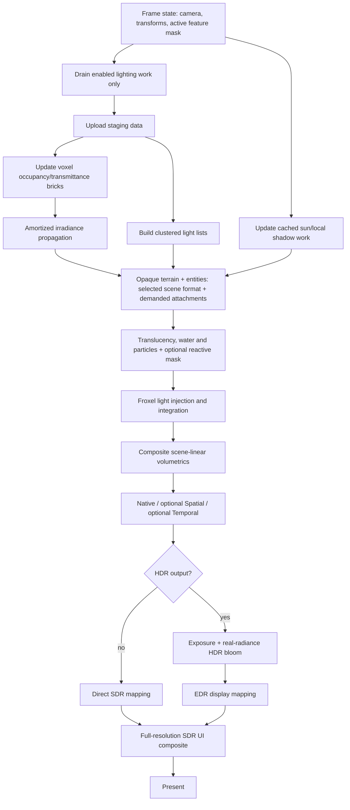

# Metallum: глобальный план независимого нового освещения, HDR и temporal-ready renderer

Статус: целевая архитектура. Этапы L0–L6 выполнены. Следующий обязательный этап — L6.5 (Performance closure, стабилизация и исправление дефектов L3–L6). Ветвь T1 (Motion/Reactive) может готовиться параллельно после стабилизации ABI.

Целевая версия на момент составления: Minecraft Java 26.2, Fabric Loader 0.19.3, Sodium 0.9.1, Java 25.

Основная аппаратная точка контроля: Apple M1 Pro.

Минимальная программная база нативной части: Metal 3, macOS 14.

Iris: намеренно не является целью совместимости нового renderer.

Этот документ — источник правды для разработки нового освещения. Он описывает не только желаемые эффекты, но и контракты данных, frame graph, порядок миграции, ограничения по памяти и GPU-времени, тестовые сцены, fallback и критерии завершения каждого этапа.

Историческая заметка `recomendationsForUpscaler.md` удалена после переноса актуальных решений о spatial scaling, temporal pipeline, HDR и порядке постобработки в этот документ.

Обязательный предшествующий документ: [`METAL_RENDERER_OPTIMIZATION_PLAN.md`](METAL_RENDERER_OPTIMIZATION_PLAN.md). Новое освещение использует созданные там frame graph, resource ABI, upload rings, lifetime/synchronization model, shader packaging и work-budget controller. Оно не создаёт второй параллельный фундамент.

### Условие начала lighting implementation (Архивный снимок состояния подготовки перед началом L3)

Полномасштабная реализация света начинается только после `Optimization Foundation Gate`:

- этапы O0–O6 плана оптимизации завершены и прошли свои exit criteria;
- для O7/O8 достаточно готового capability/fallback contract; Hi-Z/ICB и полный Metal 4 executor разрешено отложить до появления репрезентативной lighting-нагрузки и затем принимать только по A/B измерениям;
- минимальная часть O9 умеет ограничивать очереди обновлений без frame-time spikes; temporal scaler, dynamic resolution и другие необязательные контроллеры не являются условием начала света;
- на M1 Pro измерены non-lighting CPU/GPU p95 и реальный остаток frame budget;
- light-only изменение не требует terrain remesh по новому renderer contract;
- generated metallib, per-frame rings и resource lifetime validation готовы к использованию lighting subsystems.

До этого разрешены только исследования, тестовые сцены, ABI/математические unit tests и capability scaffolding, не создающие постоянный второй render path.

### Lighting Preparation Readiness — 15 июля 2026 (Архивный снимок состояния подготовки перед началом L3)

Этот checklist фиксирует только фактически готовые контракты. Он не означает, что новое освещение, temporal processing или production Metal 4 renderer уже реализованы.

- [x] O0–O6 подтверждены кодом, targeted validation, full `clean check` и имеющимся runtime evidence.
- [x] `RenderContractMode`, `LightingModel` и `DisplayOutputMode` независимы; renderer generation раздельно отклоняет material, Advanced и output, сохраняя поддержанные оси.
- [x] Immutable versioned `FrameState`/`FrameContract` готовы; production jitter остаётся нулевым, motion/reactive inputs обозначены как unavailable.
- [x] History-reset contract покрывает first frame, resize, world/dimension transitions, teleport/camera cut, projection/FOV, renderer/lighting/output generation, internal scale и reload.
- [x] Один immutable capability snapshot собирается при создании `MetalDevice`; MetalFX capabilities не привязаны к выбору Metal 3/Metal 4 executor.
- [x] Изолированный native Metal 4 lifecycle harness проходит на M1 Pro/macOS 26+ и корректно skipped на неподходящей OS/architecture/SDK.
- [x] Pure `FrameSynthesisContract` описывает admission для Frame Interpolation, cadence, presentation order, drawable ownership и in-flight lifetime, но не создаёт и не включает production FI.
- [x] `BoundedWorkQueue` задаёт capacity/item/time budgets, coalescing, priority, starvation bound, deterministic order, overflow fallback и telemetry; к production lighting queues он пока не подключён.
- [x] Production output и видимая картинка не изменены; HDR/SDR routing остался прежним.
- [x] Production executor остаётся Metal 3; Metal 4 command allocators, argument tables, residency sets и barriers есть только в test harness.
- [x] Постоянные lighting resources, motion/reactive textures и новые lighting passes не выделяются.

В O2 приняты только уже доказанные bounded in-flight upload foundations. Кандидаты private/write-combined upload и дополнительной copy batching не возвращаются без нового положительного A/B: прежние измерения не показали прироста либо ухудшали стабильность. O3 resource lifetime/synchronization foundation готов, но transient lighting heap aliasing сознательно не делается до появления реальных lighting lifetimes.

До первого lighting vertical slice сознательно отложены и **не считаются реализованными**:

- O7 Hi-Z/ICB/instancing;
- production Metal 4 executor O8c–O8f;
- production argument tables, residency sets и explicit barriers;
- Metal 4 performance A/B;
- MetalFX Temporal scaler;
- MetalFX Frame Interpolation;
- motion/reactive attachments;
- dynamic resolution;
- transient lighting heap aliasing;
- оптимизация новых lighting passes.

Единственная новая production-цена preparation layer — один capability discovery при создании `MetalDevice` и расширенные timing metadata. Новые generation/frame graph/temporal/synthesis/work-budget модели не вызываются из per-frame production path. Поэтому искусственный FPS benchmark для preparation gate не требуется; Metal 4 A/B будет нужен только после появления production executor и репрезентативной lighting-нагрузки.

---

## 1. Итоговое архитектурное решение

Metallum должен развиваться как собственный renderer для Apple Silicon со следующей схемой:

1. Мир, сущности, жидкости и частицы продолжают растеризоваться как геометрия.
2. Прямой свет для всех типов геометрии считается одной системой clustered forward+.
3. Статический блоковый мир дополнительно представлен разреженными camera-centered voxel clipmaps.
4. Высокодетализированные воксели хранят геометрию, прозрачность и материал, но не плотное полноцветное освещение на том же разрешении.
5. Воксельная структура используется для локальных теней, ambient occlusion, непрямого цветного света и затенения объёмной среды.
6. Солнце и движущиеся сущности используют отдельную cached/clipmapped shadow-систему.
7. Объёмный воздух считается во froxel grid с temporal reprojection.
8. Освещение и материалы всегда вычисляются в scene-linear пространстве, но физический формат `sceneColor` выбирается по активным потребителям: HDR требует FP16 radiance, SDR не обязан платить за полноразмерный HDR target.
9. HDR получает реальную рассчитанную яркость, а не восстанавливает её из SDR-подобного финального цвета; Legacy material contract при этом сохраняет нынешний semantic HDR path.
10. Material contract, lighting model и display-output являются независимыми осями. Обязательны шесть допустимых combinations; `Legacy + Advanced` запрещён.
11. Архитектура заранее определяет depth/motion/jitter/reactive/history-reset contracts, но соответствующие attachments и passes создаются только когда включён их реальный потребитель.
12. В будущем MetalFX Temporal и Frame Interpolation подключаются независимо от HDR и не требуют перестройки освещения, GI и volumetrics.

Короткая формула целевого кадра:

```text
linear albedo × (direct light × shadow visibility + indirect irradiance)
+ emissive radiance
+ volumetric radiance
= scene-linear lighting result
→ output-appropriate scene storage
→ optional temporal upscale
→ optional HDR exposure/bloom
→ SDR or EDR display mapping
→ SDR UI composite
→ CAMetalLayer
```

---

## 2. Цели и не-цели

### 2.1. Обязательные цели

- Цветные локальные источники света.
- Единое освещение terrain, block entities, обычных entities, items, particles и fluids.
- Тени от полных блоков, плит, ступеней, заборов и других `VoxelShape`.
- Стабильные тени от солнца и важных локальных источников.
- Цветной непрямой свет как минимум с одним приближённым bounce.
- Объёмный воздух, туман и видимые световые лучи.
- Независимые SDR и HDR output paths: HDR с реальными значениями выше reference white, SDR без HDR-only ресурсов и проходов.
- Отдельный резкий SDR-интерфейс.
- Высокий FPS на M1 Pro и масштабируемые quality tiers.
- Контракты, достаточные для последующего MetalFX Temporal и Frame Interpolation, без обязательной цены этих функций, пока они выключены.
- Безопасный legacy fallback на время миграции.
- Детерминированная проверка GPU-значений и производительности.

### 2.2. Желательные цели после основного света

- Материалы с normal map, roughness, reflectance/metalness и точной emission.
- Более качественная вода, стекло, мокрые поверхности и отражения.
- Опциональный расширенный Display P3 output.
- Опциональные улучшения для M3+ без ухудшения M1 Pro path.
- Поддержка стандартных resource packs и собственного необязательного material extension.

### 2.3. Явные не-цели

- Iris и произвольные Iris shader packs.
- Полная динамическая вокселизация сущностей.
- Хранение полного `4×4×4` FP16 radiance для всей дистанции прорисовки.
- Традиционный многопроходный deferred G-buffer как основной renderer.
- Path tracing или hardware ray tracing как обязательный режим.
- Metal 4/macOS 26 как минимальная платформа.
- Удаление работающего legacy HDR до полного покрытия нового renderer.
- Большой предварительный рефакторинг нативной части без измеримого результата этапа.
- Обязательное включение Temporal, Frame Interpolation, dynamic resolution или Metal 4 ради работы нового освещения.
- Screen Space Reflections (SSR) в версии 1.0 (заменены на стабильные reflection probes и карты окружения; SSR не резервирует обязательный full-resolution normal buffer).

---

## 3. Фактическая исходная точка проекта

План строится поверх уже работающего Metal backend, а не предполагает новый порт.

### 3.1. Что уже есть

- Нативный `CAMetalLayer` и Metal command pipeline.
- FP16 MainTarget, FP16 scene continuations и FP16 lightmap в HDR-режиме.
- Расширенный линейный sRGB output и live EDR headroom.
- Отдельный SDR UI target.
- Semantic HDR attachment с depth-aware проверкой.
- Histogram-based adaptive highlight reconstruction.
- Quarter-resolution FP16 emission/bloom и объединённый tiled compute blur.
- MetalFX Spatial с раздельными display/render dimensions.
- Детерминированные Java- и native-validation задачи.
- Подробные GPU timing stages и JSONL-отчёты.

Основные текущие точки входа:

- [`MetalDevice`](src/main/java/com/metallum/client/metal/render/MetalDevice.java) — устройство, HDR/EDR state, scene capture и MetalFX orchestration.
- [`MetalCommandEncoder`](src/main/java/com/metallum/client/metal/render/MetalCommandEncoder.java) — command-buffer и render-pass orchestration.
- [`MetalCrossShaderCompiler`](src/main/java/com/metallum/client/metal/render/MetalCrossShaderCompiler.java) — GLSL → SPIR-V → MSL и resource binding.
- [`MetalHdrFrame`](src/main/java/com/metallum/client/metal/render/MetalHdrFrame.java) — Java-side frame handoff для scene/UI.
- [`MetallumNative.swift`](src/main/native/MetallumNative.swift) — нативные pipelines, HDR, EDR, MetalFX и present.
- [`HdrUiRenderTarget`](src/main/java/com/metallum/client/hdr/HdrUiRenderTarget.java) — полноразмерный SDR UI.
- [`MetalFxSpatialScaling`](src/main/java/com/metallum/client/metalfx/MetalFxSpatialScaling.java) — текущая политика размеров и spatial presets.
- [`HdrPipelinePolicy`](src/main/java/com/metallum/client/hdr/HdrPipelinePolicy.java) и [`SceneLinearPreflightGate`](src/main/java/com/metallum/client/hdr/SceneLinearPreflightGate.java) — текущий атомарный shader/color contract.

### 3.2. Что в текущем HDR является переходным решением

Сейчас часть сцены лишь декодируется в linear RGB на границе записи в FP16 target. Texture sampling, lightmap multiplication, material composition и fog не гарантированно выполняются в линейном пространстве.

Текущий semantic attachment хранит силу/тип источника и глубину, а present shader на этой основе масштабирует уже готовый цвет. Histogram дополнительно определяет предполагаемый пик несемантических светлых областей. Это выдаёт настоящий EDR output, но не настоящий lighting radiance contract.

В новом renderer:

- `sceneColor` сам содержит реальную итоговую radiance;
- histogram управляет только exposure, а не создаёт недостающую яркость;
- semantic reconstruction остаётся только в legacy path;
- lightmap excess patch больше не участвует в новом lighting path;
- значения выше `1.0` возникают в освещении и emission до HDR compositor.

Это также оптимизация: после полного coverage gate Metallum material contract вообще не выделяет, не очищает, не заполняет и не читает legacy semantic HDR attachment и не запускает highlight reconstruction PSO. При Metallum+HDR единственная достоверная информация переходит из material/emission shaders прямо в FP16 `sceneColor`. При Metallum+SDR используется отдельный доказанно достаточный scene format/path без HDR histogram, reconstruction, EDR headroom processing и HDR bloom. Auxiliary buffers остаются только там, где нужны включённым temporal/Advanced/material algorithms и доказаны capture-ом.

### 3.3. Ограничение текущего shader binding

Текущий общий compiler принимает uniform buffers, texel buffers и sampled 2D/cube textures. Для clustered lighting и voxel fields понадобятся storage buffers, дополнительные texture types и custom compute resources.

Это необходимо решить отдельным стабильным resource ABI. Нельзя внедрять voxel/cluster data через случайные свободные slots без versioning и validation.

### 3.4. Что нельзя сломать во время миграции

- Стабильный vanilla/Sodium render при выключенном новом renderer.
- EDR → SDR fallback.
- Текущий отдельный SDR UI.
- F2 SDR screenshots.
- MetalFX Spatial до готовности Temporal.
- Depth lifetime: если поздний проход загружает depth, предыдущий pass обязан сохранить attachment.
- Три кадра в полёте и корректное отложенное освобождение ресурсов.
- Никаких CPU waits между world, lighting, MetalFX и present.

---

## 4. Неподвижные принципы проектирования

### 4.1. Один световой контракт

Один источник имеет одинаковые position, radius, color, intensity и shadow policy для блоков, сущностей и объёма. Разные shaders могут использовать разные material BRDF, но не отдельные списки или шкалы света.

### 4.2. Воксели — ускоряющая структура, а не замена raster surface

Геометрия поверхности остаётся точной и текстурированной. Воксели отвечают за occupancy, transmittance, GI и часть visibility. Сущности могут семплировать voxel irradiance, не становясь вокселями.

### 4.3. Высокая геометрическая детализация не равна высокой radiance-детализации

`4×4×4` occupancy может быть упакован в 64 бита на блок. Полноцветный radiance на таком же разрешении недопустим по памяти. Irradiance всегда хранится грубее и обновляется реже.

### 4.4. Temporal identity является частью renderer с первого дня

Любой пиксель, entity, chunk brick, shadow page и history resource должен иметь понятный жизненный цикл между кадрами. Позднее добавление motion/history поверх уже готового GI почти гарантированно создаст ghosting и переделку frame graph.

### 4.5. Apple TBDR определяет стоимость pass boundaries

Предпочтение отдаётся:

- одному крупному raster pass вместо нескольких полноэкранных G-buffer passes;
- private GPU resources;
- threadgroup/tile memory;
- fused compute;
- dirty-region updates;
- минимальному числу store/load;
- отсутствию полных копий scene/depth без доказанной необходимости.

### 4.6. Material contract, lighting model и display output — независимые оси

На старте renderer generation независимо выбирает:

- `RenderContractMode.LEGACY` или `RenderContractMode.METALLUM`;
- `LightingModel.VANILLA` или `LightingModel.ADVANCED`;
- `DisplayOutputMode.SDR` или `DisplayOutputMode.HDR`;
- отдельно — `UpscaleMode`, Frame Interpolation и optional execution capabilities.

Обязательная матрица поведения:

| Render contract | Lighting model | Output | Поведение |
|---|---|---|---|
| Legacy | Vanilla | SDR | Текущий быстрый SDR pipeline без material/HDR/Advanced работы |
| Legacy | Vanilla | HDR | Semantic attachment, reconstruction, HDR bloom и EDR mapping |
| Metallum | Vanilla | SDR | Автоматический L2 scene-linear material path с ванильной lightmap, без HDR и Advanced работы |
| Metallum | Vanilla | HDR | L2 actual FP16 radiance, exposure и bloom без semantic/reconstruction; модель света остаётся Vanilla |
| Metallum | Advanced | SDR | Будущий L3+ direct/GI/shadow/volume workload поверх L2 material path, SDR output |
| Metallum | Advanced | HDR | Тот же будущий Advanced workload и L2 actual-radiance HDR output |

`Legacy + Advanced` запрещён конструкторами generation. Failure Advanced admission откатывает только lighting model в `Metallum + Vanilla`, сохраняя output. Failure material coverage откатывает contract в `Legacy + Vanilla`, также сохраняя HDR-запрос. Если HDR capability/headroom недоступны, меняется только output на SDR. Частично новый и legacy material contract внутри одного кадра недопустим.

Жёсткие инварианты:

- `HDR=off` означает отсутствие allocation, clear, write, encode и sampling всех HDR-only ресурсов и PSO;
- `RenderContractMode.LEGACY` означает отсутствие L2 material resources/passes;
- `LightingModel.VANILLA` означает отсутствие light registry, clusters, advanced shadow caches, voxel/GI/froxel resources, PSO и очередей;
- `RenderContractMode.METALLUM + HDR` запрещает semantic-strength markers, inferred-highlight reconstruction и любые попытки выводить HDR-яркость из уже готового SDR-подобного цвета: значения выше reference white обязаны появляться в material/emission math и сохраняться в FP16 scene radiance;
- переключение одной оси не должно молча переключать другую;
- смена attachment formats выполняется через новую renderer generation; если live switch нельзя сделать безопасно, UI честно требует перезапуск renderer/игры;
- линейная математика не равна обязательному FP16-хранению: SDR format выбирается отдельной numeric/capture validation и может быть compact float или UNORM, если сохраняет требуемое качество.

### 4.7. Каждый дорогой эффект имеет ограничитель работы

GI, shadow updates, voxel uploads и volumetrics получают budget на кадр. Chunk loading или телепортация не должны превращать очередь обновлений в неограниченный GPU spike.

### 4.8. Свет не перестраивает геометрию

Изменение цвета, интенсивности или положения света обновляет `LightRegistry`, dirty voxel/GI/shadow records и GPU batches. Оно не перестраивает terrain vertex/index buffers, если не изменилась фактическая block geometry, material assignment или visibility topology.

Постановка блока-факела может потребовать rebuild только из-за его модели как геометрии. Распространение созданного им света по соседним chunk sections не является причиной remesh.

### 4.9. Освещение получает остаток измеренного frame budget

Stage budgets не складываются поверх текущего кадра как пожелания. После базовой оптимизации измеряется стоимость raster/scaler/HDR/UI; lighting preset получает только оставшийся бюджет с резервом для p95/p99. Если остатка недостаточно, сначала меняется preset/internal resolution, а не допускается постоянный GPU overload.

### 4.10. Один frame graph и один memory/synchronization contract

Lighting passes объявляют reads, writes, stages, lifetime и budget в общем frame graph из плана оптимизации. Они не кодируют собственные broad fences, временные allocators или скрытые копии scene/depth. Metal 3 и условный Metal 4 executor исполняют один логический workload.

### 4.11. Capability меняет исполнение, но не световой результат

Каждый lighting pass объявляет `requiredCapabilities`, `optionalOptimizations` и fallback. Metal 4 может изменить binding, command allocation, barriers, pass grouping или pipeline specialization, но не формулу direct light, radiance scale, voxel validity, motion convention или HDR output.

```text
ClusterBuildPass
  required: storageBuffers, indirectDispatch
  optional: argumentTables, metal4UnifiedCompute, explicitBarriers, simdReduction
  fallback: Metal3Compute
```

Pass не проверяет macOS/GPU family самостоятельно. Общий graph compiler получает immutable capability snapshot и заранее строит execution plan для всей renderer generation.

### 4.12. Lighting hot loops не знают о Metal version

Terrain/entity draw, light iteration, cluster fill, voxel traversal, GI propagation и froxel injection не выполняют `if Metal4`/GPU-family checks. Они получают заранее выбранный PSO, bindings и pass implementation.

Shader branches по capability устраняются function constants/PSO specialization. Runtime branches разрешены только для фактических данных сцены и bounded fast paths, например пустого cluster или нулевого dirty count.

Поддержка Metal 3/4 не принимается, если один только executor/capability dispatch добавляет около `0.1 ms` или больше к CPU render-thread/frame p95 относительно fixed-executor baseline.

---

## 5. Целевой frame graph



### 5.1. Порядок операций

1. Зафиксировать immutable `FrameState` для текущего submit.
2. Снять snapshot изменившихся блоков, источников и entity transforms без ожидания GPU.
3. Записать изменения в shared staging ring текущего in-flight slot.
4. Скопировать/развернуть данные в private voxel/light resources.
5. Выполнить ограниченное budget-ом обновление irradiance.
6. Построить cluster headers и light-index list.
7. Обновить только dirty/camera-exposed shadow regions.
8. Отрисовать opaque terrain и entities в низком render resolution.
9. Отрисовать поддерживаемую translucency; сформировать reactive/history mask только при активном temporal-потребителе.
10. Рассчитать и скомпозить froxel volumetrics в scene-linear radiance.
11. Передать только требуемые inputs в native, Spatial или Temporal output path.
12. Только в HDR output извлечь bloom из actual radiance и выполнить exposure analysis.
13. Выполнить независимый SDR mapping либо HDR mapping в текущий EDR headroom.
14. Скомпозить полноразмерный SDR UI.
15. Present без CPU wait.

### 5.2. Почему HDR bloom находится после upscale

Bloom — низкочастотный эффект, но включение готового размытия в temporal history может создавать длинные emissive trails. Базовый целевой порядок:

```text
sharp scene-linear world
→ temporal upscale
→ quarter-output-resolution bloom
→ display mapping
```

Если profiling покажет слишком высокую цену чтения upscaled scene, допускается альтернативный render-resolution bloom, но он должен иметь отдельную history/reactive policy. Решение принимается измерением, а не заранее.

### 5.3. HDR histogram/exposure

Histogram существует только при HDR output или если отдельный temporal experiment доказал необходимость exposure input. Его можно строить по render-resolution radiance до upscale. Он не должен повышать яркость выбранных пикселей. Его задачи:

- оценить сценовую экспозицию;
- стабильно адаптироваться между пещерой и дневным миром;
- предоставить `preExposure` для temporal scaler;
- немедленно учитывать падение доступного EDR headroom в HDR;
- не обучаться на SDR UI.

В обычном SDR без Temporal histogram, EDR queries, exposure texture и HDR bloom полностью отсутствуют в execution/resource plan.

---

## 6. Базовые контракты данных

### 6.1. `FrameState`

Java и native стороны должны обмениваться versioned frame structure. Минимальные поля:

- `frameId` — монотонный 64-битный номер логического кадра;
- `submitIndex` и in-flight slot;
- render/display dimensions;
- текущая и предыдущая camera world position;
- текущие и предыдущие jittered view/projection matrices;
- текущие и предыдущие unjittered view/projection matrices;
- near/far или параметры reversed-Z reconstruction;
- jitter в render-pixel units;
- delta time с ограниченным диапазоном;
- current exposure и `preExposure`, только если их требует активный HDR/Temporal path;
- текущий/потенциальный EDR headroom, только для HDR output policy;
- world/dimension identity;
- camera cut/teleport/resize/reset flags;
- resolved `RenderContractMode`, `LightingModel`, `DisplayOutputMode` и их независимые generation IDs;
- раздельные material/HDR/Advanced/upscale/interpolation/diagnostic resource bytes;
- Advanced counters для lights, passes, encoders, PSO, queues, dispatches и uploads;
- quality preset и feature mask.

`FrameState` ABI v3 является единым Java/Swift packet contract и становится immutable после начала encoding. Изменение настроек откладывается до границы следующего кадра, как сейчас откладывается resize MetalFX.

### 6.2. Координаты и точность

- GPU light/entity positions хранятся camera-relative в `float`.
- Абсолютные block/chunk coordinates остаются integer на CPU.
- Voxel clipmap origin привязан к brick boundaries.
- При смене dimension или большом teleport все temporal histories инвалидируются.
- Маленькое перемещение camera сдвигает toroidal clipmap, а не пересоздаёт его.

### 6.3. Scene color contract

- Рабочее пространство первой версии: linear sRGB.
- `1.0` — scene reference white, соответствующий SDR diffuse white до display mapping.
- Значения выше `1.0` разрешены в lighting math и обязательны к сохранению в HDR path; SDR storage вправе ограничить/закодировать их на явно определённой output boundary.
- RGB texture data декодируется из sRGB до lighting math.
- Alpha не проходит sRGB transfer function.
- Fog, blending, GI, volumetrics и bloom работают с linear values.
- Отрицательные значения после фильтров ограничиваются только в определённых границах pipeline, а NaN/Inf являются validation failure.
- Display P3 добавляется только с явным linear-sRGB → linear-P3 преобразованием.

Абсолютная физическая калибровка в lux/nits не требуется. Нужна стабильная относительная radiance scale, одинаковая для всех источников и материалов.

### 6.4. Основные frame attachments

| Ресурс | Базовый формат | Назначение | Lifetime |
|---|---|---|---|
| `sceneColor` | HDR: `RGBA16Float`; SDR: формат после numeric/capture validation | Scene-linear lighting result | render → scaler/output |
| `sceneDepth` | `Depth32Float` | Reversed-Z depth | raster → scaler/effects |
| `sceneMotion` | optional `RG16Float` | Motion в render-pixel units | только активный temporal consumer |
| `sceneReactive` | optional `R8Unorm` или формат, подтверждённый MetalFX | Выделенный reactive-mask input | только активный temporal consumer |
| `sceneAux` | optional compact `RGBA8Unorm` | Material/emission/history flags для собственных эффектов | raster → post |
| `sceneUpscaled` | HDR: `RGBA16Float`; SDR: validated output format | Optional Spatial/Temporal output | scaler → present |
| `uiColor` | `RGBA8Unorm` | Полноразмерный SDR UI | UI → present |
| `exposure` | optional 1×1 float/private buffer | Exposure/pre-exposure | только HDR/Temporal consumer |

Полноразмерный normal/roughness G-buffer не является обязательным. Если будущий optional material/denoiser attachment докажет необходимость, добавляется отдельный optional attachment и измеряется его store/load стоимость. `sceneReactive` не следует заранее упаковывать в `sceneAux`: Temporal scaler получает отдельную texture с форматом и usage, которые сообщает фактический MetalFX descriptor. Объединение допустимо только после runtime/API validation.

`sceneAux` не должен повторять нынешнюю packed semantic depth. В новом renderer actual depth уже является частью frame contract. Для специальных offscreen/translucent contributions применяется явный depth-aware composite.

### 6.5. `GpuLight`

Концептуальная запись источника:

```text
position.xyz, radius
linearColor.rgb, intensity
direction.xyz, type
spotAngles / shape parameters
shadowIndex, flags, stableLightId, generation
volumetricStrength, indirectStrength
```

Точный packing выбирается после alignment/throughput validation. Требования:

- 16-byte alignment;
- camera-relative position;
- stable ID для temporal и shadow cache;
- generation для безопасного переиспользования slot;
- отдельные флаги shadow/GI/volumetric;
- ограниченный максимальный GPU count;
- overflow counter вместо выхода за buffer;
- deterministic light priority при переполнении.

### 6.6. `MaterialDescriptor`

Минимальный material contract:

- base color/albedo;
- alpha mode: opaque, cutout, translucent, additive;
- normal source;
- roughness;
- dielectric F0 или metalness policy;
- emissive RGB scale;
- transmittance/absorption;
- foliage/two-sided flags;
- water/lava/special-medium flags;
- receives/casts shadow flags;
- reactive/history behavior.

Стандартный resource pack без дополнительных карт получает детерминированные defaults. Новый renderer не должен требовать PBR resource pack, чтобы выглядеть корректно.

### 6.7. Temporal contract

Для каждого rasterized объекта нужны current и previous transforms. Для terrain previous transform обычно совпадает с current, кроме сдвига camera origin и изменения geometry generation.

History reset обязателен при:

- resize или смене render scale вне разрешённого dynamic range;
- смене dimension/world;
- teleport/camera cut;
- FOV discontinuity;
- смене scaler mode;
- пересоздании MainTarget;
- изменении color/depth/motion format;
- shader/material ABI change;
- потере корректного previous transform;
- значительном скачке exposure, который нельзя компенсировать pre-exposure.

Reactive mask обязательно отмечает:

- воду и другие сложные refractive surfaces;
- быстро меняющуюся translucency;
- частицы без надёжных motion vectors;
- portal/end effects;
- emissive flicker, если он вызывает history trails;
- newly revealed geometry;
- изменившиеся voxel/GI regions при большой разнице radiance.

### 6.8. Контракт совместимости с другими модами

Совместимость определяется не названием мода, а используемым render role/API:

- неграфические Fabric-моды и оптимизации CPU/game logic не должны зависеть от lighting/output mode;
- новые блоки, предметы, модели и мобы, использующие покрытые vanilla/Sodium render roles, автоматически получают выбранный свет и output;
- resource packs без material extension получают детерминированные defaults;
- custom renderer/shader/target требует явного adapter и coverage test;
- неизвестный role не смешивается с новым lighting contract: generation либо использует безопасный adapter/default, либо отклоняет новый свет и остаётся Legacy с независимо выбранным SDR/HDR;
- список совместимости хранит причину и конкретный unsupported role, а не blanket blacklist всего мода, если можно отключить только несовместимую графическую функцию.

Каждый coverage gate проверяется минимум с vanilla и целевой версией Sodium. Совместимость с Iris намеренно не обещается.

---

## 7. Извлечение света из Minecraft

### 7.1. Статические block lights

Нельзя сканировать все блоки вокруг камеры каждый кадр. Источники формируются во время:

- chunk mesh build/rebuild;
- block-state change;
- chunk load/unload;
- resource/material reload.

Для каждого block emitter сохраняются:

- block position;
- vanilla light emission как fallback intensity;
- собственный RGB/intensity override, если материал его задаёт;
- shape/area approximation;
- участие в volumetrics и GI;
- stable ID, производный от dimension + block position + generation.

### 7.2. Динамические lights

Динамический snapshot строится один раз на кадр из:

- emissive entities;
- held items;
- projectiles/effects;
- lightning;
- временных модовых источников;
- camera/player-attached lights.

Java формирует компактный список, native code выполняет upload и cluster culling. Никаких FFM-вызовов на один источник: только batch structure или shared staging buffer.

### 7.3. Sun/sky

Солнце является directional source с отдельной shadow policy. Sky/ambient нельзя представлять тысячами lights. Нужны:

- directional sun/moon radiance;
- sky irradiance approximation;
- weather/time-of-day параметры;
- dimension-specific environment profile;
- плавная exposure policy без изменения физической интенсивности источников.

Nether, End, underwater и пользовательские dimensions используют явный environment descriptor, а не набор разрозненных shader special cases.

### 7.4. Fabric/Mixin integration discipline

Точные injection points для Minecraft 26.2 должны быть повторно проверены по исходникам перед реализацией каждого mixin. Ответственности разделяются:

- frame boundary и camera state;
- chunk build/light extraction;
- block update/unload queue;
- entity current/previous transforms;
- render-role/material classification;
- resource reload;
- world/dimension reset.

Mixin не должен выполнять тяжёлую вокселизацию или GPU upload внутри block update callback. Callback только записывает компактное событие в bounded queue.

---

## 8. Clustered forward+ direct lighting

### 8.1. Cluster grid

Начальная гипотеза для профилирования:

- tile: `16×16` render pixels;
- 24–32 logarithmic Z slices;
- cluster headers: offset + count;
- общий compact light-index buffer;
- отдельный overflow/statistics buffer.

Это не финальные константы. Они выбираются по:

- среднему и p99 lights per cluster;
- стоимости cluster build;
- fragment loop occupancy;
- памяти index list;
- качеству в пещерах и на большой дистанции.

### 8.2. Build algorithm

1. Очистить только headers/counters текущего in-flight slot.
2. Для каждого light вычислить screen-space bounds и Z range.
3. Записать light в пересекаемые clusters.
4. Ограничить count и детерминированно выбрать наиболее значимые lights при overflow.
5. Сохранить counters для telemetry.

На раннем этапе допустим двухпроходный count/prefix/fill compute. После корректности измерить one-pass/atomic или tile-local варианты.

### 8.3. Surface shading

Opaque terrain и entities читают один и тот же cluster list. Fragment shader:

1. Восстанавливает cluster index.
2. Берёт material parameters.
3. Считает direct BRDF для lights кластера.
4. Для ограниченного числа shadowed lights получает visibility.
5. Добавляет voxel irradiance.
6. Добавляет emission.
7. Пишет итоговый scene-linear result в выбранный SDR/HDR scene format; motion и aux — только при активном потребителе.

### 8.4. Ограничение shadowed lights

Нельзя выполнять длинный voxel traversal для каждого источника каждого пикселя. На cluster или surface выбираются:

- sun;
- ближайший/самый яркий локальный shadowed light;
- дополнительный shadowed light только на высоком preset;
- остальные lights считаются без дорогой visibility или с дешёвой occlusion approximation.

---

## 9. Материалы и линейный shading

### 9.1. Первая версия

Первая рабочая material model должна быть небольшой:

- Lambert или energy-conserving diffuse;
- простая GGX specular;
- dielectric default;
- optional metalness;
- normal mapping при наличии;
- exact linear RGB emission;
- alpha/cutout/transmission policies.

Сложные clear coat, anisotropy и subsurface не добавляются до стабилизации основного света.

### 9.2. Vanilla-preserving defaults

Minecraft должен оставаться узнаваемым. Без PBR-карт:

- roughness задаётся по material class;
- большинство блоков dielectric;
- metalness используется только для явно металлических материалов;
- normal остаётся геометрической;
- emission берётся из block/entity semantics;
- albedo не должен одновременно содержать запечённое сильное освещение и получать физический direct light без коррекции.

### 9.3. Resource pack extension

Позднее определяется документированный Metallum material layout. Он должен быть необязательным и versioned. Если будет полезно, можно импортировать распространённые PBR conventions отдельно от Iris, но внутренний GPU ABI остаётся собственным.

---

## 10. Воксельное представление мира

### 10.1. Разделение полей

Минимально нужны:

1. `occupancy` — консервативное покрытие геометрией;
2. `transmittance/material class` — стекло, листья, вода и другие частичные среды;
3. `irradiance` — более грубый непрямой RGB-свет;
4. optional `directionality/validity` — dominant direction и temporal confidence.

### 10.2. Sub-block encoding

Ближний уровень использует configurable subdivision:

- `1×`: один occupancy sample на блок;
- `2×`: 8 samples, можно упаковать в 1 байт;
- `4×`: 64 samples, можно упаковать в 64 бита.

`VoxelShape` консервативно пересекается с subcells. Для тонких panes/fences допускается coverage/transmittance, чтобы тень не становилась физически толще формы.

### 10.3. Clipmap layout

- Camera-centered toroidal levels.
- Origin выровнен по brick boundary.
- Сдвиг камеры обновляет только открывшиеся slabs.
- Chunk unload очищает соответствующие generations.
- Dirty block updates группируются в bricks.
- Near occupancy имеет высокое разрешение.
- Mid/far occupancy и irradiance постепенно грубеют.

Стартовый исследовательский вариант: near occupancy шириной около 64 блоков при `4×`, то есть логическая сетка `256³`. В битовом виде это около 2 MiB до material/transmittance metadata. Хранить `RGBA16Float` radiance той же сетки нельзя: один такой buffer занял бы около 128 MiB без ping-pong и mip levels.

### 10.4. Brick storage

Первая реализация может использовать плотный фиксированный clipmap для простоты и проверки. После доказательства качества:

- sparse brick pool;
- indirection table;
- bounded free list;
- generation counters;
- optional sparse texture residency только после feature/runtime validation.

Нельзя начинать сразу со сложной sparse residency: сначала нужна корректная адресация, scrolling и invalidation.

### 10.5. Update pipeline

1. Java queue принимает block/chunk events.
2. CPU worker кодирует `VoxelShape` и material class в compact brick patches.
3. Shared staging ring принимает batch.
4. GPU compute/blit обновляет private occupancy resources.
5. Dirty irradiance queue получает затронутые bricks и соседей.
6. На кадр обрабатывается ограниченное число propagation jobs.

Chunk generation не должна блокировать render thread ожиданием полного GI. Новая область сначала получает безопасный ambient fallback, затем уточняется.

---

## 11. Тени

### 11.1. Солнце

Эволюция sun shadows:

1. Обычная 2–3 cascade shadow map для проверки интеграции и bias.
2. Разделение static terrain и dynamic entities.
3. Cached/clipmapped static shadow regions.
4. Обновление только dirty pages/slabs.
5. Высокочастотный ближний dynamic layer.

Переход к virtual/sparse shadow pages допускается только после измерения обычных cached cascades. M1 Pro остаётся базовой точкой.

### 11.2. Локальные block lights

Статическая геометрия мира затеняет local lights через occupancy traversal:

- DDA для ближайших точных rays;
- ограничение максимальных steps;
- coarse-level stepping на расстоянии;
- early exit на opaque occupancy;
- накопление transmittance для стекла/листьев;
- quality-dependent softening.

### 11.3. Движущиеся сущности

Сущности не пишутся в постоянный voxel clipmap. Они:

- участвуют в sun shadow dynamic layer;
- могут использовать ограниченный local-light shadow atlas;
- на Performance получают capsule/proxy contact shadow;
- получают тени от блоков и voxel GI как обычные raster surfaces.

### 11.4. Bias и фильтрация

Для каждого shadow path нужны автоматические validation scenes:

- acne на плоской поверхности;
- peter-panning у ног entity;
- ступени и плиты;
- тонкий забор;
- листья и стекло;
- большая координата мира;
- движение камеры через cascade boundary.

Stochastic soft shadows не добавляются до стабильной temporal reprojection.

---

## 12. Непрямой цветной свет

### 12.1. Первая цель

Первый GI должен быть diffuse-only, один bounce, без glossy cone tracing. Он обязан:

- окрашивать соседние поверхности от яркого цветного источника;
- не протекать через обычную стену толщиной в блок;
- стабильно обновляться при установке/удалении блока;
- не давать вспышек при chunk load;
- иметь ограниченную задержку обновления;
- одинаково освещать terrain и entities.

### 12.2. Injection

В irradiance field инжектируются:

- sun/sky contribution;
- block emission;
- выбранные динамические lights с ограниченным радиусом;
- отражённый цвет поверхности.

Динамические источники не должны каждый кадр полностью перестраивать поле. Используются dirty regions, temporal decay и ограниченный work queue.

### 12.3. Propagation

Начать с небольшого числа compute iterations на dirty bricks. Требования:

- ping-pong или безопасный wavefront update;
- не читать и писать конфликтующие значения без явного порядка;
- threadgroup tiling;
- border halo;
- temporal validity;
- отдельная скорость появления и исчезновения света, чтобы не оставлять длинный ghost trail.

Raster shading всегда читает последнюю полностью завершённую irradiance generation. Propagation записывает следующую generation, а swap выполняется только на границе кадра после завершения зависимостей. Частично обновлённое поле не должно быть видимо поверхности.

Voxel cone tracing рассматривается только после измерения простого irradiance propagation. Оно может стать Ultra path для более направленного GI, но не базовой зависимостью.

### 12.4. Sampling surfaces

- Несколько trilinear samples вокруг surface normal.
- Visibility/normal weighting для снижения light leaking.
- Fallback sky/ambient при invalid brick.
- History confidence для плавного перехода после update.
- Entity sampling использует ту же функцию и world position.

---

## 13. Froxel volumetrics

### 13.1. Представление

Начальная гипотеза:

- XY resolution: примерно `renderWidth/8 × renderHeight/8`;
- 48–64 logarithmic depth slices;
- FP16 scattering/extinction;
- отдельная history texture;
- quality presets меняют XY scale, Z slices и количество lights.

### 13.2. Проходы

1. Построить density/extinction для воздуха, воды, погоды и dimension profile.
2. Внедрить clustered direct lighting.
3. Получить sun/local shadow visibility через shadow/voxel data.
4. Добавить low-frequency voxel irradiance при наличии бюджета.
5. Интегрировать scattering вдоль Z.
6. Reproject history.
7. Depth-aware composite в scene-linear color.

После корректности проверить объединение injection/integration или tile-local варианты. До измерения проходы остаются логически раздельными для простоты validation.

### 13.3. Temporal правила

- Camera reprojection использует unjittered matrices.
- Newly exposed froxels сбрасывают history.
- Изменение density/weather уменьшает history weight.
- Быстрый light flicker не должен оставлять луч в воздухе после исчезновения.
- Teleport/dimension change полностью очищает volume history.

---

## 14. Transparency, water и particles

Transparency является главным источником temporal artefacts и не должна оставаться «последней мелочью».

### 14.1. Категории

- Cutout terrain: opaque path с alpha test и motion.
- Простая alpha translucency: low-resolution scene до upscale, approximate motion + reactive mask.
- Water/glass refraction: отдельный material path, depth-aware sampling и высокий reactive weight.
- Additive particles: до upscale, exact/approximate motion или полный reactive reset.
- Screen-space overlays и UI: после upscale.

### 14.2. Reactive mask

MetalFX Temporal поддерживает reactive mask, поэтому его ABI slot и lifetime contract резервируются заранее. Production attachment не выделяется и не записывается при Spatial/native output. До включения Temporal mask генерируется только в явном diagnostic mode и проверяется на тестовых сценах.

### 14.3. Order-independent transparency

Apple imageblocks потенциально позволяют tile-local OIT, но это отдельная поздняя оптимизация. Базовый план не зависит от OIT. Сначала сохраняется корректный Minecraft ordering и измеряется реальная проблема.

---

## 15. Настоящий HDR

### 15.1. Новый принцип

HDR не решает, какой объект «должен быть ярким». Lighting/material pipeline уже выдаёт scene-linear radiance.

Пример внутренней шкалы, а не жёсткие финальные константы:

```text
dark cave surface       < 0.05
ordinary diffuse         0.1–1.0
bright cloud/snow        около или выше 1.0
torch/lava emission      несколько единиц
sun disc                 заметно выше diffuse white
```

Точные intensities калибруются по reference scenes и остаются стабильными между SDR и HDR. Lighting solution одинакова, но это не требует одинакового физического framebuffer: SDR получает раннюю явную output boundary и не несёт HDR-only bandwidth.

### 15.2. Что сохраняется в HDR generation

- FP16 scene targets.
- Live current/potential EDR headroom.
- `RGBA16Float` CAMetalLayer в EDR.
- App-controlled tone/display mapping.
- Отдельный SDR UI.
- Quarter-resolution bloom compute design.
- Безопасный SDR fallback.
- Diagnostic EDR patterns.

### 15.3. Что прекращается в новом lighting path

- Scene-wide inferred highlight peak как способ создать яркость.
- Semantic strength как замена emission radiance.
- Lightmap excess compression.
- Финальная sRGB→linear декодировка shaders, которые уже работают linear end-to-end.
- Материально-зависимое усиление после завершения lighting.
- Allocation, clear, store/load и sampling legacy semantic HDR attachment.
- Отдельный reconstruction dispatch/PSO и его промежуточные данные.
- Повторное копирование `sceneColor`, если scaler/HDR pass может читать исходную FP16 texture по корректному lifetime.

Удаление выполняется только после атомарного shader-role coverage gate. Legacy+HDR продолжает использовать весь прежний reconstruction contract; смешанный lighting contract запрещён. В обоих SDR-режимах semantic HDR, histogram/reconstruction, HDR bloom и EDR resources отсутствуют независимо от выбранного lighting.

### 15.4. Bloom

Bloom seed строится из actual scene radiance:

- threshold относительно reference white и exposure;
- цвет берётся из FP16 scene, а не из отдельного SDR marker;
- optional `sceneAux` может использоваться для диагностики и material classification до upscale, но базовый bloom не зависит от него и не изобретает интенсивность;
- coverage weighting сохраняется;
- bright reflected highlights тоже могут bloom, если реально превышают threshold.

### 15.5. Exposure и EDR headroom

Lighting intensity не меняется при переносе окна между дисплеями. Меняется только display mapping.

- Headroom падает — tone mapper немедленно ограничивает output.
- Exposure адаптируется плавно.
- UI остаётся SDR.
- Histogram не включает UI.
- Temporal scaler получает согласованные exposure/preExposure.

### 15.6. Display P3

Первая версия остаётся linear sRGB. Позднее:

1. Добавить точное linear-sRGB → linear-Display-P3 преобразование.
2. Изменить layer colorspace на extended linear Display P3.
3. Добавить gamut mapping для насыщенных emissive lights.
4. Проверить SDR screenshots и внешние дисплеи.

Менять только label colorspace без преобразования данных запрещено.

---

## 16. Temporal-ready архитектура и будущий MetalFX Temporal

### 16.1. Что реализуется заранее

До включения Temporal должны уже существовать как контракты и проверяемые shader capabilities, но не обязательно как постоянно выделенные resources:

- `FrameState` с current/previous matrices;
- Halton или другая детерминированная jitter sequence;
- jittered projection только для world render;
- unjittered matrices для culling, shadow stability и UI;
- per-pixel motion vectors;
- depth contract и `depthReversed=true`;
- optional exposure texture/preExposure policy для SDR и HDR;
- optional reactive mask;
- reset policy;
- previous transforms для entities;
- dynamic render-content dimensions;
- output-format policy: FP16 для HDR и отдельно validated SDR format;
- UI после upscale.

### 16.2. Motion vector convention

До написания всех shaders фиксируется и GPU-тестируется единая convention:

- единицы: render pixels;
- направление: current pixel → previous pixel либо наоборот, строго по MetalFX contract;
- scale X/Y передаётся явно;
- jitter удаляется/учитывается ровно один раз;
- Y orientation проверяется diagnostic pattern;
- stationary camera/static geometry дают нулевое движение с допустимой погрешностью;
- entity motion включает current/previous model transform;
- skinned/animated geometry получает как минимум rigid proxy, затем точные previous vertices при необходимости.

### 16.3. Temporal scaler resources

MetalFX descriptor создаётся не на кадр, а при изменении:

- device;
- максимального input/output размера;
- texture formats;
- reactive-mask enablement;
- dynamic-resolution range.

На кадр устанавливаются:

- color texture;
- depth texture;
- motion texture;
- reactive mask;
- exposure texture/preExposure;
- jitter offsets;
- actual input-content width/height;
- reset flag;
- private output texture.

### 16.4. HDR и Temporal

Temporal обязан иметь две проверяемые конфигурации:

```text
SDR scene color
→ MetalFX Temporal с SDR-compatible format/range
→ SDR display mapping

pre-exposed scene-linear FP16 HDR
→ MetalFX Temporal FP16
→ restore exposure
→ HDR bloom/display mapping
```

HDR не является prerequisite для Temporal, а Temporal не является prerequisite для HDR или нового освещения. Перед включением каждой конфигурации требуется native GPU validation диапазона, clamp/NaN, orientation и цвета. Если MetalFX требует ограниченного HDR-диапазона, используется согласованный `preExposure`, а не tone mapping до scaler.

### 16.5. Dynamic resolution

После Temporal controller из плана оптимизации расширяется управлением input resolution по GPU p95:

- изменяет input content scale плавно;
- не пересоздаёт scaler при каждом небольшом изменении, если descriptor поддерживает range;
- округляет размеры согласно фактическим требованиям MetalFX;
- имеет hysteresis;
- не реагирует на единичный spike;
- сбрасывает history только когда API/формат действительно требует;
- сохраняет display-resolution UI.

Lighting work budgets и render scale имеют единый coordinator. Сначала откладываются невидимые GI/shadow/voxel updates, затем с hysteresis снижается volumetric/GI quality, и только затем меняется input scale. Нельзя одновременно резко менять несколько параметров: это создаёт temporal reset, скачок качества и новый frame spike.

### 16.6. Spatial fallback

Spatial остаётся fallback для:

- отсутствия Temporal support;
- failure при создании scaler;
- diagnostic comparison;
- временно неподдерживаемых motion/depth formats;
- безопасного восстановления после runtime error.

Fallback переключается на границе кадра с resize/reset, не во время encoding.

---

## 17. Metal-native организация

### 17.1. Target policy

- Основной API: Metal 3/macOS 14.
- Runtime capability checks обязательны.
- Residency sets на macOS 15+ являются условной resource-management оптимизацией и не заменяют hazards/synchronization.
- Metal 4 поддерживается M1-series на уровне GPU family, но его API path требует macOS 26+; поэтому enhancements изолированы и необязательны.
- Metal 3 и Metal 4 используют общий frame/resource graph из плана оптимизации. MetalFX Temporal и Frame Interpolation могут быть реализованы на Metal 3 и не ждут полного Metal 4 executor.
- M1 Pro должен проходить все correctness tests и иметь рабочие presets.
- M3+ может получить отдельные optional RT/denoised features позже.

Capability levels фиксируются отдельно:

| Level | Lighting contract | Optional execution |
|---|---|---|
| Metal 3/macOS 14 | Полный direct light, voxels, shadows, GI, volume, независимые SDR/HDR outputs | Обычные bindings/encoders/fences, MetalFX при runtime support |
| Metal 3 + residency | Тот же результат | Stable residency sets на macOS 15+ |
| Metal 4 Core | Тот же результат | Compiler, allocators, argument tables, explicit barriers, unified compute, attachment mapping |
| Metal 4 Extended | Тот же результат | Sparse/новые indirect/RT возможности только при отдельном GPU-family gate |

M1 Pro является обязательным Metal 4 Core test device, но extended features более новых GPU не становятся зависимостью Performance/Balanced/Ultra.

### 17.1.1. Atomic renderer generation

Executor, capability snapshot, compiler policy, argument tables, residency sets и resource layouts выбираются до начала кадра и неизменны до смены generation. Resize/world reload/device change создаёт новую generation. При Metal 4 failure готовится Metal 3 generation, а старая освобождается только после завершения in-flight submit.

Частично Metal 3/частично Metal 4 command lifecycle внутри одного кадра запрещён, хотя shaders/metallib/PSO и logical passes могут быть общими.

### 17.2. Native shaders

Большой lighting renderer не должен бесконечно расширять embedded MSL string.

Целевое состояние:

```text
src/main/native/
  MetallumNative.swift              # стабильные C ABI exports
  runtime/                           # state/resources/encoders, выделяются по мере работы
  shaders/
    Common.metal
    ClusterBuild.metal
    VoxelUpdate.metal
    VoxelLighting.metal
    Shadows.metal
    Volumetrics.metal
    HdrPresent.metal
    TemporalSupport.metal
```

MSL собирается Gradle-задачей в generated `.metallib`, а не записывается в `src/main/resources` во время build. Debug runtime compilation может оставаться диагностическим fallback. Production не должен компилировать весь lighting library в первом игровом кадре.

Обязательные lighting PSO prewarm-ятся после capability/preset gate и до первого `METALLUM` world frame. Feature key остаётся bounded; неизвестный variant не компилируется синхронно внутри draw/dispatch hot path.

Не требуется предварительно дробить весь существующий `MetallumNative.swift`. Код переносится в отдельный файл только когда соответствующая подсистема реально изменяется и покрыта тестами.

### 17.3. Resource allocation

- Persistent clipmaps/shadow caches живут на device lifetime.
- Resolution-dependent targets живут на renderer-size generation.
- History resources имеют explicit generation и reset.
- Constants, light records, dirty bricks и indirect work items используют специализированные bounded rings по числу in-flight frames из плана оптимизации.
- Основные GPU-only textures/buffers используют `.private`.
- Shared memory используется только для CPU→GPU staging/readback/telemetry.
- CPU-write-only upload memory тестируется с `.writeCombined`, но принимается только по A/B и никогда не читается CPU.
- Временные ресурсы переиспользуются/alias-ятся через frame-graph lifetime и heaps после профилирования; scene/depth/motion/history/shadow cache не alias-ятся.
- Occupancy, irradiance, shadows и froxels имеют отдельные persistent memory classes и high-water telemetry.

### 17.4. Synchronization

- Никакого `waitUntilCompleted` в обычном кадре.
- Один command buffer предпочтителен, пока он не создаёт доказанную проблему scheduling.
- Resource access graph генерирует узкие producer/consumer dependencies; lighting code не добавляет глобальный fence самостоятельно.
- Fences/events/barriers используются только для реальной зависимости и фактических producer/consumer stages.
- Store/load attachments определяются фактическим последующим чтением.
- Cross-pass dependencies документируются в frame graph.
- Compute updates не должны перезаписывать resource, который читает незавершённый in-flight frame.
- Metal 4 write→read/write dependency получает device visibility; residency не заменяет synchronization.
- Новая queue добавляется только после доказанного scheduling выигрыша и полного cross-queue event contract.

Metal 3 executor переводит graph edges в точные fences/memory barriers. Metal 4 executor переводит те же edges в producer/consumer/intra-pass barriers. Whole-resource correctness реализуется раньше subresource/range narrowing.

### 17.5. Pipeline variants

Варианты создаются по небольшому feature key:

- material class;
- alpha mode;
- shadow receive mode;
- voxel GI on/off;
- motion output on/off по фактическим temporal consumers; новый свет без temporal не платит за MRT;
- quality specialization constants.

Нельзя создавать комбинаторный PSO explosion. Предсказуемые variants prewarm после capability gate; остальные компилируются вне горячего draw path или имеют безопасный fallback.

На macOS 26+ dedicated Metal 4 compiler может независимо использоваться раньше полного Metal 4 command executor: async compilation, harvesting/archive, flexible PSO и color-attachment mapping включаются отдельными gates. Совместимость PSO не должна заставлять дублировать lighting shader source.

Внутри kernels при доказанной точности используются packed formats и `half`; world/camera transforms, depth reconstruction и большие координаты остаются `float`. SIMD-group reductions применяются к histogram/cluster/work counters только если capture показывает выигрыш относительно atomics.

### 17.6. Tile shaders

Tile/imageblock path является оптимизацией, не архитектурной зависимостью. Кандидаты:

- tile-local light culling;
- compact material auxiliary data;
- OIT;
- локальное объединение lighting/composite.

Он добавляется только если GPU capture/timestamps показывают выгоду относительно compute-built clusters на M1 Pro.

Tile path не должен создавать отдельный lighting contract. Это альтернативный executor одного pass/resource description с теми же численными tests и fallback на обычный clustered forward+.

### 17.7. Metal 4 argument-table layout

Metal 4 path использует несколько bounded tables, а не одну глобальную максимального размера:

- frame/global: matrices, exposure, dimensions, jitter;
- world/lighting: lights, clipmaps, shadow/GI resources;
- materials: textures, samplers, descriptor tables;
- pass-local: transient inputs/outputs.

Bindings генерируются из versioned resource ABI. Обновляются только dirty slots. Все косвенно доступные allocations входят в committed residency sets до encoding. Metal 3 получает эквивалентные bindings через обычный/argument-buffer path.

### 17.8. Кандидаты Metal 4 pass consolidation

Первый обязательный A/B slice:

```text
light/voxel upload
→ cluster build
→ opaque forward+ render
→ HDR histogram/compute
```

Unified compute применяется к совместимым copy/fill/dispatch operations. Color-attachment mapping исследуется для motion/reactive/compact auxiliary outputs. Fusion принимается только при одинаковом ordering/numeric output и снижении encoder/store-load или GPU p95.

---

## 18. Java/Fabric структура нового кода

Предлагаемая ответственность packages:

```text
com.metallum.client.renderer
  RendererMode / RendererCapabilityGate / MetalCapabilities
  RendererGeneration / MetalExecutorKind / FrameState

com.metallum.client.lighting
  LightRegistry / LightSnapshot / LightExtractor / LightingConfig

com.metallum.client.material
  MaterialRegistry / MaterialDescriptor / MaterialReloadListener

com.metallum.client.voxel
  VoxelShapeEncoder / VoxelDirtyQueue / VoxelClipmapController

com.metallum.client.temporal
  TemporalFrameState / MotionHistory / HistoryResetReason

com.metallum.client.metal.render
  существующий backend и resource wrappers

com.metallum.client.metal.render.bridge
  versioned batch/native ABI
```

Правила:

- Java определяет Minecraft semantics и формирует batch snapshots.
- Native Swift/Metal владеет GPU resources и encoding.
- Никаких FFM calls на отдельный block/light/entity.
- Все ABI structs имеют version/size checks.
- Renderer shutdown/world unload освобождает state в безопасном порядке.
- Resource reload создаёт новую generation и не мутирует используемые GPU tables.

---

## 19. Конфигурация и quality tiers

Новый lighting config лучше отделить от существующих HDR/MetalFX файлов на время миграции, например `metallum-renderer.properties`. После стабилизации возможна аккуратная консолидация с migration code.

Пользовательские оси должны быть короткими и независимыми. Внутренние диагностические flags, voxel resolution и отдельные лимиты не становятся обычными настройками ради настроек.

Минимальные пользовательские настройки после соответствующих coverage gates:

```properties
schemaVersion=2
improvedLighting=false
hdr=auto
lightingPreset=balanced
upscaler=native
frameInterpolation=false
dynamicResolution=false
```

- В schema 2 `improvedLighting` только запрашивает `LightingModel.ADVANCED` и никогда не включает/выключает L2 material contract или HDR.
- Конфиг без `schemaVersion` считается v1: оба старых значения `improvedLighting` мигрируют в `false`, сохраняя preset и Frame Interpolation. Повреждённая/неизвестная версия не перезаписывается и fail-closed использует Advanced Off.
- L2 `RenderContractMode.METALLUM` выбирается автоматически после material admission; `-Dmetallum.renderer.contract=legacy` является скрытым compatibility override и принудительно даёт `Legacy + Vanilla`.
- `hdr=off/auto/on` меняет только output policy. `auto` выбирает HDR лишь при доступном и разрешённом EDR display; resolved SDR не запускает HDR-only работу.
- `lightingPreset` управляет качеством shadows/GI/volumetrics внутри нового света, но не HDR.
- `upscaler` и Frame Interpolation независимы от обеих осей; unsupported/failure даёт native/Spatial fallback, а не отключает свет или HDR.
- недоступные функции скрываются или объясняются одной причиной; advanced diagnostic overrides не входят в обычный экран настроек.

До готовности L3 по умолчанию остаётся `improvedLighting=false`; запрос `true` явно разрешается обратно в Vanilla с причиной admission fallback. Текущий отдельный HDR-файл не читается и не изменяется миграцией renderer config.

### 19.1. Предварительные presets

| Параметр | Performance | Balanced | Ultra |
|---|---|---|---|
| Цель | стабильные 90 FPS, 120 best effort | основное качество при 60–75 FPS | максимум при 60 FPS в подходящей сцене |
| Near occupancy | `2×`, optional short `4×` | `4×` ограниченного радиуса | `4×` большего радиуса |
| Irradiance | грубый, 1 bounce | 1 bounce, больше levels | больше levels/iterations |
| Sun shadows | 2 cached levels | 3 cached levels | 3–4 levels |
| Local shadowed lights | 1 важный | 1–2 | 2+ по budget |
| Froxels | примерно 1/12–1/8 XY | примерно 1/8 XY | примерно 1/6–1/8 XY |
| Recommended render scale | native по умолчанию; снижение только после положительного A/B | native или quality temporal после A/B | native/native-like |
| Optional material/denoiser attachment | off | optional | on после profiling |

Все числа являются стартовыми гипотезами. Финальные значения фиксируются только после benchmark matrix.

---

## 20. Производительность и память

### 20.1. Frame targets

- Performance: основной gate GPU p95 ≤ 10.5 ms для стабильных 90 FPS; повышение к 120 FPS допускается только при GPU p95 примерно ≤ 7.9–8.1 ms.
- Balanced: GPU p95 ≤ 12.7–16.0 ms в зависимости от выбранной цели 75/60 FPS.
- Ultra: GPU p95 ≤ 16.0 ms; при превышении preset обязан ограничить expensive update work, а не накапливать spike.

Это цели всего кадра, а не отдельных новых эффектов.

120 FPS с direct lights, shadows, GI, volumetrics, scaler, HDR и UI на M1 Pro является best effort, а не гарантией для любого мира. Продуктовая цель Performance — прежде всего ровные 90 FPS и хорошие `1% low`. Metallum render contract в SDR измеряется отдельно от HDR: цена output не маскируется в общем Advanced lighting budget, а выключенный HDR обязан заметно убирать собственные passes/bandwidth, даже если итоговый выигрыш зависит от bottleneck конкретной сцены.

### 20.2. Первичные stage budgets

После Optimization Foundation Gate они пересчитываются по реальным captures. Начальные пределы для M1 Pro при сниженном render resolution:

| Stage | Performance p95 | Balanced p95 | Ultra p95 |
|---|---:|---:|---:|
| Cluster build | ≤ 0.15 ms | ≤ 0.25 ms | ≤ 0.35 ms |
| Дополнительная цена direct fragment lighting | ≤ 0.65 ms | ≤ 1.10 ms | ≤ 1.50 ms |
| Voxel dirty upload/update в обычном кадре | ≤ 0.15 ms | ≤ 0.40 ms | ≤ 0.50 ms |
| Cached sun/local shadow update | ≤ 0.40 ms | ≤ 0.80 ms | ≤ 1.15 ms |
| GI propagation | ≤ 0.50 ms | ≤ 0.95 ms | ≤ 1.50 ms |
| Volumetrics | ≤ 0.35 ms | ≤ 0.90 ms | ≤ 1.20 ms |
| Optional scaler | отдельный A/B budget; `0 ms` при native | отдельный A/B budget | отдельный A/B budget |
| HDR mapping + histogram + bloom | ≤ 1.60 ms | ≤ 1.75 ms | ≤ 1.90 ms |

Обычный дополнительный lighting overhead без scaler/HDR ограничивается `2.2 ms` для Performance, `4.4 ms` для Balanced и `6.2 ms` для Ultra. Performance/Balanced caps уточнены по худшему из повторных L0 baseline: `8.213 + 2.2 = 10.413 ms` и `8.213 + 4.4 = 12.613 ms`, что оставляет около `0.09 ms` до соответствующих full-frame gates. Это не означает, что budget обязательно надо израсходовать. В SDR строка HDR имеет фактическую стоимость `0 ms` и нулевые persistent/transient HDR allocations; обычный SDR output учитывается в baseline present.

Update spike имеет тот же frame cap, что обычный кадр: после teleport/chunk churn лишняя работа остаётся в bounded queue. Допускается временно заменить обычную долю одного эффекта более крупным update, но не сложить все максимумы таблицы и не превысить общий frame target.

Эти значения — engineering gates, а не обещание текущей реализации. Если baseline показывает другую реальность, таблица обновляется до начала соответствующего этапа.

### 20.3. Persistent memory budgets

Дополнительная память нового renderer сверх текущих world/UI targets:

- Performance: ориентир ≤ 192 MiB;
- Balanced: ориентир ≤ 256 MiB;
- Ultra: ориентир ≤ 384 MiB.

В отчёт включаются:

- occupancy/transmittance;
- irradiance ping-pong/history;
- shadow caches;
- clusters/light buffers;
- froxels/history;
- temporal attachments, только при активном temporal consumer;
- scaler output, только при активном scaler;
- HDR scene/output/history resources, только в HDR generation;
- work queues и staging.

Если resource существует только ради редкой диагностики, он не должен постоянно занимать production memory.

### 20.4. CPU budgets

- Никакого полного world scan на кадр.
- Никакого создания объектов на каждый visible light/block в render hot path.
- Chunk voxel encoding выполняется worker-ом или во время уже существующей rebuild работы.
- Worker создаёт конечный packed payload; render thread только фиксирует snapshots/batch handles и делает bounded copy в специализированный staging ring.
- Никаких FFM crossings на отдельный light/brick/shadow page; один versioned batch на класс обновлений.
- Никаких Metal-version/capability checks в draw/light/voxel loops; только заранее скомпилированный execution plan.
- Light-only updates не входят в geometry rebuild/upload counters.
- Очереди bounded; overflow приводит к coarse rebuild/fallback, а не unlimited growth.

### 20.5. Порядок динамической деградации

При нехватке GPU budget эффекты упрощаются в следующем порядке:

1. Отложить невидимые/далёкие dirty voxel, GI и shadow jobs.
2. Снизить GI iterations и update radius.
3. Снизить froxel XY/Z resolution или update rate с temporal stabilization.
4. Сократить число shadowed local lights/pages.
5. С hysteresis снизить temporal input resolution.
6. Отключить optional reflections/Ultra material attachments.

Direct lighting важных источников, scene-linear HDR, motion/depth/reactive correctness, UI resolution и resource synchronization не деградируют первыми.

### 20.6. Оптимизационные ограничения для каждого lighting stage

- Cluster lists имеют fixed capacity, priority sort и детерминированный overflow.
- Voxel update/propagation запускается indirect dispatch по реальному числу dirty bricks; пустая очередь не обходит весь clipmap.
- Occupancy хранится плотнее и детальнее irradiance; full-resolution radiance volume запрещён.
- Shadow cache обновляет только dirty/exposed pages и переиспользует стабильные результаты.
- Froxel injection использует cluster data, packed FP16 fields и temporal history; full-resolution volumetric ray march запрещён как базовый path.
- Histogram/cluster reductions сначала агрегируются в SIMD/threadgroup, если M1 Pro capture подтверждает снижение atomic contention.
- Hi-Z/ICB из плана оптимизации может отбрасывать geometry до дорогого fragment light loop, но lighting correctness не зависит от его наличия.
- Pass fusion применяется только при одинаковом ordering/attachments и доказанном выигрыше store/load bandwidth на TBDR.

---

## 21. Telemetry и диагностика

Существующие IDs `MetalGpuTimingStage` нельзя перенумеровывать. Новые stages добавляются после текущего ABI диапазона:

- light upload/cluster build;
- voxel upload;
- voxel propagation;
- sun shadow;
- local shadow;
- volumetric injection;
- volumetric integration/composite;
- temporal scaler;
- optional reflections.

JSONL report расширяется полями:

- resolved lighting/output/upscale/interpolation modes и lighting preset;
- Metal executor (`metal3`/`metal4`) и frame-graph version;
- immutable capability snapshot/level и active compiler/binding/synchronization slices;
- render/display dimensions;
- command buffer/encoder/pass counts;
- bytes uploaded/copied/read back и ring high-water/overflow;
- command allocator high-water/reset generation, argument-table dirty updates, residency-set churn и barrier stage/count;
- light count;
- cluster p50/p95/p99 и overflow;
- dirty voxel bricks submitted/remaining;
- oldest dirty-brick age;
- GI jobs completed/queued;
- shadow pages updated/reused;
- chunk rebuild/upload count по причине, отдельно light-only;
- froxel dimensions;
- history resets с reason;
- temporal reactive coverage;
- persistent/transient/heap memory estimate и alias savings;
- exposure/preExposure/headroom;
- scaler type и actual input scale.

Diagnostic overlays:

- cluster heat map;
- shadow cache residency;
- occupancy/clipmap levels;
- irradiance validity;
- froxel slices;
- motion vectors;
- reactive mask;
- HDR false-color radiance;
- exposure/headroom graph.

---

## 22. Поэтапная реализация

Каждый этап завершается отдельным коммитом или серией коммитов.

Поскольку новые этапы не образуют строго линейную цепочку (подготовка векторов движения может идти параллельно со стабилизацией, а генерация кадров не блокирует работу над глобальным освещением), последовательность разработки определяется следующим графом зависимостей:

```text
Lighting (Освещение):
L6.5 (Стабилизация L3-L6) ──> L6.6 (Direct Chromatic Transmittance) ──> L6.7 (Direct Froxel Volumetrics) ──> L7 (Voxel GI) ──> L8 (Materials/Water) ──> L9 (Hardening)

Temporal (Временные эффекты):
T1 (Motion/Reactive Contracts) ──> T2 (Fixed-scale MetalFX) ──> T3 (Dynamic Resolution)

Presentation (Вывод кадров):
P1 (ProMotion/Present Pacing) ──> P2 (Frame Interpolation) ──> P3 (Общая доводка)
```

Связи и правила взаимодействия между ветвями:
- **T1** является обязательным условием для **T2** (MetalFX Temporal) и **P2** (Frame Interpolation), так как предоставляет векторы движения.
- **L6.7** (Direct Froxel Volumetrics) использует конвенции и матрицы камеры из **T1** для накопления истории (reprojection), но не требует активного апскейлера **T2** (может работать на native/spatial сглаживании).
- **T3** (Dynamic Resolution) требует полностью работоспособного **T2**.
- **P2** (Frame Interpolation) требует готовности **T1**, **T2** и **P1** (для правильного present pacing интерфейса).
- **T3** желателен перед **P2** по выбранному порядку, но технически не обязателен.
- Разработка глобального освещения **L7** и материалов/воды **L8** не зависит от готовности **P1** / **P2**.
- **L8** (Materials) использует и расширяет motion/reactive маски, заложенные на этапе **T1**.
- Устройства без поддержки MetalFX (например, старые macOS) используют ветвь Lighting напрямую с Spatial fallback.

### Этап -1. Базовая оптимизация renderer

Выполнить обязательный фундамент O0–O6 из [`METAL_RENDERER_OPTIMIZATION_PLAN.md`](METAL_RENDERER_OPTIMIZATION_PLAN.md). O7/O8 не блокируют свет: до репрезентативной нагрузки от них требуются только capability isolation, безопасный Metal 3 fallback и отсутствие архитектурной зависимости. Полные Hi-Z/ICB/Metal 4 эксперименты разумно проводить после появления измеримого lighting workload.

#### Exit criteria

- Optimization Foundation Gate из начала этого документа пройден.
- Известен non-lighting frame budget M1 Pro для native/Spatial presets.
- Frame graph, batch ABI, rings, shader packaging и bounded queues готовы.
- Capability matrix и atomic generation fallback спроектированы и проверены на минимальном scaffolding; optional O7/O8 slices могут быть явно отложены без блокировки этапа 0.
- Light-only update не требует terrain remesh по целевому contract.
- Legacy renderer визуально и численно не регрессировал.

До выполнения этого этапа переход к этапу 0 запрещён.

### Этап 0. Независимые feature gates, admission и эталонные сцены — ✅ ВЫПОЛНЕН 15 июля 2026

#### Работы

- [x] Импортировать итоговые native-resolution и MetalFX Spatial timings из optimization baseline.
- [x] Рассчитать фактический остаток GPU/CPU frame budget под каждый lighting preset.
- [x] Добавить независимые render-contract/output axes и отдельный upscale/interpolation feature mask без изменения картинки; в L2.5 contract и lighting model окончательно разнесены типами.
- [x] Реализовать generation planner для всех четырёх lighting/output комбинаций и описать точный resource/pass manifest каждой.
- [x] Добавить validation, доказывающую отсутствие HDR-only ресурсов/passes в SDR, material work в Legacy и Advanced work в Vanilla.
- [x] Расширить общий versioned `FrameState`/native ABI lighting полями и unit tests, не создавая второй ABI.
- [x] Создать набор ручных test worlds/scenes.
- [x] Зафиксировать screenshots и HDR numeric probes.
- [x] Добавить resolved lighting/output/upscale/interpolation modes, preset, resource bytes и light-work поля в существующий timing report.
- [x] Утвердить stage/memory budgets либо явно скорректировать таблицы раздела 20 по capture.

#### Exit criteria

- [x] Legacy output побитово/визуально не изменился в допустимых пределах.
- [x] Все существующие Gradle/native validations проходят.
- [x] Есть p50/p95/p99 baseline и вычисленный lighting headroom минимум для native, Spatial Quality и Spatial Performance.
- [x] Performance/Balanced/Ultra не превышают полный frame budget уже на бумаге при сумме утверждённых stage caps.
- [x] Новый mode безопасно отказывает и возвращается в legacy.
- [x] Каждая из четырёх комбинаций создаётся независимо; failure одной оси не меняет другую.
- [x] При SDR HDR-only resource/pass counters равны нулю; при Legacy material counters равны нулю, при Vanilla Advanced counters равны нулю.

#### Rollback

Удаление feature gate полностью возвращает прежнее поведение; никаких новых permanent resources.

#### Результат выполнения

- Production остался Legacy + Metal 3; запрос METALLUM атомарно отклоняет только lighting-ось и сохраняет HDR; Frame Interpolation до своего этапа остаётся disabled.
- 18 ручных scene contracts и SHA-256 трёх legacy HDR captures зафиксированы в [`benchmark/lighting/reference-scenes-l0-v1.json`](benchmark/lighting/reference-scenes-l0-v1.json); тяжёлые world/PNG artifacts намеренно остаются в ignored `run/`.
- M1 Pro baseline, artifact/report hashes и GPU/CPU headroom лежат в [`benchmark/lighting/m1-pro-l0-baseline-v1.json`](benchmark/lighting/m1-pro-l0-baseline-v1.json). Native/Quality/Performance GPU p95: `7.730/7.339/8.212 ms`; самая узкая CPU admission-точка — Spatial Performance, `0.101 ms` render-submission-window headroom.
- Performance/Balanced lighting caps скорректированы с `3.0/4.6` до `2.2/4.4 ms` по худшему повторному p95; Ultra и memory budgets без изменений.

### Этап 1. Frame contract и условные temporal capabilities без постоянной цены — ✅ ВЫПОЛНЕН 15 июля 2026

#### Работы

- [x] Реализовать immutable `FrameState`.
- [x] Использовать общий frame-graph/resource-generation contract плана оптимизации.
- [x] Добавить current/previous camera matrices и frame IDs.
- [x] Добавить jitter sequence, пока с diagnostic/zero-amplitude режимом.
- [x] Зарезервировать ABI/resource-graph roles для motion/reactive, но production attachments создавать только при активном temporal consumer.
- [x] Реализовать history reset reasons.
- [x] Добавить native capability query для Temporal/reactive mask/formats.
- [x] Начать выделять MSL shader files и generated metallib только для нового кода.
- [x] В diagnostic mode выделять motion/reactive resources из утверждённых heaps/rings и объявлять lifetime в общем graph; обычный native/Spatial кадр их не создаёт и не пишет.

#### Exit criteria

- [x] Static scene motion равен нулю.
- [x] Camera/entity motion проходит orientation/scale GPU tests.
- [x] Resize, teleport и dimension change дают ровно один корректный reset.
- [x] Spatial path продолжает работать.
- [x] UI не получает jitter.
- [x] Новый свет без Temporal не получает дополнительный full-resolution MRT bandwidth.

#### Результат выполнения

- Единый per-frame ABI v2 публикует финальные world-camera transforms и one-shot reset mask через три переиспользуемых in-flight packet slots; production jitter остаётся строго нулевым.
- `METALLUM_TEMPORAL_DIAGNOSTICS=1` включает отдельный camera/static-depth motion/reactive pass только при полном Temporal/reactive/format/usage capability profile. Это не production entity motion: `FrameContract` по-прежнему сообщает `UNAVAILABLE`.
- При выключенной диагностике Native и оба Spatial режима сохраняют `0` diagnostic bytes/passes/encoders/PSO и 17 обычных PSO. Live diagnostic smoke: `89,087,040` bytes, один pass/encoder/PSO, без Metal errors и видимого изменения world/UI.
- M1 Pro stable A/B, CPU p95 / GPU p95 / 1% low, L0 → L1: Native `10.856→10.823 ms / 7.707→7.834 ms / 56.715→57.928`; Quality `10.797→9.765 / 7.580→7.215 / 60.339→65.098`; Performance `10.905→10.458 / 8.193→8.074 / 59.621→60.576`. Нестабильные control-выбросы исключены немедленным A–B–A повтором.

### Этап 2. Scene-linear material contract и независимые SDR/HDR output paths — ✅ ВЫПОЛНЕН 16 июля 2026

#### Работы

- [x] Ввести `METALLUM` shader/material flavor.
- [x] Перевести texture sampling, albedo multiplication, fog и blending нового path в linear contract.
- [x] Для Metallum+HDR писать actual FP16 scene radiance.
- [x] Для Metallum+SDR выбрать минимальный достаточный scene format по numeric tests и GPU capture; не переносить в него полноразмерную FP16/HDR цену без доказанной необходимости.
- [x] Перевести emission на явную линейную шкалу.
- [x] Перестроить HDR histogram как exposure-only и извлекать HDR bloom из actual radiance.
- [x] Отключить inferred reconstruction только в Metallum+HDR.
- [x] После полного shader-role coverage не выделять/очищать/писать legacy semantic attachment и не создавать reconstruction PSO ни в одной `RenderContractMode.METALLUM` generation.
- [x] Передавать HDR FP16 `sceneColor` scaler/present без дублирующего scene snapshot, если lifetime graph разрешает прямое чтение.
- [x] Сохранить текущий semantic HDR целиком только в Legacy+HDR.
- [x] В обоих SDR-режимах исключить semantic attachment, HDR histogram, reconstruction, EDR mapping, HDR bloom и HDR-only PSO/resources.
- [x] Добавить отдельные generation/resource tests для Legacy+SDR, Legacy+HDR, Metallum+SDR и Metallum+HDR.

#### Exit criteria

- [x] Reference white, emission и headroom проходят numeric GPU validation в HDR; SDR mapping сохраняет цвет и lighting ordering без HDR-only pipeline.
- [x] Нет double decode/encode.
- [x] Metallum+SDR и Metallum+HDR дают эквивалентное lighting solution до output boundary, но вправе использовать разные storage formats.
- [x] UI остаётся SDR и визуально совпадает с legacy.
- [x] Unsupported shader role атомарно блокирует только новый material contract, сохраняя независимо выбранный SDR/HDR output через `Legacy + Vanilla`.
- [x] HDR off подтверждён timing/resource telemetry как отсутствие работы, а не нулевая интенсивность внутри всё ещё запущенных passes.
- [x] Metallum+HDR numeric probes доказывают, что radiance выше `1.0` присутствует до histogram/bloom/display mapping; отключение reconstruction не меняет эти значения.
- [x] При одинаковом разрешении отдельно измерена цена Legacy+HDR и Metallum+HDR; новый native-HDR path не принимается при необъяснённой регрессии и должен показать, какие legacy reconstruction/semantic costs он устранил.

#### Результат выполнения

- Реализованы четыре изолированных generation-контракта: Legacy+SDR `RGBA8`, Legacy+HDR semantic с фактическим startup storage, Metallum+SDR scene-linear `RGBA8`, Metallum+HDR actual-radiance `RGBA16F`. Для атомарной смены output добавлены только необходимые compatibility generations.
- `METALLUM` покрывает реальные shader roles Minecraft 26.2 и Sodium; texture/albedo/tint/fog/blending и emission линейны. Неизвестный role инвалидирует текущий кадр и на следующей generation оставляет тот же SDR/HDR output с `Legacy + Vanilla`.
- В Metallum+HDR histogram управляет только exposure, bloom берётся из actual radiance; semantic/depth/reconstruction отсутствуют. Оба SDR generation имеют `0` HDR bytes/passes/PSO. SDR UI остаётся отдельным `RGBA8` target; title/loading UI обрабатывается без запуска HDR effects.
- GPU numeric validation: radiance `1.640` сохраняется до display mapping и даёт `2.799`; `hdrStrength` и Legacy reconstruction на неё не влияют; sRGB `0.5 → 0.214`, UI-only `0.5 → 0.216`, 50% alpha white → `0.5` linear.
- M1 Pro, Native 3024×1964, EDR headroom `8`, 3000 кадров: Legacy+HDR `137.316 FPS / 7.402 ms GPU p95`, Metallum+HDR `158.362 FPS / 6.454 ms`; verdict `IMPROVEMENT`. HDR resources уменьшены с `148,478,688` до `100,965,600` bytes за счёт удаления semantic/depth/reconstruction.
- Legacy+EDR остаётся display-only режимом с SDR/RGBA8 generation; semantic `ENHANCED` поддерживает исходный RGBA8 MainTarget, а scene-wide Legacy HDR и Metallum actual-radiance используют startup FP16. Переходы EDR → Enhanced и startup EDR закрыты отдельными регрессионными проверками.
- Переключатель `Продвинутое освещение` на странице Metallum в Sodium сохраняет только запрос `improvedLighting`; L2 material contract выбирается автоматически, а изменение запроса применяется после перезапуска.
- Live output generation публикуется только после успешной перенастройки `CAMetalLayer`, поэтому отклонённая native-смена не меняет активный Java generation.
- Финальная L2-регрессия ограничила material flavor реальным world pass, восстановила fence-цепочку SDR UI seed, откалибровала legacy lightmap для linear multiplication и ограничила Actual bloom доступным headroom. FP16 loading overlay сохраняет белый логотип Mojang. На встроенном дисплее подтверждены нормальная ночь, HDR-пики и отсутствие menu/world артефактов.

### Этап 2.5. Отделить Metallum material renderer от Advanced Lighting — ✅ ВЫПОЛНЕН 16 июля 2026

Этот этап обязателен до L3. L2 уже является самостоятельным полезным renderer/material/HDR path и не должен впоследствии выключаться вместе с clustered lighting, shadows, voxel GI или volumetrics.

#### Пользовательский результат

- `Продвинутое освещение = Off` сохраняет Metallum material contract L2, scene-linear SDR и actual-radiance HDR, но использует ванильную lightmap/модель света и не запускает ни одной подсистемы L3+.
- `Продвинутое освещение = On` запрашивает Advanced Lighting L3+ поверх того же L2 contract.
- HDR остаётся независимым `Off/On`: при Metallum material contract используется L2 actual-radiance path, при автоматическом Legacy fallback — legacy reconstruction.
- Обычному игроку не добавляется отдельная настройка renderer contract: Metallum выбирается автоматически при полном shader-role coverage, а принудительный Legacy разрешён только как скрытый compatibility/developer override.

#### Работы

- [x] Заменить прежнюю перегруженную ось `LightingMode.LEGACY/METALLUM` на `RenderContractMode.LEGACY/METALLUM` и `LightingModel.VANILLA/ADVANCED`.
- [x] Сделать L2 Metallum material renderer автоматическим основным contract при успешном coverage/admission независимо от настройки advanced lighting.
- [x] Перепривязать пользовательский `improvedLighting` только к `LightingModel.ADVANCED`, то есть только к L3 и последующим lighting subsystems.
- [x] Зафиксировать допустимые resolved combinations: Legacy+Vanilla+SDR/HDR, Metallum+Vanilla+SDR/HDR и Metallum+Advanced+SDR/HDR. Advanced lighting без Metallum material contract недопустим.
- [x] Сохранить для Metallum+Vanilla+HDR `METALLUM_HDR_ACTUAL_RADIANCE_RGBA16F` и `ACTUAL_RADIANCE_EXPOSURE_BLOOM`; semantic attachment и inferred reconstruction там запрещены.
- [x] Разделить frame-graph/resource domains L2 material path и L3+ lighting work. При Vanilla lighting должны отсутствовать light registry, cluster buffers/passes, advanced shadow caches, voxel/GI/froxel resources и их очереди.
- [x] Сделать fallback независимым: failure advanced-lighting admission возвращает Metallum+Vanilla с тем же SDR/HDR output; только failure L2 material coverage возвращает Legacy+Vanilla, также сохраняя запрос HDR.
- [x] Добавить schema-versioned migration текущего `improvedLighting`: старое значение означало включение L2 и не должно молча включить будущую дорогую L3-систему. После миграции L2 выбирается автоматически, а запрос Advanced по умолчанию остаётся `Off`, пока L3 не реализован и не прошёл admission.
- [x] До готовности L3 не показывать advanced lighting как фактически активный: requested `On` обязан fail-closed разрешаться в Vanilla/Unavailable и явно отражаться в diagnostics.
- [x] Обновить окружающие архитектурные разделы, matrix, telemetry и terminology плана, если после реализации они всё ещё смешивают material renderer и lighting model.
- [x] Не реализовывать light extraction, clustered forward+, цветные источники, новые тени, voxels, GI или volumetrics в этом этапе.

#### Exit criteria

- [x] С `improvedLighting=Off` активен и полностью работоспособен L2 Metallum material renderer в SDR и HDR; визуальные/numeric результаты L2 не регрессировали.
- [x] Metallum+Vanilla+HDR сохраняет actual radiance выше `1.0` до histogram/bloom/display mapping и не имеет legacy semantic/reconstruction resources или PSO.
- [x] Manifest/telemetry доказывают нулевые bytes, passes, encoders, PSO и work queues всех L3+ domains при Vanilla lighting.
- [x] Artificial failure Advanced admission оставляет Metallum+Vanilla и текущий SDR/HDR output; artificial failure material coverage атомарно даёт Legacy+Vanilla с сохранением HDR-запроса.
- [x] Config migration детерминирована, покрыта тестами и не включает Advanced lighting пользователям только из-за старого L2 opt-in.
- [x] Native, Spatial Quality и Spatial Performance работают с Metallum+Vanilla в SDR/HDR; UI остаётся полноразмерным SDR.
- [x] L2 build, HDR numeric validations, resource/generation matrix, Metal validation и runtime smoke проходят без новых ошибок.
- [x] На M1 Pro отсутствует необъяснённая CPU/GPU p95 или memory-регрессия относительно завершённого L2 при одинаковых settings.
- [x] В production frame graph по-прежнему нет ни одной фактической работы L3.

#### Результат выполнения

- `RenderContractMode`, `LightingModel` и output стали независимыми generation axes; schema 2 мигрирует прежний L2 opt-in в безопасный Advanced Off, а L2 material contract выбирается автоматически.
- Единый `FrameState` ABI v3 и timing report публикуют resolved axes, generation IDs, раздельные resource bytes и Advanced work counters; при Vanilla все L3+ counters равны нулю.
- M1 Pro, встроенный Retina, 3000 кадров: SDR Native/Quality/Performance GPU p95 `5.783/5.537/5.007 ms`, без регрессии к L2 `5.787/5.549/5.040 ms`; HDR-матрица также прошла с `0` dropped events.
- Metal validation и искусственный запрос Advanced подтвердили fail-closed `Metallum + Vanilla` с сохранением output и без Advanced ресурсов/работы. L3 должен заменить этот отказ только после полного admission registry/cluster/direct-light pipeline.

### Этап 3. Light registry и clustered forward+ — ✅ ВЫПОЛНЕН 16 июля 2026

#### Работы

- [x] Реализовать static/dynamic light extraction.
- [x] Добавить один versioned batch GPU light upload через специализированный lighting ring.
- [x] Расширить native resource ABI.
- [x] Реализовать cluster count/prefix/fill.
- [x] Подключить terrain и entities к одному direct-light shader.
- [x] Добавить цветные block lights.
- [x] Добавить cluster telemetry/overflow fallback.
- [x] Подтвердить, что light-only churn не увеличивает geometry rebuild/upload counters.
- [x] Исполнять registry/upload/cluster/direct-light passes только при `RenderContractMode.METALLUM + LightingModel.ADVANCED`; output SDR/HDR не меняет списки и формулу света.

#### Exit criteria

- [x] Одинаковый источник одинаково освещает блок и entity.
- [x] Нет visible discontinuity между соседними clusters.
- [x] Overflow детерминирован и не повреждает память.
- [x] Cluster stage укладывается в обновлённый budget.
- [x] Vanilla lightmap path не затронут при выключенном Advanced Lighting.
- [x] Metallum+Advanced+SDR и Metallum+Advanced+HDR имеют одинаковые cluster/light counters в одной сцене.

#### Результат выполнения

- Static и dynamic emitters сведены в bounded registry; один versioned upload обслуживает общий terrain/entity direct-light shader. Реальный layout: tiles `64×64`, `6` logarithmic Z-slices, до `4096` camera-independent candidates на кадр и `256` lights на cluster во всех presets; overflow детерминирован и телеметрируется.
- Источники извлекаются из фактической emission каждого `BlockState`/`FluidState`, поэтому слабые и модовые emitters не требуют allowlist; неизвестные модовые источники получают нейтральный цвет. Advanced Lighting не использует vanilla block-light fallback.
- Плотные emissive fluids до GPU сводятся в cached world-aligned proxies с сохранением support и интегральной энергии; обычные block emitters не объединяются. Native parallel prepare + compact count/prefix/fill, Metal Validation, randomized overflow/OOB и SDR/HDR contract tests прошли.
- M1 Pro, Balanced HDR Native, `2194` lights: `105.20 FPS`, полный GPU p95 `12.44 ms`; cluster upload/build p50/p95/p99 `0.43/0.52/1.26 ms`, `0` overflow/dropped indices/admission/index/ring rejects. Визуальную перепроверку слабых источников, дистанции и dense-fluid transitions пользователь отложил.
- Дополнение L3: camera-independent registry сохранён, но direct-light upload теперь содержит только influence spheres из frustum и guard band; background остаётся доступен будущим L4–L8 consumers.

### Этап 4. Sun/sky и первые тени — ✅ ВЫПОЛНЕН 17 июля 2026

#### Работы

- [x] Ввести environment descriptor.
- [x] Реализовать directional sun/moon и sky irradiance.
- [x] Добавить 2–3 cascade sun shadow map.
- [x] Terrain и entities участвуют в одном shadow contract.
- [x] Стабилизировать cascades относительно camera.
- [x] Добавить PCF/bias controls и shadow timings.
- [x] Не связывать shadow quality с HDR output; все Advanced shadow resources отсутствуют при `LightingModel.VANILLA`.

#### Exit criteria

- Нет неприемлемого acne/peter-panning в reference scenes.
- Плиты, ступени и заборы дают детальную sun shadow.
- Entity self/cast shadow стабилен.
- Cascade boundaries не заметны при обычном движении.

#### Результат выполнения

- Versioned environment/shadow ABI использует фактический sky state измерения; sun/moon, sky irradiance и 2/3/3 стабилизированных cascade для Performance/Balanced/Ultra не зависят от SDR/HDR output.
- Terrain и solid entities повторно используют свою точную геометрию в одном caster contract; отдельный `SUN_SHADOW` shader сохраняет alpha-cutout/dissolve, но исключает lightmap/fog/material/Advanced работу. Visibility использует bounded 3×3 PCF, cascade blending и preset bias controls.
- Advanced allocation fail-closed атомарно возвращает Vanilla; при `LightingModel.VANILLA` environment/shadow resources и passes отсутствуют. `clean check`, shadow numeric/ABI tests и 300 кадров Metal API/GPU Validation прошли без новых ошибок.
- M1 Pro, Balanced HDR Native, 3000 кадров: `106.34 FPS`, полный GPU p95 `11.47 ms` против L3 `105.20 FPS`/`12.44 ms`; sun-shadow avg/p95/worst `3.36/3.93/4.66 ms`, `0` dropped timing events, crash/fault/fallback после admission отсутствуют.
- После live-проверки исправлена L4-регрессия terrain: вместо уже затемнённого `skyColor` используются data-driven `LightmapRenderState.skyFactor/skyLightColor/ambientColor`, а их scene-linear шкала ограничена дневным irradiance `0.46` и тестируемым ночным floor. Это важно сохранять при добавлении L5–L8 indirect light: legacy skylight в Advanced path не возвращён.
- После исправления `clean check` и ночной 3000-кадровый benchmark снова прошли: `0` dropped events, native pipeline failures и cluster overflow; повторная ручная приёмка финальной дневной/ночной кривой остаётся открытой.
- Важное отличие для L6: L4 пока полностью перерисовывает каскады каждый кадр; его `3.93 ms` не является budget для будущего cached update (`0.80 ms`). Ручная визуальная приёмка acne/peter-panning и границ каскадов без Computer Use/screenshots не выполнялась и остаётся отдельным live signoff.
- Дополнение L4: camera-dependent исчезновение теней и светлая полоса в закрытой пещере были дефектами L4, а не ожидаемым отсутствием L6/L7. Исправлены sky-gate прямого солнца, внешний fade последнего cascade, rotation-stable sphere, одинаковая caster extrusion и независимый от main camera Sodium light-frustum caster list; его batches ограничены тремя signature slots и не инвалидируют основной terrain cache.
- Финальный `clean check` и runtime прошли без crash/fault и fallback после admission. Исправленный production-path завершил accepted 3000-frame run с `74.47 FPS / 18.50 ms GPU p95`; same-build 300-frame A/B дал `75.29 / 17.89` для light-frustum против `76.51 / 18.79` для прежнего camera-list, поэтому сильное падение не вызвано новым caster selection; `SUN_SHADOW` — `2.16/3.44/5.23 ms` avg/p95/worst. Старый результат `106.34 FPS` не покрывал исправленный Sodium target/caster contract и не должен использоваться как его baseline; общий corrected-path gap нужно учитывать в L6 caching, ручная проверка исходной пещеры и движения всё ещё нужна.
- ✅ Дополнение L4: движущиеся полосы около границ `13.5/31.7` блоков были L4 shadow acne, а не ограничением будущих этапов. Исправлены знак caster bias для reverse-Z, scale-aware normal bias каждого cascade и полное receiver/caster overlap зоны blend; новых pass/texture fetch нет. `clean check` прошёл, два accepted 3000-frame run дали `74.43/75.95 FPS` против прежних `74.47`; detailed `SUN_SHADOW` остался в том же диапазоне (`2.21/3.40/5.22 ms` avg/p95/worst). Общий GPU p95 показал межпрогонный разброс, поэтому ручная проверка исчезновения полос и отсутствия peter-panning остаётся обязательным live signoff.
- ✅ Дополнение L4: остаточные рывки были не tick-only временем Minecraft, а quarter-texel rebasing, зависимым от поворота камеры центром cascade и point-PCF. Дискретный anchor удалён; camera-centred sphere сохраняет world-aligned XY при yaw/pitch, а 3×3 PCF использует аппаратный linear depth comparison. Это добавляет один generation-lifetime sampler без новых texture/pass, но увеличивает footprint cascade примерно на `15–20%` ради полной непрерывности. Регрессии, `clean check` и Metal Validation прошли; два репрезентативных accepted 3000-frame run дали `75.02/75.36 FPS` и GPU p95 `18.28/18.46 ms` против `76.06/18.66 ms` до исправления (`0` dropped/FAIL/fallback). Один CPU/desktop-шумный repeat дал `67.59 FPS`, хотя GPU p95 улучшился до `17.64 ms`; финальная плавность при живом ходе солнца, вращении и перемещении камеры остаётся обязательным ручным signoff.
- ✅ Дополнение L4: оставшиеся только при ходьбе рывки и рябь листвы вызывало непрерывное sub-texel скольжение shadow raster grid по статичной геометрии. Generation-local стабилизатор накапливает только `double`-дельту камеры и сдвигает caster/receiver каждого cascade строго на целые light-space texel; абсолютные координаты в поворачивающийся sun basis не проецируются. Новых GPU resource/pass/fetch нет, CPU-работа ограничена тремя O(1) phase updates за кадр. Регрессии на `±30M`, финальный `clean check` и 300-frame Metal Validation прошли; два accepted 3000-frame run дали `86.30/86.48 FPS`, GPU p95 `14.67/14.59 ms`, `0` dropped/FAIL/fallback. Ручной signoff ходьбы у детальной листвы и sprint/FOV остаётся обязательным; L6 cached shadows должны сохранить этот integer-texel phase contract.
- ✅ Дополнение L4: слишком светлые солнечные тени были результатом сохранения `100%` sky irradiance при нулевой видимости солнца. Полная тень теперь сохраняет ambient floor и `42%` рассеянного света неба; полностью освещённые поверхности, clustered block light и emission не изменены. Видимость PCF переиспользуется, поэтому новых pass/resource/texture fetch нет. `clean check`, 300-frame Metal Validation и accepted 3000-frame run прошли (`85.17 FPS`, GPU p95 `13.97 ms`, Advanced generation `2`, `0` dropped/FAIL); визуальная оценка контраста днём, ночью и рядом с локальными источниками остаётся ручным signoff.

### Этап 5. Sub-block voxel occupancy — ✅ ВЫПОЛНЕН 18 июля 2026

#### Работы

- [x] Реализовать `VoxelShapeEncoder` для `1×/2×/4×`.
- [x] Добавить block/chunk dirty queues.
- [x] Реализовать camera-centered toroidal clipmap.
- [x] Добавить occupancy/transmittance/material classes.
- [x] Добавить debug visualization.
- [x] Выделить private brick resources/heaps через общий resource allocator.
- [x] Передавать coalesced dirty bricks через lighting upload ring.
- [x] Строить indirect dispatch по фактическому числу dirty bricks.
- [x] Ограничить upload/update budget и возраст очереди.
- [x] Не создавать clipmap и dirty queues при `LightingModel.VANILLA`; HDR не влияет на occupancy representation.

#### Exit criteria

- [x] Slab/stairs/fence shapes совпадают с reference masks.
- [x] Glass/leaves не становятся полностью opaque.
- [x] Camera scrolling не очищает весь clipmap.
- [x] Chunk load/unload не оставляет stale geometry.
- [x] Очередь не растёт бесконечно при быстром полёте.

#### Результат выполнения

- Occupancy строится только из принятых Sodium mesh snapshots, включая authoritative empty-section path; упаковка `1×/2×/4×` вынесена с render thread в bounded пул из двух workers с очередью до 16 brick, generation/revision/owner validation и точным повтором готового batch при busy ring.
- Осознанное отличие от текста плана: L5 использует отдельные versioned 3-slot voxel ring и context-local hazard-tracked private heap вместо общего L3 ring/allocator. Это изолирует busy/ошибки L5 от L3/L4; storage и guard ranges синхронно инициализируются один раз при создании контекста.
- Vanilla не создаёт voxel world/queue/GPU resources. Постоянная ошибка L5 подавляет только его до следующей renderer/lighting generation; per-frame L5 work становится нулевым, хотя manifest сохраняет planned L5 capacity, а runtime telemetry честно сообщает `active=false`.
- `clean check` (62 задачи), Java/FFM/native bridge и отдельный native harness прошли с Metal API/GPU Validation. Финальный Balanced HDR Native runtime, 300 warmup + 300 measurement: `90.13 FPS`, полный GPU p95 `13.91 ms`, voxel upload/update avg/p95/worst `0.195/0.213/1.130 ms`; `2256/2256` bricks completed, remaining/age/rejected/stale/ring-busy/dropped events — `0`.
- L5 остаётся producer-only: до L6 voxel data не читается fragment lighting path, поэтому новых видимых теней/GI на этом этапе быть не должно; для проверки предусмотрены PPM slice visualization и GPU checksum.
- Дополнение L5: в Sodium добавлен выключенный по умолчанию `L5 GPU Clipmap Checksum`. После перезапуска он раз в 120 idle-кадров Advanced без блокировки считает checksum finest clipmap и публикует его в telemetry; Vanilla и production rejection accounting не затрагиваются. Runtime-проверка дала `debug_checksum=2779096485`, `2124/2124` completed и нули remaining/age/rejected/stale/ring-busy.
- Дополнение L5: в Sodium добавлено выключенное по умолчанию экранное превью `Occupancy / Material / Transmittance` с выбором уровня и Z-среза. Панель использует fail-isolated CPU mirror только принятых native L5 upload-команд, корректно учитывает toroidal logical coordinates/subdivision и не изменяет Metal present или production L5 resource budget; пурпурные клетки означают ещё не загруженные слоты.

### Этап 6. Local voxel shadows и cached sun shadows — ✅ ВЫПОЛНЕН 18 июля 2026

#### Работы

- [x] Реализовать DDA/coarse traversal.
- [x] Подключить важные local shadowed lights.
- [x] Добавить transmittance accumulation.
- [x] Разделить static/dynamic sun shadow updates.
- [x] Добавить cache invalidation от block changes.
- [x] Добавить entity local-shadow atlas/proxy path.
- [x] Исполнять subsystem только при новом свете; SDR/HDR используют одну visibility.

#### Exit criteria

- [x] Torch shadow от fence/slab соответствует occupancy resolution.
- [x] Удаление блока обновляет тень в ограниченное время.
- [x] Static camera/world переиспользует shadow cache.
- [x] Local shadow count не создаёт unbounded fragment loop.

#### Результат выполнения

- Local visibility использует resident point-shadow atlas по `stableId`: страницы `8/16/32/64`, шесть граней, до четырёх distance/transmittance hits и preset budgets `32/64/128 MiB`. Replacement и reuse защищены submit fences; CPU build/upload ограничены по workers, страницам и байтам.
- Каждый валидный источник фактического L3 direct snapshot теперь всегда светит: `READY/STALE` используют atlas, а ещё не готовые и не полностью покрытые L5 источники получают дешёвый `APPROXIMATE_DIRECT` без DDA. `FAIL_CLOSED` оставлен только для невалидного/глобально неактивного L6 frame; частичные clipmap pages намеренно не публикуются из-за утечек и нестабильной invalidation.
- Исправлены dense-lava self-shadow и квадратные кольца на плоских receiver: footprint входит в cache key, а cached hit сравнивается с tangent plane receiver. При релевантном block change пригодная старая страница остаётся `STALE` до атомарного `reserve → blit → commit`; dirty source сразу строит целевую страницу без видимой лестницы `8→16→32→64`. Mirror публикует каждый принятый L5 batch только с его точным origin-contract и logical tags; camera origin сам по себе страницу не инвалидирует.
- Sun shadow разделена на инвалидируемый static cache и рабочую копию с dynamic entity layer каждого кадра. Block/chunk changes, смена мира/измерения, солнца и выход камеры из реального cascade padding обновляют cache; неподвижный мир его переиспользует.
- Осознанное отличие: entity local shadows используют bounded AABB proxy path (`8/16/24` proxies), без отдельного atlas; static entity geometry получает обычную voxel visibility, а dynamic proxies затеняют выбранные block lights.
- Heap payload страницы копируется прямо в mapped Metal staging; это устранило воспроизводимый SIGSEGV на `64²` upload. Replacement двухфазный и fence-safe, ошибки используют bounded exponential retry без уничтожения старой страницы; фоновые upgrades ограничены, чтобы не блокировать изменения мира.
- Финальный `clean check` прошёл (`64` задачи), включая actual GLSL→SPIR-V→MSL, CPU/numeric/native ABI и Metal Validation. Отдельный live Metal API + Shader Validation завершился без crash/fault; автоматический torch add/remove route завершил epoch с `errors=0`, пустыми финальными очередями и без пропавших descriptors.
- M1 Pro, Balanced HDR Native, финальный reviewed artifact accepted на `1800 + 3000` кадрах: `70.23 FPS`, GPU p95 `20.35 ms`, минимум окна `69.85 FPS`, `0` dropped events против прежних `70.43/20.21`. Установившееся покрытие: `594/594` descriptors, `46 READY`, `548 APPROXIMATE_DIRECT`, `0 FAIL_CLOSED`; cluster overflow/dropped indices, L6 queue/capacity/retry — `0`.
- Автоматические contracts дополнительно покрывают immediate mirror publication, stale continuity, direct-to-target quality, atomic replacement, bounded capacity recovery и missing-data retry backoff. Ручной live-signoff отсутствия мигания при установке блока и приемлемости дальнего `APPROXIMATE_DIRECT` после перезапуска остаётся обязательным: Computer Use и новые screenshots не применялись.
- ✅ Дополнение L6 после dense-cave signoff: близкие `32²/64²` страницы используют до `96` DDA steps; устаревшая страница более низкого resolution/cache-level не показывается вместо нужной тени. Foreground jobs отменяются кооперативно и физически удаляются из executor queue, L5 ready batches справедливо обслуживают все clipmap levels, а atlas держит replacement reserve и выполняет не более одного fence-safe eviction с приоритетным восстановлением.
- Follow-up validation: `clean check` (`64` задачи) и `300+300` кадров Metal API/GPU Validation прошли без crash/fault. На 594 источниках `STALE/FAIL_CLOSED/capacityBlocked/retryBackoff = 0`; 9000-frame stress дал `70.07 FPS`, GPU p95 `20.60 ms`, а финальный accepted `1800+3000` — `70.30 FPS`, GPU p95 `20.01 ms`, минимум окна `69.82 FPS`, `0` dropped events.
- ✅ Дополнение L6 — настоящее размытие pixelated shadows выполнено: прежний low-resolution-only фильтр заменён seam-safe full-cell `4-tap` интерполяцией для `8²–64²`, применяемой после light loop к доминирующему `READY/STALE` вкладу; остальные источники сохраняют точный `1-tap`, поэтому добавляются только три cache evaluation на пиксель. Числовой A/B подтверждает `50%` переход вместо hard step на `32²/64²`, а контракты покрывают внутренние границы, `12` cubemap seams и `8` углов. `clean check` (`64` задачи), actual GLSL→SPIR-V→MSL и `300+300` Metal API/GPU Validation прошли; accepted `1800+3000`: `59.44 FPS`, GPU p95 `19.26 ms`, минимум окна `57.78 FPS`, `1% low 47.09`, `0` dropped/FAIL при стабильных `46 READY / 548 APPROXIMATE / 0 FAIL_CLOSED`. Ручной dense-cave signoff размытия всё ещё обязателен.
- ✅ Дополнение L6 — мерцание теней при смене distance quality устранено: пригодная resident-страница остаётся `STALE` до атомарного commit новой вместо временного `APPROXIMATE_DIRECT`, а начатый upgrade удерживается до обратного downgrade-порога. Контракты покрывают переход `32→64→32` без кадра без тени; `clean check` (`64` задачи) и 900 кадров torch-toggle под Metal API/GPU Validation прошли без fault/FAIL/L6 failure. Accepted `1800+3000`: `59.56 FPS`, GPU p95 `19.10 ms`, минимум окна `58.61 FPS`, `0` dropped events; установившееся L6-состояние — `46 READY / 548 APPROXIMATE / 0` pending/capacity/retry.
- ✅ Дополнение L6 — динамические тени света в руке и движущихся `ENTITY` перенесены в отдельный GPU compute-path поверх L5, не меняющий static CPU-atlas и его `32/64/128 MiB`: budgets Performance/Balanced/Ultra равны `1×16²×32`, `2×32²×96`, `4×32²×96`, а тройной in-flight suffix занимает `147456/1179648/2359296 B`. Held light гарантированно занимает первый slot; movement threshold/hold равны `1/64` блока и `12` кадров, static↔dynamic переход атомарен, self-proxy исключается stable ID, а при L5 scroll используется последний принятый native snapshot и самый детальный полностью tagged level. Accepted dynamic `1800+3000` дал 3000/3000 READY held frames без fallback/miss/failure: Balanced `41.11 FPS`, full GPU p95 `28.91 ms`, dynamic p95 `0.237 ms`; Ultra `36.90 FPS`, `34.46 ms`, `0.399 ms`; static route подтвердил нулевые dispatches. `300+300` Metal API/Shader Validation и `clean check` (`68` задач) прошли; два lossless fragment-atlas кандидата удалены после A/B (один ухудшил lows, второй дал только `0.189 ms < 0.20 ms`). Важное отклонение: third-person anchor пока является интерполированной body-space точкой руки, а не animated arm bone, поскольку стабильного bone transform в renderer contract нет.

### Этап 6.5. Performance closure, стабилизация и исправление дефектов L3–L6

Перед продолжением разработки необходимо стабилизировать текущую производительность прямого света и теней на Apple Silicon.

#### Работы
- **Nether & Light Overlaps:** Провести полную отладку производительности. Локализовать стоимость: измерить соотношение построения кластеров (cluster build) и шейдинга фрагментов (fragment shading), реальную стоимость DDA-трассировки локальных теней L6. Оптимизировать слишком большие перекрывающиеся сферы влияния (overlap influence spheres), ограничивая количество источников на кластер (до 256) и оптимизировав per-cluster selection и fragment loop.
- **Cluster admission:** Оптимизировать построение и заполнение кластерных списков источников света на GPU, отсекая источники вне frustum и guard band.
- **Dense fluid lighting:** Оптимизировать плотные светящиеся жидкости (лавовые прокси, вода) для исключения лишней нагрузки.
- **L6 стоимость:** Снизить затраты на трассировку локальных воксельных теней, оптимизировав обращения к текстурному атласу и кэшу страниц.
- **Bugs:** Исправить накопленные баги рендеринга (самозатенение лавы, артефакты размытия, стыки cubemap).
- **Performance presets:** Реализовать масштабируемые пресеты качества (Performance, Balanced, Ultra) для настройки бюджетов очередей и разрешения атласа теней.
- **Ручные signoff:** Провести ручную верификацию отсутствия мерцаний геометрии и теней в сложных тестовых сценах.

#### Exit criteria
- GPU p95 время кадра укладывается в целевые бюджеты на M1 Pro при Balanced HDR режиме (Performance: GPU p95 <= 10.5 ms; Balanced: GPU p95 <= 12.7–16.0 ms; Ultra: GPU p95 <= 16.0 ms).
- Бюджеты должны выполняться и проверяться отдельно для следующих «гейтов»: обычная сцена, Nether lava, dynamic held light, torch toggle, camera rotation.
- Стабильный фреймрейт без микрофризов (оценка 1% low и frame pacing).
- Нулевой показатель dropped events в очередях обновления вокселей при динамических изменениях мира.

### Этап T1. Полноценные motion/reactive contracts

Подготовка основы для временного сглаживания и апскейлинга через внедрение точных векторов движения.

#### Работы
- **Terrain:** Добавить расчет векторов движения для статической геометрии ландшафта (учитывая сдвиги камеры и регенерацию чанков).
- **Entities:** Реализовать корректные векторы движения для подвижных сущностей (мобы, игроки), используя их интерполированные по кадрам позиции и учитывая skinned animations (previous animation pose).
- **Block entities:** Добавить поддержку векторов движения для анимированных и движущихся block entities (поршни, сундуки).
- **Held items:** Сформировать корректный motion-контракт для предметов в руках игрока (с учетом покачивания камеры).
- **Текущие жидкости и частицы:** Реализовать генерацию векторов движения для текущей воды/лавы и частиц (применяя упрощенный approximate fallback для частиц).
- **Jitter:** Внедрить субпиксельное дрожание проекционной матрицы (jitter) для всех шейдеров геометрии.
- **Reset:** Реализовать надежный механизм сброса истории (history reset) при телепортациях, смене измерений, резком FOV и FOV transitions.
- **Debug views:** Создать экранные отладочные проходы (debug views) для визуального контроля векторов движения и маски реактивности.

#### Exit criteria
- Численный допуск и валидация векторов движения: векторы движения статичного кадра при неподвижной сцене строго равны нулю.
- Удаление jitter ровно один раз перед презентацией/шейдингом с сохранением корректных проекций.
- Корректная обработка Newly revealed geometry и disocclusion coverage.
- Корректное смещение координат при camera-relative origin rebasing.
- Отсутствие NaN/Inf и out-of-range значений в текстурах векторов движения.
- Надежный сброс истории (history reset) при телепортациях, смене измерений и резком FOV без визуальных дефектов.
- Визуально чистые и непрерывные карты motion vectors в debug-окне.

### Этап T2. Fixed-scale MetalFX Temporal

Интеграция временного апскейлинга при фиксированном разрешении рендеринга.

#### Работы
- **SDR:** Настроить и протестировать временной апскейл для SDR-режима вывода.
- **HDR/preExposure:** Реализовать корректное масштабирование HDR-яркостей, используя механизм экспозиции (`preExposure`) для предотвращения переполнения и сохранения цветового тона (hue).
- **UI после upscale:** Наложить полноэкранный SDR UI в нативном разрешении дисплея строго после фазы апскейлинга сцены.
- **Spatial fallback:** Внедрить автоматический откат на пространственный апскейл (Spatial) или нативный рендер в случае сбоя инициализации Temporal-контекста.
- **Без DRS:** Работа ведется строго с фиксированными коэффициентами масштабирования (без динамического разрешения).

#### Exit criteria
- Нет систематического либо неприемлемого ghosting в утвержденных reference scenes (включая entities, воду, частицы); обнаруженные исключения имеют documented reactive/fallback policy.
- Отдельно проверена корректность SDR (RGBA8) и FP16 HDR (preExposure) диапазонов и ориентации.
- Значения HDR не clamp-ятся и не вызывают сдвига цветового тона (no hue shift).
- Нулевые allocations/passes для HDR в SDR, и нулевые allocations/passes для Temporal, если функция выключена.
- UI остается в полном нативном разрешении и накладывается после апскейла кадра сцены.
- Автоматический атомарный Spatial fallback при отказе Temporal на границе кадра.
- Надежный reset истории при resize, camera cuts и world transitions.
- Сравнение производительности (A/B testing) с Spatial/Native апскейлерами.

### Этап T3. Dynamic resolution

Реализация динамического масштабирования разрешения (DRS) в зависимости от GPU-нагрузки.

#### Работы
- **Hysteresis:** Настроить гистерезис переключения разрешений, чтобы избежать постоянного мерцания (осцилляции) размеров буфера при граничной нагрузке.
- **GPU p95 controller:** Создать контроллер времени кадра, отслеживающий p95/p99 задержку GPU и отдающий команду на снижение/повышение разрешения на основе устойчивого превышения GPU budget за окно наблюдения (без реакции на единичные всплески).
- **Scale range:** Задать допустимый диапазон масштабирования входного разрешения, определяемый возможностями MetalFX и качеством изображения (без жестких ограничений в 50%).
- **Integration с work budgets:** Связать контроллер DRS с бюджетами очередей освещения, чтобы при максимальном снижении разрешения также урезались лимиты фоновых обновлений.
- **Benchmark mode:** Сохранять режим fixed-scale для бенчмаркинга.
- **Context management:** Не пересоздавать MetalFX context при малейших изменениях масштаба, минимизировать сброс истории.

#### Exit criteria
- Кадр масштабируется плавно без видимых перепадов яркости, мерцания размеров буфера или скачков качества.
- Dynamic resolution не осциллирует при пограничной нагрузке.

### Этап L6.6. Direct chromatic transmittance

Реализация цветного пропускания света через полупрозрачные блоки для прямого освещения.

#### Работы
- **Сначала локальные источники:** Добавить расчет цветного затухания света от точечных и прожекторных источников.
- **RGB attenuation в L6 visibility:** Внедрить поддержку 3-канального (RGB) затухания при DDA-трассировке вокселей локальных теней (вместо однокомпонентного occlusion).
- **Ограниченное число samples:** Ограничить количество выборок вокселей при трассировке для сохранения производительности шейдера.
- **Солнечный вариант (CSM):** Выделяется как отдельная исследовательская задача (research gate) для оценки влияния полупрозрачных блоков, без обещания гарантированного жесткого алгоритма.
- **Absolute budgets:** Бюджет производительности устанавливается как абсолютный прирост в миллисекундах для каждого пресета качества (например, Ultra: <= 0.3 ms), а не как процент от полного кадра.

#### Exit criteria
- Нейтральное стекло не меняет цветовой тон (hue).
- Цветное стекло не увеличивает энергию света (соблюдение закона сохранения энергии).
- Несколько слоев стекла корректно перемножают transmittance.
- Непрозрачные блоки полностью прекращают прохождение света (нулевой transmittance).
- Пустое пространство сохраняет единичный transmittance (1.0).
- Листья, вода и стекло имеют раздельные material policies.
- RGB-значения transmittance строго укладываются в диапазон [0.0, 1.0], исключены NaN, отрицательные значения или выбросы.

### Этап L6.7. Direct froxel volumetrics

Внедрение объемного тумана и световых лучей на основе прямого освещения.

#### Работы
- **Sun shafts:** Реализовать световые лучи (God Rays), пробивающиеся сквозь геометрию от солнца.
- **Local-light fog:** Внедрить объемное рассеивание от локальных источников света (факелы, лампы) в froxel-сетке.
- **Dimension profiles:** Создать пресеты плотности воздуха и тумана для Обычного мира, Nether и End.
- **Temporal reprojection:** Реализовать сглаживание фрокселей во времени для устранения ступенчатости. Использовать camera matrices и reset conventions из T1, полностью независимо от наличия активного `MTLFXTemporalScaler` (может работать на native/spatial сглаживании).

#### Exit criteria
- Световые лучи корректно перекрываются геометрией (shadow visibility).
- Локальный объемный свет рассеивается без видимых швов и переходов сетки фрокселей (no tile/cluster seams).
- Исчезнувший или переместившийся источник света не оставляет шлейфов в тумане.
- Объемный свет по стоимости укладывается в stage budget конкретного пресета качества.

### Этап L7. Voxel GI

Диффузное глобальное освещение (Global Illumination) на основе воксельных клипмапов.

#### Работы
- **Injection:** Инжекция прямого и излучающего (emissive) света в воксельную структуру.
- **Propagation:** Распространение света по воксельной сетке с ограничением итераций на кадр.
- **Chromatic transmittance:** Корректный учет цветного поглощения света вокселями при распространении (свет от GI несет цвета стекол).
- **Surface/entity sampling:** Выборка диффузного вклада GI поверхностями мира и динамическими сущностями.
- **Low-frequency indirect volumetric contribution:** Передача непрямого света в фроксельную сетку объемного тумана.

#### Exit criteria
- Voxel GI не протекает сквозь стены толщиной в 1 блок.
- Ограниченная задержка обновления (bounded update latency) при быстрых изменениях сцены.
- Нет бесконечного ghosting или ярких вспышек (white bursts) при chunk load.
- Динамические сущности (entities) получают согласованное непрямое освещение с ландшафтом (terrain).

### Этап L8. Materials, water, glass optics, reflections — ✅ ВЫПОЛНЕН (2026-07-29)

GGX-материалы, полупрозрачность и отражающие свойства без использования Screen Space Reflections (SSR).

#### Работы
- **GGX, roughness, metalness:** Внедрение микрограненого распределения GGX для расчета бликов, поддержка шероховатости (roughness) и металлических свойств (metalness) для металлов и гладких блоков.
- **Water rendering:**
  - Реализовать отражение неба и солнца для водной поверхности.
  - Настроить коэффициент Френеля (Fresnel) для изменения отражающей способности в зависимости от угла обзора.
  - Внедрить нормали (normal maps) или процедурные волны для симуляции волнения на воде.
  - Реализовать преломление света (refraction) на границе раздела сред.
  - Внедрить физически корректное поглощение цвета по глубине (absorption).
  - Настроить прямые блики (specular highlights) от солнца и локальных источников света.
  - Использовать фоновые отражения окружения (environment reflection) из профилей измерений (dimension profiles).
- **Metal and smooth blocks:**
  - Внедрить прямые блики от реальных источников света.
  - Реализовать иерархию отражений:
    1. Sky/dimension environment map — обязательный стабильный fallback.
    2. Cached local reflection probes — включаются только после профилирования, обновляются редко (без per-frame cubemap capture), имеют жестко ограниченный бюджет.
    3. Плавное смешивание зондов.
    4. Нет обязательного полноразмерного normal buffer для отражений.
    5. Статичный fallback при невалидном зонде.
- **Wet surfaces (Мокрые поверхности):**
  - Реализовать динамическое снижение шероховатости (roughness) во время дождя.
  - Настроить усиление эффекта Френеля для мокрых блоков.
  - Добавить точечные локальные блики и затемнение базового цвета (albedo).
  - Спроецировать отражение неба и карт окружения (probe) на влажные поверхности.
- **Полная reactive policy:** Тонкая настройка весов в реактивной маске апскейлера для всех полупрозрачных, мокрых и отражающих поверхностей во избежание шлейфов.

#### Exit criteria
- Корректный внешний вид PBR-материалов (металлы, гладкие блоки) и реалистичная вода без использования Screen Space Reflections (подтверждено отсутствием вызовов трассировки по буферу глубины).
- Мокрые поверхности визуально воспринимаются влажными за счет правильного баланса Френеля, шероховатости и затемнения альбедо.
- Вода выглядит качественно лучше ванильной, оставаясь стабильной в динамике и производительной на M1 Pro.

#### Реализация (2026-07-29)

- Добавлен versioned compact surface-material contract без нового terrain stream:
  non-emissive metal, smooth dielectric, water и glass используют условно свободный
  exact-emission bit и version-locked Sodium base values; все прежние уровни emission
  `0..15` сохраняются без потери точности.
- Advanced terrain path получил energy-conserving Lambert + GGX/Schlick, один
  bounded dominant local specular candidate, analytic sky/dimension environment
  fallback, water Fresnel/procedural waves/refraction/Beer-Lambert absorption и
  rain-driven wet roughness/Fresnel/albedo. Entity и End Portal сохраняют прежний
  L3-L6 hot path. SSR, depth ray marching, full-resolution normal buffer, per-frame
  cubemap capture и новые reflection resources не добавлены; cached probes остаются
  выключенными до отдельного профилирования, как и требовал план.
- Полная production reactive policy записывает веса water/glass/metal/smooth/wet
  только в уже существующий трехслотовый `R8` input активного MetalFX Temporal.
  Native/Spatial/MetalFX OFF не выбирают reactive shader flavor и не выделяют L8
  motion/reactive ресурсы. Diagnostic disocclusion и material weight объединяются
  операцией `max`; native validation подтверждает сохранение предварительно записанного
  material weight. Mojang intermediary compacted fragment outputs независимо от
  GLSL locations, поэтому runtime повторно фиксирует SPIR-V outputs по именам перед
  MSL emission и строго проверяет `fragColor -> color(0)`, scalar reactive -> `color(1)`.
- Два ранних shader-варианта отклонены из-за регрессии (`51.810 -> 42.643 FPS` и
  `51.810 -> 48.677 FPS`). Финальный coherent-gated вариант оставляет буквальный
  L3-L6 helper path для обычного сухого terrain. На одинаковом
  `nether-lava-stress-v1`, native `3024x1964`, HDR, Balanced, MetalFX OFF, VSync OFF,
  detailed `300+600`: `52.858 FPS`, GPU p95 `20.9015 ms` против контроля
  `51.810 FPS / 21.4842 ms`; 1% low `+9.36%`, 0.1% low `-4.48%`. Критического
  ущерба common-path FPS не обнаружено. Для единственного MRT-пути выполнен отдельный
  Temporal Quality A/B на `hdrtest-static-v1`, `300+600`: аппаратный `max` blend
  отклонён (`57.788 -> 44.442 FPS`, `-23.09%`). Финальный depth/order-owned R8 write
  оставляет `max` только diagnostic merge: интерливированный контроль
  `55.475 FPS / GPU p95 22.1505 ms`, кандидат
  `51.147 FPS / 23.9044 ms` (`-7.80% FPS`, `+7.92% p95`), 1%/0.1% lows
  `+36.73%/+63.74%`. Регрессия остаётся внутри принятого short-run limit `-12%` и
  не является критической; устойчивого улучшения tails по одному A/B не заявляется.
- Численные, actual-source GLSL/SPIR-V, compact ABI, shader flavor, Java/native bridge
  и Metal GPU reactive-merge контракты входят в `check`. Автоматические проверки не
  заменяют финальный субъективный visual smoke воды/стекла/мокрых поверхностей на
  пользовательском мире, но незакрытого L8 code path после stage gate нет.
- После live-проверки исправлена L8-регрессия alpha-cutout: sampled fragment alpha
  больше не классифицирует материал как glass. Явный block policy и настоящий Sodium
  `TRANSLUCENT` render pass фиксируются при ремеше, тогда как foliage, grass overlays
  и их mip-уровни остаются dielectric. Это устраняет серо-серебряную glass-оптику на
  листве и боковых гранях травы и убирает лишний L8 fragment path для этих поверхностей.
- Процедурная фаза волн воды привязана к точным integer camera blocks и дробной
  camera-relative позиции через периодический 256-блочный contract. Прежняя формула
  учитывала только camera fraction, поэтому при переходе игрока через block boundary
  узор скачком менял фазу. Новый split сохраняет world-space фазу без large-world
  float precision loss, дополнительных ресурсов или работы на non-water terrain.
- Wet policy разделена на remesh-time классы stone, wood, porous и общий dielectric:
  при полном намокании целевые roughness равны соответственно `0.28`, `0.42`, `0.72`
  и `0.50`, а отдельный specular scale не позволяет снегу, листве и травяным cutout
  превращаться в лакированное стекло. Wet dielectric F0 ограничен водяной пленкой
  `0.025` вместо прежнего усиления до `0.075`; затемнение альбедо также зависит от
  класса материала. Микрошероховатость модулируется яркостью уже выбранного texel
  альбедо, поэтому не требует дополнительного texture sample. Новые wet-only классы
  не открывают L8 optics в сухом common path; дополнительных buffers, textures,
  passes и per-frame allocations нет. Dry Sky Fresnel намеренно не расширялся по
  разрешению пользователя.

### Этап P1. ProMotion/present pacing

Оптимизация вывода кадров на дисплеях с переменной частотой обновления.

#### Реализация (2026-07-24)

Extended ProMotion scheduler реализован для real-only и MetalFX FI paths:
runtime `NSScreen` interval range, fullscreen Adaptive-Sync gating,
`present(afterMinimumDuration:)`, absolute Mach midpoint, display-generation
invalidation и actual `presentedTime` telemetry. `CAMetalDisplayLink` изучен,
но намеренно не добавлен вторым drawable owner поверх GLFW; такой переход
требует отдельной замены render-loop ownership. Автоматический native gate
пройден, live Metal HUD/input-latency/long-session evidence остаётся открытым
exit criterion. Подробности: `docs/promotion-frame-scheduler.md`.

#### Работы
- **[done] Runtime display contract:** `NSScreen` minimum/maximum interval,
  granularity, fullscreen и display generation вместо hardcoded 120 Гц.
- **[done] Presentation timestamping:** `present(afterMinimumDuration:)`,
  absolute Mach midpoint для FI и фактический `presentedTime` feedback.
- **[done] Telemetry:** missed targets, timed/plain requests, фактические
  real/generated counters и interval histogram. `preferredFrameLatency` не
  применяется: это свойство `CAMetalDisplayLink`, а текущий GLFW path владеет
  drawable самостоятельно.
- **[done] Adaptability/fallback:** windowed/fixed/VSync-Off используют
  безопасный plain present; screen/fullscreen/system-policy change инвалидирует
  старый plan без краша.
- **[future architecture option] CAMetalDisplayLink:** только вместе с полной
  передачей ему drawable/render-loop ownership; не запускать параллельно с
  существующим `nextDrawable()` path.

#### Exit criteria
- Target presentation pacing минимизирует микрофризы и input lag при стабильной нагрузке.
- Система корректно адаптируется под смену частоты обновления дисплея, а при изменении системных политик (температурный троттлинг, энергосбережение) корректно переходит на fallback без крашей (система может динамически снижать герцовку из-за ОС, что учитывается как нормальное поведение).

### Этап P2. Frame Interpolation

Внедрение генерации кадров для удвоения отображаемой плавности.

#### Работы
- **Последовательность:** Запуск только после готовности Temporal (T2), DRS (T3) и present pacing (P1). Не блокирует разработку GI (L7) или материалов (L8).
- Интегрировать `MTLFXFrameInterpolator` в презентационную цепочку.
- Использовать векторы движения и буфер глубины для синтеза промежуточных кадров, полностью исключая наложение на UI и курсор мыши.

#### Exit criteria
- При выключении генерации кадров в меню, allocations и dispatches `MTLFXFrameInterpolator` равны нулю.
- В телеметрию выводятся раздельно rendered FPS (частота симуляции) и generated FPS (частота отображения кадра).
- Измерение задержки ввода (input latency).
- UI и курсор мыши полностью изолированы от интерполяции (UI накладывается на финальном present, курсор не дублируется и не размывается).
- Сброс истории при camera cuts, изменении размеров окна, изменении настроек дисплея.
- Автоматический fallback на обычный present при сбоях интерполятора.
- Измеряемый прирост плавности (perceived smoothness) на дисплее M1 Pro.

### Этап L9/P3. Общая доводка

Финальная стабилизация всей графической системы мода.

#### Работы
- Покрыть все известные vanilla/Sodium render roles.
- Проверить ресурсный reload, world reload, resize, fullscreen, перенос на другой дисплей (display move) и корректный shutdown.
- Прогнать полную матрицу совместимости как декартово произведение всех активных осей:
  - Render contracts (Legacy/Metallum)
  - Lighting models (Vanilla/Advanced)
  - Output modes (SDR/HDR)
  - Scaler modes (Native/Spatial/Temporal)
  - DRS (on/off)
  - Frame Interpolation (on/off)
  - ProMotion (on/off)
- Провести профилирование и оптимизацию критических hotspots.
- Зафиксировать соблюдение memory и timing бюджетов.
- Валидация fallback механизмов через искусственное введение ошибок (failure injections).
- Принять финальное решение по судьбе Legacy renderer.

#### Exit criteria
- Полная валидационная матрица успешно пройдена без ошибок времени жизни ресурсов под Metal validation.
- Нет необъяснимых p95 всплесков времени кадра.
- Неиспользуемые/выключенные подсистемы подтверждены нулевым объемом выделенных ресурсов и проходов.

---

## 23. Validation matrix

### 23.1. Автоматические задачи, которые необходимо добавить

- `lightingMathUnitTest`;
- `materialContractUnitTest`;
- `lightClusterValidation`;
- `motionVectorValidation`;
- `voxelShapeValidation`;
- `voxelClipmapValidation`;
- `voxelLightingValidation`;
- `shadowValueValidation`;
- `volumetricValueValidation`;
- `hdrRadianceValidation`;
- `nativeHdrSourceValidation`;
- `temporalContractValidation`;
- `temporalScalingValidation`;
- `lightingOutputMatrixValidation`;
- `disabledFeatureResourceValidation`;
- `frameInterpolationValidation`.

Они дополняют, а не заменяют текущие:

- `metalRuntimeUnitTest`;
- `hdrUnitTest`;
- `hdrValueValidation`;
- `spatialScalingUnitTest`;
- `spatialScalingValidation`;
- `gpuTimingValidation`;
- `./gradlew clean check`.

И используют уже пройденные foundation gates:

- `frameGraphValidation`;
- `resourceLifetimeValidation`;
- `uploadRingValidation`;
- `metalSynchronizationValidation`;
- `chunkLightDecouplingValidation`;
- `frameBudgetControllerValidation`.
- `metalCapabilityValidation`;
- `metal4AllocatorLifecycleValidation`;
- `metal4ArgumentTableValidation`;
- `metal4BarrierValidation`;
- `metal4GenerationFallbackValidation`;

### 23.2. Обязательные reference scenes

1. Тёмная закрытая комната с одним белым факелом.
2. Та же комната с красным, зелёным и синим источниками.
3. Стена толщиной один блок между светом и камерой.
4. Плита, ступени, забор, pane и листья перед источником.
5. Entity проходит между светом и стеной.
6. Entity входит из яркой области в тёмную.
7. Восход/закат и движение cascade boundaries.
8. Дождь/гроза и быстрое изменение sky light.
9. Вода над/под камерой и стекло.
10. Лава и emissive particles.
11. Nether, End и пользовательский dimension.
12. Chunk load/unload возле camera.
13. Быстрый полёт, teleport и смена FOV.
14. Resize/fullscreen и перенос окна между SDR/EDR дисплеями.
15. Низкий render scale с motion/reactive diagnostic views.
16. Все шесть допустимых contract/lighting/output combinations в одной и той же сцене.
17. Unknown/custom render role: корректный adapter/default либо атомарный material-contract fallback в `Legacy + Vanilla` при сохранении HDR-запроса.
18. Frame Interpolation: движение камеры, GUI, cursor, pause/menu и camera cut.

### 23.3. Численные проверки HDR

- Monotonic light intensity.
- Stable reference white.
- Emissive radiance выше diffuse при одинаковом albedo.
- Headroom clamp без hue shift.
- SDR mapping не меняет lighting solution.
- Histogram не создаёт radiance.
- В `RenderContractMode.METALLUM + HDR` значения выше reference white уже существуют до histogram, bloom и display mapping; semantic reconstruction PSO/attachment отсутствуют.
- Bloom energy bounded и coverage weighted.
- No NaN/Inf/negative runaway.
- Temporal preExposure round-trip.
- SDR generation не содержит HDR histogram/reconstruction/bloom/EDR passes и ресурсов.
- `LightingModel.VANILLA` generation не содержит cluster/voxel/GI/froxel passes, encoders, PSO, queues и ресурсов.

### 23.4. Runtime proof каждого крупного этапа

- Чистая сборка.
- Metal validation без новых ошибок.
- Автоматическая загрузка мира.
- Логи активации нужного mode/path.
- 300+ кадров timing report после прогрева.
- p50/p95/p99 и per-stage comparison с предыдущим checkpoint.
- `1% low`, encoder/pass count, bytes copied/uploaded, ring/queue high-water и chunk rebuild reason comparison.
- Ручная проверка reference scenes на разблокированном Mac.

---

## 24. Основные риски и меры защиты

| Риск | Последствие | Защита |
|---|---|---|
| Полное покрытие Minecraft render roles займёт больше времени | Смешение color contracts | Атомарный capability gate и legacy fallback |
| Chunk updates создают spikes | Неровный FPS | Bounded dirty queues и work budget |
| Light changes вызывают terrain remesh | Низкие `1% low` при динамическом свете | Обязательный geometry/light decoupling gate и rebuild-reason telemetry |
| Dense voxel radiance расходует память | Unified-memory pressure | Разделение occupancy/irradiance, clipmaps, coarse levels |
| GI протекает через стены | Плохая картинка | Conservative occupancy, visibility weighting, validity |
| Temporal ghosting | Trails entities/water/lights | Motion, reactive mask, reset reasons, reference scenes |
| Shadow acne/popping | Нестабильные тени | Stable cascades, bias tests, cached generation |
| Слишком много lights в cluster | Длинный fragment loop | Priority, caps, overflow telemetry |
| Full-resolution MRT bandwidth | Потеря FPS на TBDR | Forward+, compact aux, optional normal buffer |
| Выключенная функция оставляет скрытые ресурсы/passes | HDR Off или Advanced Off почти не возвращает FPS | Generation manifest и zero-resource/zero-dispatch validation |
| Runtime shader compilation | Первый кадр тормозит | Generated metallib и PSO prewarm |
| Lighting создаёт второй allocator/sync model | Дублирование и hazards | Общий frame graph, rings, heaps и executor foundation |
| Один `supportsMetal4` включает неподдерживаемую extended feature | Crash/validation failure на M1 | Capability matrix по OS и GPU family |
| Metal 4 argument table не соответствует residency set | GPU fault | Generated binding/residency plan и validation |
| Metal 4 barrier расходится с Metal 3 dependency | Разная картинка/мерцание | Один graph edge source и parity scenes |
| Metal 4 allocator/generation освобождён рано | Редкая corruption | In-flight ownership и deferred retirement |
| Metal 4 optimization меняет lighting math | Разные presets/HDR | Optional execution policy и единые numeric tests |
| Сумма допустимых stages превышает frame budget | Постоянный GPU overload | Admission gate по фактическому non-lighting headroom и preset caps |
| Мод добавляет неизвестный material/render role | Некорректный свет | Deterministic default или legacy rejection |
| EDR display меняется во время игры | Clamp/скачок | Live headroom, display-only mapping, history policy |
| Большой Swift refactor ломает bridge | Высокий regression risk | Извлекать модули только вместе с подсистемой и тестами |
| Temporal API/format недоступен | Renderer не запускается | Spatial/native fallback |
| Frame Interpolation воспринимается как реальный FPS | Завышенные ожидания, latency и UI artifacts | Отдельные rendered/generated FPS, UI-after-interpolation и default off до A/B proof |

---

## 25. Definition of Done всей программы

Новая система считается завершённой, когда одновременно выполнено следующее:

- Базовый optimization Definition of Done остаётся выполнен; lighting не обошёл его rings/lifetime/sync contracts.
- Все основные vanilla/Sodium world/entity render roles используют единый scene-linear contract.
- Colored direct lights работают на terrain и entities.
- Sun и local shadows стабильны и масштабируются preset-ами.
- `VoxelShape` влияет на local shadows и GI с configurable resolution.
- Один цветной indirect bounce работает без критического leaking.
- Froxel volumetrics работают в воздухе и специальных средах.
- Все шесть допустимых комбинаций Legacy+Vanilla+SDR/HDR, Metallum+Vanilla+SDR/HDR и Metallum+Advanced+SDR/HDR проходят correctness/performance matrix.
- HDR получает actual scene radiance в Metallum material contract; reconstruction отключён в `RenderContractMode.METALLUM + HDR`.
- Legacy semantic attachment/reconstruction resources полностью отсутствуют в обеих Metallum generations после coverage gate.
- В SDR отсутствуют HDR histogram/reconstruction/bloom/EDR resources и passes; при `LightingModel.VANILLA` отсутствуют Advanced lighting resources и work queues.
- HDR bloom основан на actual radiance; SDR не обязан выполнять bloom.
- SDR и EDR отображают эквивалентное lighting solution через независимые output paths и не обязаны использовать один framebuffer format.
- Motion/depth/reactive/exposure contracts проверены, а неиспользуемые attachments отсутствуют.
- MetalFX Temporal работает отдельно с SDR и FP16 HDR, имеет native/Spatial fallback и не требуется для нового света.
- Frame Interpolation, если принята по A/B, работает независимо от lighting/HDR и имеет обычный present fallback; её выключение бесплатно.
- UI остаётся полноразмерным SDR.
- Performance/Balanced/Ultra соблюдают утверждённые p95 и memory budgets на M1 Pro.
- Light/chunk churn соблюдает `1% low`, bounded queue и no-remesh criteria.
- Metal 3 и Metal 4 Core дают эквивалентную radiance/HDR картинку; различается только измеренно более эффективное исполнение.
- Metal 4 capabilities включаются независимо; отсутствие extended функции не отключает основной Metal 4 Core path.
- Все автоматические и runtime validation gates проходят.
- `RenderContractMode.LEGACY` остаётся безопасным compatibility fallback или удаляется только отдельным осознанным решением после стабилизации; до этого `Legacy + Vanilla + HDR` обеспечивает текущую совместимую HDR-реконструкцию.

---

## 26. Зафиксированные решения, которые не следует пересматривать без новых измерений

1. Iris compatibility не определяет архитектуру Metallum Renderer.
2. Entities не вокселизируются каждый кадр.
3. Весь видимый мир и entities используют clustered forward+ direct lighting.
4. Voxel clipmaps отвечают за статическую occupancy, local visibility и indirect light.
5. Sun shadows не заменяются исключительно voxel traversal.
6. Полноразмерный deferred G-buffer не является базовым path.
7. Material/emission math всегда scene-linear; FP16 scene storage обязателен для `RenderContractMode.METALLUM + HDR`, а SDR использует минимальный формат, прошедший numeric/capture validation.
8. HDR reconstruction остаётся только Legacy+HDR-механизмом; оба SDR-режима не запускают HDR pipeline.
9. Temporal ABI/data contract реализуется раньше Temporal scaler, но production attachments создаются только для активного temporal consumer.
10. UI рендерится после upscale в display resolution.
11. Metal 3/macOS 14 и M1 Pro остаются базой; Metal 4 — optional path.
12. Новая оптимизация принимается только по runtime/GPU evidence.
13. Базовая оптимизация renderer предшествует полномасштабной реализации lighting.
14. Light-only изменения не перестраивают terrain geometry.
15. Lighting использует общий frame graph, upload rings, heaps и synchronization model.
16. Performance целится в стабильные 90 FPS; 120 FPS на M1 Pro является best effort.
17. При нехватке budget сначала ограничиваются optional GI/volumetric/shadow updates; lighting/output correctness не нарушается. Temporal, dynamic resolution и Frame Interpolation не включаются автоматически как маскировка перегруза.
18. Metal 4 capability matrix заменяет единый boolean; OS и GPU family проверяются раздельно.
19. Metal 4 compiler, allocators, argument tables, barriers и pass consolidation внедряются независимыми slices.
20. Executor/capabilities неизменны внутри renderer generation; fallback происходит атомарно между кадрами.
21. Optional Metal 4 path не меняет lighting, temporal или HDR semantics.
22. Lighting hot loops не проверяют Metal version/GPU family; specialization выполняется на generation/PSO boundary.
23. Capability dispatch не может добавлять измеримую CPU p95 регрессию около `0.1 ms` и выше.
24. Improved lighting, HDR, Temporal и Frame Interpolation — независимые оси; выключенная функция не оставляет своих ресурсов, passes или очередей.
25. Полный Metal 4 executor, Hi-Z/ICB и другие условные оптимизации не блокируют свет и испытываются после появления репрезентативной нагрузки.

---

## 27. Первичные внешние технические ориентиры

- Apple: [Tailor your apps for Apple GPUs and tile-based deferred rendering](https://developer.apple.com/documentation/metal/tailor-your-apps-for-apple-gpus-and-tile-based-deferred-rendering)
- Apple: [Rendering a scene with forward-plus lighting using tile shaders](https://developer.apple.com/documentation/metal/rendering-a-scene-with-forward-plus-lighting-using-tile-shaders)
- Apple: [Rendering a scene with deferred lighting in Swift](https://developer.apple.com/documentation/metal/rendering-a-scene-with-deferred-lighting-in-swift)
- Apple: [MetalFX](https://developer.apple.com/documentation/metalfx)
- Apple: [MTLFXTemporalScalerBase](https://developer.apple.com/documentation/metalfx/mtlfxtemporalscalerbase)
- Apple: [Metal feature set tables](https://developer.apple.com/metal/Metal-Feature-Set-Tables.pdf)
- Apple: [Understanding the Metal 4 core API](https://developer.apple.com/documentation/metal/understanding-the-metal-4-core-api)
- Apple: [Using the Metal 4 compilation API](https://developer.apple.com/documentation/metal/using-the-metal-4-compilation-api)
- NVIDIA Research: [Interactive Indirect Illumination Using Voxel Cone Tracing](https://research.nvidia.com/index.php/publication/2011-09_interactive-indirect-illumination-using-voxel-cone-tracing)
- NVIDIA Research: [Dynamic Diffuse Global Illumination with Ray-Traced Irradiance Fields](https://research.nvidia.com/index.php/publication/2019-05_dynamic-diffuse-global-illumination-ray-traced-irradiance-fields)
