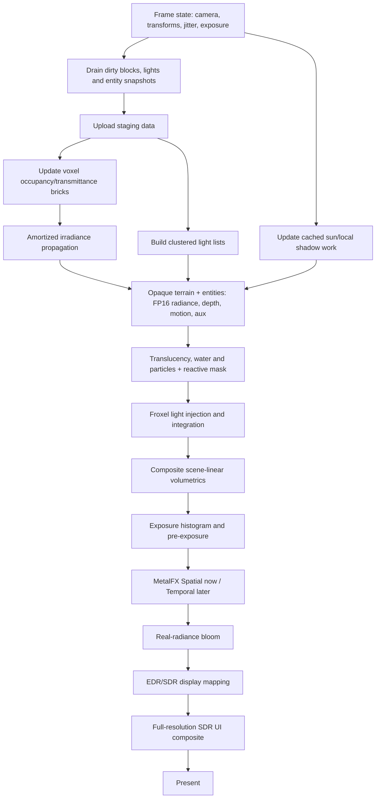

# Metallum: глобальный план нового освещения, HDR и temporal-ready renderer

Статус: целевая архитектура и поэтапный план реализации.

Целевая версия на момент составления: Minecraft Java 26.2, Fabric Loader 0.19.3, Sodium 0.9.1, Java 25.

Основная аппаратная точка контроля: Apple M1 Pro.

Минимальная программная база нативной части: Metal 3, macOS 14.

Iris: намеренно не является целью совместимости нового renderer.

Этот документ — источник правды для разработки нового освещения. Он описывает не только желаемые эффекты, но и контракты данных, frame graph, порядок миграции, ограничения по памяти и GPU-времени, тестовые сцены, fallback и критерии завершения каждого этапа.

Существующий [`recomendationsForUpscaler.md`](recomendationsForUpscaler.md) остаётся полезной исторической заметкой о spatial scaling, но решения о temporal pipeline, HDR и порядке постобработки определяются этим документом.

---

## 1. Итоговое архитектурное решение

Metallum должен развиваться как собственный renderer для Apple Silicon со следующей схемой:

1. Мир, сущности, жидкости и частицы продолжают растеризоваться как геометрия.
2. Прямой свет для всех типов геометрии считается одной системой clustered forward+.
3. Статический блоковый мир дополнительно представлен разреженными camera-centered voxel clipmaps.
4. Высокодетализированные воксели хранят геометрию, прозрачность и материал, но не плотное полноцветное освещение на том же разрешении.
5. Воксельная структура используется для локальных теней, ambient occlusion, непрямого цветного света и затенения объёмной среды.
6. Солнце и движущиеся сущности используют отдельную cached/clipmapped shadow-систему.
7. Объёмный воздух считается во froxel grid с temporal reprojection.
8. Весь мир до UI рендерится в scene-linear FP16 radiance.
9. HDR получает реальную рассчитанную яркость, а не восстанавливает её из SDR-подобного финального цвета.
10. Архитектура с первого этапа формирует depth, motion vectors, jitter, exposure и history-reset contract, даже пока фактически используется MetalFX Spatial.
11. В будущем MetalFX Temporal заменяет Spatial без перестройки освещения, HDR, GI и volumetrics.

Короткая формула целевого кадра:

```text
linear albedo × (direct light × shadow visibility + indirect irradiance)
+ emissive radiance
+ volumetric radiance
= scene-linear FP16 radiance
→ exposure analysis / pre-exposure
→ temporal upscale
→ bloom / display mapping
→ SDR UI composite
→ CAMetalLayer EDR/SDR
```

---

## 2. Цели и не-цели

### 2.1. Обязательные цели

- Цветные локальные источники света.
- Единое освещение terrain, block entities, обычных entities, items, particles и fluids.
- Тени от полных блоков, плит, ступеней, заборов и других `VoxelShape`.
- Стабильные тени от солнца и важных локальных источников.
- Цветной непрямой свет как минимум с одним приближённым bounce.
- Объёмный воздух, туман и видимые световые лучи.
- Scene-linear HDR с реальными значениями выше reference white.
- Отдельный резкий SDR-интерфейс.
- Высокий FPS на M1 Pro и масштабируемые quality tiers.
- Подготовка всех данных для MetalFX Temporal и динамического render resolution.
- Безопасный legacy fallback на время миграции.
- Детерминированная проверка GPU-значений и производительности.

### 2.2. Желательные цели после основного света

- Материалы с normal map, roughness, reflectance/metalness и точной emission.
- Более качественная вода, стекло, мокрые поверхности и отражения.
- Опциональный расширенный Display P3 output.
- Опциональные улучшения для M3+ без ухудшения M1 Pro path.
- Поддержка стандартных resource packs и собственного необязательного material extension.

### 2.3. Явные не-цели

- Iris и произвольные Iris shader packs.
- Полная динамическая вокселизация сущностей.
- Хранение полного `4×4×4` FP16 radiance для всей дистанции прорисовки.
- Традиционный многопроходный deferred G-buffer как основной renderer.
- Path tracing или hardware ray tracing как обязательный режим.
- Metal 4/macOS 26 как минимальная платформа.
- Удаление работающего legacy HDR до полного покрытия нового renderer.
- Большой предварительный рефакторинг нативной части без измеримого результата этапа.

---

## 3. Фактическая исходная точка проекта

План строится поверх уже работающего Metal backend, а не предполагает новый порт.

### 3.1. Что уже есть

- Нативный `CAMetalLayer` и Metal command pipeline.
- FP16 MainTarget, FP16 scene continuations и FP16 lightmap в HDR-режиме.
- Расширенный линейный sRGB output и live EDR headroom.
- Отдельный SDR UI target.
- Semantic HDR attachment с depth-aware проверкой.
- Histogram-based adaptive highlight reconstruction.
- Quarter-resolution FP16 emission/bloom и объединённый tiled compute blur.
- MetalFX Spatial с раздельными display/render dimensions.
- Детерминированные Java- и native-validation задачи.
- Подробные GPU timing stages и JSONL-отчёты.

Основные текущие точки входа:

- [`MetalDevice`](src/main/java/com/metallum/client/metal/render/MetalDevice.java) — устройство, HDR/EDR state, scene capture и MetalFX orchestration.
- [`MetalCommandEncoder`](src/main/java/com/metallum/client/metal/render/MetalCommandEncoder.java) — command-buffer и render-pass orchestration.
- [`MetalCrossShaderCompiler`](src/main/java/com/metallum/client/metal/render/MetalCrossShaderCompiler.java) — GLSL → SPIR-V → MSL и resource binding.
- [`MetalHdrFrame`](src/main/java/com/metallum/client/metal/render/MetalHdrFrame.java) — Java-side frame handoff для scene/UI.
- [`MetallumNative.swift`](src/main/native/MetallumNative.swift) — нативные pipelines, HDR, EDR, MetalFX и present.
- [`HdrUiRenderTarget`](src/main/java/com/metallum/client/hdr/HdrUiRenderTarget.java) — полноразмерный SDR UI.
- [`MetalFxSpatialScaling`](src/main/java/com/metallum/client/metalfx/MetalFxSpatialScaling.java) — текущая политика размеров и spatial presets.
- [`HdrPipelinePolicy`](src/main/java/com/metallum/client/hdr/HdrPipelinePolicy.java) и [`SceneLinearPreflightGate`](src/main/java/com/metallum/client/hdr/SceneLinearPreflightGate.java) — текущий атомарный shader/color contract.

### 3.2. Что в текущем HDR является переходным решением

Сейчас часть сцены лишь декодируется в linear RGB на границе записи в FP16 target. Texture sampling, lightmap multiplication, material composition и fog не гарантированно выполняются в линейном пространстве.

Текущий semantic attachment хранит силу/тип источника и глубину, а present shader на этой основе масштабирует уже готовый цвет. Histogram дополнительно определяет предполагаемый пик несемантических светлых областей. Это выдаёт настоящий EDR output, но не настоящий lighting radiance contract.

В новом renderer:

- `sceneColor` сам содержит реальную итоговую radiance;
- histogram управляет только exposure, а не создаёт недостающую яркость;
- semantic reconstruction остаётся только в legacy path;
- lightmap excess patch больше не участвует в новом lighting path;
- значения выше `1.0` возникают в освещении и emission до HDR compositor.

### 3.3. Ограничение текущего shader binding

Текущий общий compiler принимает uniform buffers, texel buffers и sampled 2D/cube textures. Для clustered lighting и voxel fields понадобятся storage buffers, дополнительные texture types и custom compute resources.

Это необходимо решить отдельным стабильным resource ABI. Нельзя внедрять voxel/cluster data через случайные свободные slots без versioning и validation.

### 3.4. Что нельзя сломать во время миграции

- Стабильный vanilla/Sodium render при выключенном новом renderer.
- EDR → SDR fallback.
- Текущий отдельный SDR UI.
- F2 SDR screenshots.
- MetalFX Spatial до готовности Temporal.
- Depth lifetime: если поздний проход загружает depth, предыдущий pass обязан сохранить attachment.
- Три кадра в полёте и корректное отложенное освобождение ресурсов.
- Никаких CPU waits между world, lighting, MetalFX и present.

---

## 4. Неподвижные принципы проектирования

### 4.1. Один световой контракт

Один источник имеет одинаковые position, radius, color, intensity и shadow policy для блоков, сущностей и объёма. Разные shaders могут использовать разные material BRDF, но не отдельные списки или шкалы света.

### 4.2. Воксели — ускоряющая структура, а не замена raster surface

Геометрия поверхности остаётся точной и текстурированной. Воксели отвечают за occupancy, transmittance, GI и часть visibility. Сущности могут семплировать voxel irradiance, не становясь вокселями.

### 4.3. Высокая геометрическая детализация не равна высокой radiance-детализации

`4×4×4` occupancy может быть упакован в 64 бита на блок. Полноцветный radiance на таком же разрешении недопустим по памяти. Irradiance всегда хранится грубее и обновляется реже.

### 4.4. Temporal identity является частью renderer с первого дня

Любой пиксель, entity, chunk brick, shadow page и history resource должен иметь понятный жизненный цикл между кадрами. Позднее добавление motion/history поверх уже готового GI почти гарантированно создаст ghosting и переделку frame graph.

### 4.5. Apple TBDR определяет стоимость pass boundaries

Предпочтение отдаётся:

- одному крупному raster pass вместо нескольких полноэкранных G-buffer passes;
- private GPU resources;
- threadgroup/tile memory;
- fused compute;
- dirty-region updates;
- минимальному числу store/load;
- отсутствию полных копий scene/depth без доказанной необходимости.

### 4.6. Новый и legacy contract не смешиваются в кадре

На старте renderer выбирает один режим:

- `LEGACY`: существующий pipeline и текущий HDR reconstruction;
- `METALLUM`: новый lighting/material/HDR contract целиком.

Если capability gate или shader coverage не пройдены, весь кадр остаётся legacy. Частично линейная сцена с частично legacy-материалами недопустима.

### 4.7. Каждый дорогой эффект имеет ограничитель работы

GI, shadow updates, voxel uploads и volumetrics получают budget на кадр. Chunk loading или телепортация не должны превращать очередь обновлений в неограниченный GPU spike.

---

## 5. Целевой frame graph



### 5.1. Порядок операций

1. Зафиксировать immutable `FrameState` для текущего submit.
2. Снять snapshot изменившихся блоков, источников и entity transforms без ожидания GPU.
3. Записать изменения в shared staging ring текущего in-flight slot.
4. Скопировать/развернуть данные в private voxel/light resources.
5. Выполнить ограниченное budget-ом обновление irradiance.
6. Построить cluster headers и light-index list.
7. Обновить только dirty/camera-exposed shadow regions.
8. Отрисовать opaque terrain и entities в низком render resolution.
9. Отрисовать поддерживаемую translucency и сформировать reactive/history mask.
10. Рассчитать и скомпозить froxel volumetrics в scene-linear radiance.
11. Передать scene color, depth, motion, exposure и reactive mask в выбранный scaler.
12. Из уже масштабированного FP16 scene color извлечь quarter-resolution bloom.
13. Выполнить exposure/display mapping в текущий EDR headroom.
14. Скомпозить полноразмерный SDR UI.
15. Present без CPU wait.

### 5.2. Почему bloom находится после upscale

Bloom — низкочастотный эффект, но включение готового размытия в temporal history может создавать длинные emissive trails. Базовый целевой порядок:

```text
sharp scene-linear world
→ temporal upscale
→ quarter-output-resolution bloom
→ display mapping
```

Если profiling покажет слишком высокую цену чтения upscaled scene, допускается альтернативный render-resolution bloom, но он должен иметь отдельную history/reactive policy. Решение принимается измерением, а не заранее.

### 5.3. Histogram/exposure

Histogram можно строить по render-resolution radiance до upscale. Он не должен повышать яркость выбранных пикселей. Его задачи:

- оценить сценовую экспозицию;
- стабильно адаптироваться между пещерой и дневным миром;
- предоставить `preExposure` для temporal scaler;
- немедленно учитывать падение доступного EDR headroom;
- не обучаться на SDR UI.

---

## 6. Базовые контракты данных

### 6.1. `FrameState`

Java и native стороны должны обмениваться versioned frame structure. Минимальные поля:

- `frameId` — монотонный 64-битный номер логического кадра;
- `submitIndex` и in-flight slot;
- render/display dimensions;
- текущая и предыдущая camera world position;
- текущие и предыдущие jittered view/projection matrices;
- текущие и предыдущие unjittered view/projection matrices;
- near/far или параметры reversed-Z reconstruction;
- jitter в render-pixel units;
- delta time с ограниченным диапазоном;
- current exposure и `preExposure`;
- текущий/потенциальный EDR headroom;
- world/dimension identity;
- camera cut/teleport/resize/reset flags;
- quality preset и feature mask.

`FrameState` становится immutable после начала encoding. Изменение настроек откладывается до границы следующего кадра, как сейчас откладывается resize MetalFX.

### 6.2. Координаты и точность

- GPU light/entity positions хранятся camera-relative в `float`.
- Абсолютные block/chunk coordinates остаются integer на CPU.
- Voxel clipmap origin привязан к brick boundaries.
- При смене dimension или большом teleport все temporal histories инвалидируются.
- Маленькое перемещение camera сдвигает toroidal clipmap, а не пересоздаёт его.

### 6.3. Scene color contract

- Рабочее пространство первой версии: linear sRGB.
- `1.0` — scene reference white, соответствующий SDR diffuse white до display mapping.
- Значения выше `1.0` разрешены и ожидаемы.
- RGB texture data декодируется из sRGB до lighting math.
- Alpha не проходит sRGB transfer function.
- Fog, blending, GI, volumetrics и bloom работают с linear values.
- Отрицательные значения после фильтров ограничиваются только в определённых границах pipeline, а NaN/Inf являются validation failure.
- Display P3 добавляется только с явным linear-sRGB → linear-P3 преобразованием.

Абсолютная физическая калибровка в lux/nits не требуется. Нужна стабильная относительная radiance scale, одинаковая для всех источников и материалов.

### 6.4. Основные frame attachments

| Ресурс | Базовый формат | Назначение | Lifetime |
|---|---|---|---|
| `sceneColor` | `RGBA16Float` | Scene-linear radiance | render → scaler |
| `sceneDepth` | `Depth32Float` | Reversed-Z depth | raster → scaler/effects |
| `sceneMotion` | `RG16Float` | Motion в render-pixel units | raster → temporal |
| `sceneReactive` | `R8Unorm` или формат, подтверждённый MetalFX | Выделенный reactive-mask input | raster → temporal |
| `sceneAux` | optional compact `RGBA8Unorm` | Material/emission/history flags для собственных эффектов | raster → post |
| `sceneUpscaled` | `RGBA16Float` | Spatial/temporal output | scaler → present |
| `uiColor` | `RGBA8Unorm` | Полноразмерный SDR UI | UI → present |
| `exposure` | 1×1 float/private buffer | Exposure/pre-exposure | histogram → temporal/present |

Полноразмерный normal/roughness G-buffer не является обязательным. Если будущий SSR/denoiser докажет необходимость, добавляется отдельный optional attachment и измеряется его store/load стоимость. `sceneReactive` не следует заранее упаковывать в `sceneAux`: Temporal scaler получает отдельную texture с форматом и usage, которые сообщает фактический MetalFX descriptor. Объединение допустимо только после runtime/API validation.

`sceneAux` не должен повторять нынешнюю packed semantic depth. В новом renderer actual depth уже является частью frame contract. Для специальных offscreen/translucent contributions применяется явный depth-aware composite.

### 6.5. `GpuLight`

Концептуальная запись источника:

```text
position.xyz, radius
linearColor.rgb, intensity
direction.xyz, type
spotAngles / shape parameters
shadowIndex, flags, stableLightId, generation
volumetricStrength, indirectStrength
```

Точный packing выбирается после alignment/throughput validation. Требования:

- 16-byte alignment;
- camera-relative position;
- stable ID для temporal и shadow cache;
- generation для безопасного переиспользования slot;
- отдельные флаги shadow/GI/volumetric;
- ограниченный максимальный GPU count;
- overflow counter вместо выхода за buffer;
- deterministic light priority при переполнении.

### 6.6. `MaterialDescriptor`

Минимальный material contract:

- base color/albedo;
- alpha mode: opaque, cutout, translucent, additive;
- normal source;
- roughness;
- dielectric F0 или metalness policy;
- emissive RGB scale;
- transmittance/absorption;
- foliage/two-sided flags;
- water/lava/special-medium flags;
- receives/casts shadow flags;
- reactive/history behavior.

Стандартный resource pack без дополнительных карт получает детерминированные defaults. Новый renderer не должен требовать PBR resource pack, чтобы выглядеть корректно.

### 6.7. Temporal contract

Для каждого rasterized объекта нужны current и previous transforms. Для terrain previous transform обычно совпадает с current, кроме сдвига camera origin и изменения geometry generation.

History reset обязателен при:

- resize или смене render scale вне разрешённого dynamic range;
- смене dimension/world;
- teleport/camera cut;
- FOV discontinuity;
- смене scaler mode;
- пересоздании MainTarget;
- изменении color/depth/motion format;
- shader/material ABI change;
- потере корректного previous transform;
- значительном скачке exposure, который нельзя компенсировать pre-exposure.

Reactive mask обязательно отмечает:

- воду и другие сложные refractive surfaces;
- быстро меняющуюся translucency;
- частицы без надёжных motion vectors;
- portal/end effects;
- emissive flicker, если он вызывает history trails;
- newly revealed geometry;
- изменившиеся voxel/GI regions при большой разнице radiance.

---

## 7. Извлечение света из Minecraft

### 7.1. Статические block lights

Нельзя сканировать все блоки вокруг камеры каждый кадр. Источники формируются во время:

- chunk mesh build/rebuild;
- block-state change;
- chunk load/unload;
- resource/material reload.

Для каждого block emitter сохраняются:

- block position;
- vanilla light emission как fallback intensity;
- собственный RGB/intensity override, если материал его задаёт;
- shape/area approximation;
- участие в volumetrics и GI;
- stable ID, производный от dimension + block position + generation.

### 7.2. Динамические lights

Динамический snapshot строится один раз на кадр из:

- emissive entities;
- held items;
- projectiles/effects;
- lightning;
- временных модовых источников;
- camera/player-attached lights.

Java формирует компактный список, native code выполняет upload и cluster culling. Никаких FFM-вызовов на один источник: только batch structure или shared staging buffer.

### 7.3. Sun/sky

Солнце является directional source с отдельной shadow policy. Sky/ambient нельзя представлять тысячами lights. Нужны:

- directional sun/moon radiance;
- sky irradiance approximation;
- weather/time-of-day параметры;
- dimension-specific environment profile;
- плавная exposure policy без изменения физической интенсивности источников.

Nether, End, underwater и пользовательские dimensions используют явный environment descriptor, а не набор разрозненных shader special cases.

### 7.4. Fabric/Mixin integration discipline

Точные injection points для Minecraft 26.2 должны быть повторно проверены по исходникам перед реализацией каждого mixin. Ответственности разделяются:

- frame boundary и camera state;
- chunk build/light extraction;
- block update/unload queue;
- entity current/previous transforms;
- render-role/material classification;
- resource reload;
- world/dimension reset.

Mixin не должен выполнять тяжёлую вокселизацию или GPU upload внутри block update callback. Callback только записывает компактное событие в bounded queue.

---

## 8. Clustered forward+ direct lighting

### 8.1. Cluster grid

Начальная гипотеза для профилирования:

- tile: `16×16` render pixels;
- 24–32 logarithmic Z slices;
- cluster headers: offset + count;
- общий compact light-index buffer;
- отдельный overflow/statistics buffer.

Это не финальные константы. Они выбираются по:

- среднему и p99 lights per cluster;
- стоимости cluster build;
- fragment loop occupancy;
- памяти index list;
- качеству в пещерах и на большой дистанции.

### 8.2. Build algorithm

1. Очистить только headers/counters текущего in-flight slot.
2. Для каждого light вычислить screen-space bounds и Z range.
3. Записать light в пересекаемые clusters.
4. Ограничить count и детерминированно выбрать наиболее значимые lights при overflow.
5. Сохранить counters для telemetry.

На раннем этапе допустим двухпроходный count/prefix/fill compute. После корректности измерить one-pass/atomic или tile-local варианты.

### 8.3. Surface shading

Opaque terrain и entities читают один и тот же cluster list. Fragment shader:

1. Восстанавливает cluster index.
2. Берёт material parameters.
3. Считает direct BRDF для lights кластера.
4. Для ограниченного числа shadowed lights получает visibility.
5. Добавляет voxel irradiance.
6. Добавляет emission.
7. Пишет итоговый FP16 radiance, motion и aux flags.

### 8.4. Ограничение shadowed lights

Нельзя выполнять длинный voxel traversal для каждого источника каждого пикселя. На cluster или surface выбираются:

- sun;
- ближайший/самый яркий локальный shadowed light;
- дополнительный shadowed light только на высоком preset;
- остальные lights считаются без дорогой visibility или с дешёвой occlusion approximation.

---

## 9. Материалы и линейный shading

### 9.1. Первая версия

Первая рабочая material model должна быть небольшой:

- Lambert или energy-conserving diffuse;
- простая GGX specular;
- dielectric default;
- optional metalness;
- normal mapping при наличии;
- exact linear RGB emission;
- alpha/cutout/transmission policies.

Сложные clear coat, anisotropy и subsurface не добавляются до стабилизации основного света.

### 9.2. Vanilla-preserving defaults

Minecraft должен оставаться узнаваемым. Без PBR-карт:

- roughness задаётся по material class;
- большинство блоков dielectric;
- metalness используется только для явно металлических материалов;
- normal остаётся геометрической;
- emission берётся из block/entity semantics;
- albedo не должен одновременно содержать запечённое сильное освещение и получать физический direct light без коррекции.

### 9.3. Resource pack extension

Позднее определяется документированный Metallum material layout. Он должен быть необязательным и versioned. Если будет полезно, можно импортировать распространённые PBR conventions отдельно от Iris, но внутренний GPU ABI остаётся собственным.

---

## 10. Воксельное представление мира

### 10.1. Разделение полей

Минимально нужны:

1. `occupancy` — консервативное покрытие геометрией;
2. `transmittance/material class` — стекло, листья, вода и другие частичные среды;
3. `irradiance` — более грубый непрямой RGB-свет;
4. optional `directionality/validity` — dominant direction и temporal confidence.

### 10.2. Sub-block encoding

Ближний уровень использует configurable subdivision:

- `1×`: один occupancy sample на блок;
- `2×`: 8 samples, можно упаковать в 1 байт;
- `4×`: 64 samples, можно упаковать в 64 бита.

`VoxelShape` консервативно пересекается с subcells. Для тонких panes/fences допускается coverage/transmittance, чтобы тень не становилась физически толще формы.

### 10.3. Clipmap layout

- Camera-centered toroidal levels.
- Origin выровнен по brick boundary.
- Сдвиг камеры обновляет только открывшиеся slabs.
- Chunk unload очищает соответствующие generations.
- Dirty block updates группируются в bricks.
- Near occupancy имеет высокое разрешение.
- Mid/far occupancy и irradiance постепенно грубеют.

Стартовый исследовательский вариант: near occupancy шириной около 64 блоков при `4×`, то есть логическая сетка `256³`. В битовом виде это около 2 MiB до material/transmittance metadata. Хранить `RGBA16Float` radiance той же сетки нельзя: один такой buffer занял бы около 128 MiB без ping-pong и mip levels.

### 10.4. Brick storage

Первая реализация может использовать плотный фиксированный clipmap для простоты и проверки. После доказательства качества:

- sparse brick pool;
- indirection table;
- bounded free list;
- generation counters;
- optional sparse texture residency только после feature/runtime validation.

Нельзя начинать сразу со сложной sparse residency: сначала нужна корректная адресация, scrolling и invalidation.

### 10.5. Update pipeline

1. Java queue принимает block/chunk events.
2. CPU worker кодирует `VoxelShape` и material class в compact brick patches.
3. Shared staging ring принимает batch.
4. GPU compute/blit обновляет private occupancy resources.
5. Dirty irradiance queue получает затронутые bricks и соседей.
6. На кадр обрабатывается ограниченное число propagation jobs.

Chunk generation не должна блокировать render thread ожиданием полного GI. Новая область сначала получает безопасный ambient fallback, затем уточняется.

---

## 11. Тени

### 11.1. Солнце

Эволюция sun shadows:

1. Обычная 2–3 cascade shadow map для проверки интеграции и bias.
2. Разделение static terrain и dynamic entities.
3. Cached/clipmapped static shadow regions.
4. Обновление только dirty pages/slabs.
5. Высокочастотный ближний dynamic layer.

Переход к virtual/sparse shadow pages допускается только после измерения обычных cached cascades. M1 Pro остаётся базовой точкой.

### 11.2. Локальные block lights

Статическая геометрия мира затеняет local lights через occupancy traversal:

- DDA для ближайших точных rays;
- ограничение максимальных steps;
- coarse-level stepping на расстоянии;
- early exit на opaque occupancy;
- накопление transmittance для стекла/листьев;
- quality-dependent softening.

### 11.3. Движущиеся сущности

Сущности не пишутся в постоянный voxel clipmap. Они:

- участвуют в sun shadow dynamic layer;
- могут использовать ограниченный local-light shadow atlas;
- на Performance получают capsule/proxy contact shadow;
- получают тени от блоков и voxel GI как обычные raster surfaces.

### 11.4. Bias и фильтрация

Для каждого shadow path нужны автоматические validation scenes:

- acne на плоской поверхности;
- peter-panning у ног entity;
- ступени и плиты;
- тонкий забор;
- листья и стекло;
- большая координата мира;
- движение камеры через cascade boundary.

Stochastic soft shadows не добавляются до стабильной temporal reprojection.

---

## 12. Непрямой цветной свет

### 12.1. Первая цель

Первый GI должен быть diffuse-only, один bounce, без glossy cone tracing. Он обязан:

- окрашивать соседние поверхности от яркого цветного источника;
- не протекать через обычную стену толщиной в блок;
- стабильно обновляться при установке/удалении блока;
- не давать вспышек при chunk load;
- иметь ограниченную задержку обновления;
- одинаково освещать terrain и entities.

### 12.2. Injection

В irradiance field инжектируются:

- sun/sky contribution;
- block emission;
- выбранные динамические lights с ограниченным радиусом;
- отражённый цвет поверхности.

Динамические источники не должны каждый кадр полностью перестраивать поле. Используются dirty regions, temporal decay и ограниченный work queue.

### 12.3. Propagation

Начать с небольшого числа compute iterations на dirty bricks. Требования:

- ping-pong или безопасный wavefront update;
- не читать и писать конфликтующие значения без явного порядка;
- threadgroup tiling;
- border halo;
- temporal validity;
- отдельная скорость появления и исчезновения света, чтобы не оставлять длинный ghost trail.

Raster shading всегда читает последнюю полностью завершённую irradiance generation. Propagation записывает следующую generation, а swap выполняется только на границе кадра после завершения зависимостей. Частично обновлённое поле не должно быть видимо поверхности.

Voxel cone tracing рассматривается только после измерения простого irradiance propagation. Оно может стать Ultra path для более направленного GI, но не базовой зависимостью.

### 12.4. Sampling surfaces

- Несколько trilinear samples вокруг surface normal.
- Visibility/normal weighting для снижения light leaking.
- Fallback sky/ambient при invalid brick.
- History confidence для плавного перехода после update.
- Entity sampling использует ту же функцию и world position.

---

## 13. Froxel volumetrics

### 13.1. Представление

Начальная гипотеза:

- XY resolution: примерно `renderWidth/8 × renderHeight/8`;
- 48–64 logarithmic depth slices;
- FP16 scattering/extinction;
- отдельная history texture;
- quality presets меняют XY scale, Z slices и количество lights.

### 13.2. Проходы

1. Построить density/extinction для воздуха, воды, погоды и dimension profile.
2. Внедрить clustered direct lighting.
3. Получить sun/local shadow visibility через shadow/voxel data.
4. Добавить low-frequency voxel irradiance при наличии бюджета.
5. Интегрировать scattering вдоль Z.
6. Reproject history.
7. Depth-aware composite в scene-linear color.

После корректности проверить объединение injection/integration или tile-local варианты. До измерения проходы остаются логически раздельными для простоты validation.

### 13.3. Temporal правила

- Camera reprojection использует unjittered matrices.
- Newly exposed froxels сбрасывают history.
- Изменение density/weather уменьшает history weight.
- Быстрый light flicker не должен оставлять луч в воздухе после исчезновения.
- Teleport/dimension change полностью очищает volume history.

---

## 14. Transparency, water и particles

Transparency является главным источником temporal artefacts и не должна оставаться «последней мелочью».

### 14.1. Категории

- Cutout terrain: opaque path с alpha test и motion.
- Простая alpha translucency: low-resolution scene до upscale, approximate motion + reactive mask.
- Water/glass refraction: отдельный material path, depth-aware sampling и высокий reactive weight.
- Additive particles: до upscale, exact/approximate motion или полный reactive reset.
- Screen-space overlays и UI: после upscale.

### 14.2. Reactive mask

MetalFX Temporal поддерживает reactive mask, поэтому формат и attachment резервируются заранее. Даже пока активен Spatial, mask генерируется в diagnostic mode и проверяется на тестовых сценах.

### 14.3. Order-independent transparency

Apple imageblocks потенциально позволяют tile-local OIT, но это отдельная поздняя оптимизация. Базовый план не зависит от OIT. Сначала сохраняется корректный Minecraft ordering и измеряется реальная проблема.

---

## 15. Настоящий HDR

### 15.1. Новый принцип

HDR не решает, какой объект «должен быть ярким». Lighting/material pipeline уже выдаёт scene-linear radiance.

Пример внутренней шкалы, а не жёсткие финальные константы:

```text
dark cave surface       < 0.05
ordinary diffuse         0.1–1.0
bright cloud/snow        около или выше 1.0
torch/lava emission      несколько единиц
sun disc                 заметно выше diffuse white
```

Точные intensities калибруются по reference scenes, но остаются стабильными между SDR и HDR. SDR просто отображает ту же сцену меньшим headroom.

### 15.2. Что сохраняется

- FP16 scene targets.
- Live current/potential EDR headroom.
- `RGBA16Float` CAMetalLayer в EDR.
- App-controlled tone/display mapping.
- Отдельный SDR UI.
- Quarter-resolution bloom compute design.
- Безопасный SDR fallback.
- Diagnostic EDR patterns.

### 15.3. Что прекращается в новом path

- Scene-wide inferred highlight peak как способ создать яркость.
- Semantic strength как замена emission radiance.
- Lightmap excess compression.
- Финальная sRGB→linear декодировка shaders, которые уже работают linear end-to-end.
- Материально-зависимое усиление после завершения lighting.

### 15.4. Bloom

Bloom seed строится из actual scene radiance:

- threshold относительно reference white и exposure;
- цвет берётся из FP16 scene, а не из отдельного SDR marker;
- optional `sceneAux` может использоваться для диагностики и material classification до upscale, но базовый bloom не зависит от него и не изобретает интенсивность;
- coverage weighting сохраняется;
- bright reflected highlights тоже могут bloom, если реально превышают threshold.

### 15.5. Exposure и EDR headroom

Lighting intensity не меняется при переносе окна между дисплеями. Меняется только display mapping.

- Headroom падает — tone mapper немедленно ограничивает output.
- Exposure адаптируется плавно.
- UI остаётся SDR.
- Histogram не включает UI.
- Temporal scaler получает согласованные exposure/preExposure.

### 15.6. Display P3

Первая версия остаётся linear sRGB. Позднее:

1. Добавить точное linear-sRGB → linear-Display-P3 преобразование.
2. Изменить layer colorspace на extended linear Display P3.
3. Добавить gamut mapping для насыщенных emissive lights.
4. Проверить SDR screenshots и внешние дисплеи.

Менять только label colorspace без преобразования данных запрещено.

---

## 16. Temporal-ready архитектура и будущий MetalFX Temporal

### 16.1. Что реализуется заранее

До включения Temporal должны уже существовать:

- `FrameState` с current/previous matrices;
- Halton или другая детерминированная jitter sequence;
- jittered projection только для world render;
- unjittered matrices для culling, shadow stability и UI;
- per-pixel motion vectors;
- depth contract и `depthReversed=true`;
- exposure texture/preExposure;
- reactive mask;
- reset policy;
- previous transforms для entities;
- dynamic render-content dimensions;
- полноразмерный private FP16 scaler output;
- UI после upscale.

### 16.2. Motion vector convention

До написания всех shaders фиксируется и GPU-тестируется единая convention:

- единицы: render pixels;
- направление: current pixel → previous pixel либо наоборот, строго по MetalFX contract;
- scale X/Y передаётся явно;
- jitter удаляется/учитывается ровно один раз;
- Y orientation проверяется diagnostic pattern;
- stationary camera/static geometry дают нулевое движение с допустимой погрешностью;
- entity motion включает current/previous model transform;
- skinned/animated geometry получает как минимум rigid proxy, затем точные previous vertices при необходимости.

### 16.3. Temporal scaler resources

MetalFX descriptor создаётся не на кадр, а при изменении:

- device;
- максимального input/output размера;
- texture formats;
- reactive-mask enablement;
- dynamic-resolution range.

На кадр устанавливаются:

- color texture;
- depth texture;
- motion texture;
- reactive mask;
- exposure texture/preExposure;
- jitter offsets;
- actual input-content width/height;
- reset flag;
- private output texture.

### 16.4. HDR и Temporal

Предпочтительный path:

```text
pre-exposed scene-linear FP16
→ MetalFX Temporal FP16
→ restore exposure if required
→ bloom
→ EDR display mapping
```

Перед включением требуется native GPU validation, что выбранные FP16 formats и диапазон значений сохраняются без clamp/NaN и без изменения orientation. Если MetalFX требует ограниченного диапазона, используется согласованный preExposure, а не tone mapping до scaler.

### 16.5. Dynamic resolution

После Temporal можно добавить controller, использующий GPU p95:

- изменяет input content scale плавно;
- не пересоздаёт scaler при каждом небольшом изменении, если descriptor поддерживает range;
- округляет размеры согласно фактическим требованиям MetalFX;
- имеет hysteresis;
- не реагирует на единичный spike;
- сбрасывает history только когда API/формат действительно требует;
- сохраняет display-resolution UI.

### 16.6. Spatial fallback

Spatial остаётся fallback для:

- отсутствия Temporal support;
- failure при создании scaler;
- diagnostic comparison;
- временно неподдерживаемых motion/depth formats;
- безопасного восстановления после runtime error.

Fallback переключается на границе кадра с resize/reset, не во время encoding.

---

## 17. Metal-native организация

### 17.1. Target policy

- Основной API: Metal 3/macOS 14.
- Runtime capability checks обязательны.
- Metal 4 enhancements изолированы и необязательны.
- M1 Pro должен проходить все correctness tests и иметь рабочие presets.
- M3+ может получить отдельные optional RT/denoised features позже.

### 17.2. Native shaders

Большой lighting renderer не должен бесконечно расширять embedded MSL string.

Целевое состояние:

```text
src/main/native/
  MetallumNative.swift              # стабильные C ABI exports
  runtime/                           # state/resources/encoders, выделяются по мере работы
  shaders/
    Common.metal
    ClusterBuild.metal
    VoxelUpdate.metal
    VoxelLighting.metal
    Shadows.metal
    Volumetrics.metal
    HdrPresent.metal
    TemporalSupport.metal
```

MSL собирается Gradle-задачей в generated `.metallib`, а не записывается в `src/main/resources` во время build. Debug runtime compilation может оставаться диагностическим fallback. Production не должен компилировать весь lighting library в первом игровом кадре.

Не требуется предварительно дробить весь существующий `MetallumNative.swift`. Код переносится в отдельный файл только когда соответствующая подсистема реально изменяется и покрыта тестами.

### 17.3. Resource allocation

- Persistent clipmaps/shadow caches живут на device lifetime.
- Resolution-dependent targets живут на renderer-size generation.
- History resources имеют explicit generation и reset.
- Per-frame staging использует bounded ring по числу in-flight frames.
- Основные GPU-only textures/buffers используют `.private`.
- Shared memory используется только для CPU→GPU staging/readback/telemetry.
- Временные ресурсы переиспользуются через workspace/heaps после профилирования lifetime.

### 17.4. Synchronization

- Никакого `waitUntilCompleted` в обычном кадре.
- Один command buffer предпочтителен, пока он не создаёт доказанную проблему scheduling.
- Fences/events используются только для реальной зависимости.
- Store/load attachments определяются фактическим последующим чтением.
- Cross-pass dependencies документируются в frame graph.
- Compute updates не должны перезаписывать resource, который читает незавершённый in-flight frame.

### 17.5. Pipeline variants

Варианты создаются по небольшому feature key:

- material class;
- alpha mode;
- shadow receive mode;
- voxel GI on/off;
- motion output on/off только для legacy/fallback, в новом mode motion обычно всегда включён;
- quality specialization constants.

Нельзя создавать комбинаторный PSO explosion. Предсказуемые variants prewarm после capability gate; остальные компилируются вне горячего draw path или имеют безопасный fallback.

### 17.6. Tile shaders

Tile/imageblock path является оптимизацией, не архитектурной зависимостью. Кандидаты:

- tile-local light culling;
- compact material auxiliary data;
- OIT;
- локальное объединение lighting/composite.

Он добавляется только если GPU capture/timestamps показывают выгоду относительно compute-built clusters на M1 Pro.

---

## 18. Java/Fabric структура нового кода

Предлагаемая ответственность packages:

```text
com.metallum.client.renderer
  RendererMode / RendererCapabilityGate / FrameState

com.metallum.client.lighting
  LightRegistry / LightSnapshot / LightExtractor / LightingConfig

com.metallum.client.material
  MaterialRegistry / MaterialDescriptor / MaterialReloadListener

com.metallum.client.voxel
  VoxelShapeEncoder / VoxelDirtyQueue / VoxelClipmapController

com.metallum.client.temporal
  TemporalFrameState / MotionHistory / HistoryResetReason

com.metallum.client.metal.render
  существующий backend и resource wrappers

com.metallum.client.metal.render.bridge
  versioned batch/native ABI
```

Правила:

- Java определяет Minecraft semantics и формирует batch snapshots.
- Native Swift/Metal владеет GPU resources и encoding.
- Никаких FFM calls на отдельный block/light/entity.
- Все ABI structs имеют version/size checks.
- Renderer shutdown/world unload освобождает state в безопасном порядке.
- Resource reload создаёт новую generation и не мутирует используемые GPU tables.

---

## 19. Конфигурация и quality tiers

Новый lighting config лучше отделить от существующих HDR/MetalFX файлов на время миграции, например `metallum-renderer.properties`. После стабилизации возможна аккуратная консолидация с migration code.

Минимальные настройки:

```properties
renderer=legacy
lightingPreset=balanced
voxelResolution=auto
indirectLighting=true
volumetrics=true
shadowQuality=balanced
upscaler=spatial
dynamicResolution=false
```

По умолчанию до завершения всех coverage gates остаётся `renderer=legacy`.

### 19.1. Предварительные presets

| Параметр | Performance | Balanced | Ultra |
|---|---|---|---|
| Цель | высокий 90–120 FPS | качество при 60–90 FPS | максимум при 60 FPS |
| Near occupancy | `2×`, optional short `4×` | `4×` ограниченного радиуса | `4×` большего радиуса |
| Irradiance | грубый, 1 bounce | 1 bounce, больше levels | больше levels/iterations |
| Sun shadows | 2 cached levels | 3 cached levels | 3–4 levels |
| Local shadowed lights | 1 важный | 1–2 | 2+ по budget |
| Froxels | примерно 1/12–1/8 XY | примерно 1/8 XY | примерно 1/6–1/8 XY |
| Temporal scale | агрессивный | умеренный | качество/native-like |
| Optional SSR/normal buffer | off | optional | on после profiling |

Все числа являются стартовыми гипотезами. Финальные значения фиксируются только после benchmark matrix.

---

## 20. Производительность и память

### 20.1. Frame targets

- Performance: стремиться к GPU p95 ≤ 8.33 ms с Temporal/dynamic resolution.
- Balanced: GPU p95 ≤ 11.1–16.67 ms в зависимости от выбранной FPS-цели.
- Ultra: GPU p95 ≤ 16.67 ms.

Это цели всего кадра, а не отдельных новых эффектов.

### 20.2. Первичные stage budgets

После этапа baseline они пересчитываются по реальным captures. Начальные пределы для M1 Pro при сниженном render resolution:

| Stage | Предварительный p95 budget |
|---|---:|
| Cluster build | ≤ 0.25 ms |
| Voxel dirty upload/update в обычном кадре | ≤ 0.50 ms |
| Voxel update spike после движения/изменений | ≤ 1.50 ms |
| Cached sun shadow update | ≤ 1.25 ms |
| GI propagation | ≤ 1.50 ms |
| Volumetrics | ≤ 1.25 ms |
| Scaler + HDR mapping + bloom | ≤ 1.75 ms |

Эти значения — engineering gates, а не обещание текущей реализации. Если baseline показывает другую реальность, таблица обновляется до начала соответствующего этапа.

### 20.3. Persistent memory budgets

Дополнительная память нового renderer сверх текущих world/UI targets:

- Performance: ориентир ≤ 192 MiB;
- Balanced: ориентир ≤ 256 MiB;
- Ultra: ориентир ≤ 384 MiB.

В отчёт включаются:

- occupancy/transmittance;
- irradiance ping-pong/history;
- shadow caches;
- clusters/light buffers;
- froxels/history;
- temporal attachments;
- scaler output;
- work queues и staging.

Если resource существует только ради редкой диагностики, он не должен постоянно занимать production memory.

### 20.4. CPU budgets

- Никакого полного world scan на кадр.
- Никакого создания объектов на каждый visible light/block в render hot path.
- Chunk voxel encoding выполняется worker-ом или во время уже существующей rebuild работы.
- Render thread только фиксирует snapshots и batch handles.
- Очереди bounded; overflow приводит к coarse rebuild/fallback, а не unlimited growth.

---

## 21. Telemetry и диагностика

Существующие IDs `MetalGpuTimingStage` нельзя перенумеровывать. Новые stages добавляются после текущего ABI диапазона:

- light upload/cluster build;
- voxel upload;
- voxel propagation;
- sun shadow;
- local shadow;
- volumetric injection;
- volumetric integration/composite;
- temporal scaler;
- optional reflections.

JSONL report расширяется полями:

- renderer mode и preset;
- render/display dimensions;
- light count;
- cluster p50/p95/p99 и overflow;
- dirty voxel bricks submitted/remaining;
- oldest dirty-brick age;
- GI jobs completed/queued;
- shadow pages updated/reused;
- froxel dimensions;
- history resets с reason;
- temporal reactive coverage;
- persistent/transient memory estimate;
- exposure/preExposure/headroom;
- scaler type и actual input scale.

Diagnostic overlays:

- cluster heat map;
- shadow cache residency;
- occupancy/clipmap levels;
- irradiance validity;
- froxel slices;
- motion vectors;
- reactive mask;
- HDR false-color radiance;
- exposure/headroom graph.

---

## 22. Поэтапная реализация

Каждый этап завершается отдельным небольшим коммитом или серией checkpoint-коммитов. Переход к следующему этапу запрещён без exit criteria текущего.

### Этап 0. Baseline, feature gates и эталонные сцены

#### Работы

- Зафиксировать native-resolution и MetalFX Spatial timings текущего HEAD.
- Добавить `RendererMode.LEGACY/METALLUM` и capability gate без изменения картинки.
- Определить versioned `FrameState`/native ABI на бумаге и в unit tests.
- Создать набор ручных test worlds/scenes.
- Зафиксировать screenshots и HDR numeric probes.
- Добавить renderer/preset поля в timing report.

#### Exit criteria

- Legacy output побитово/визуально не изменился в допустимых пределах.
- Все существующие Gradle/native validations проходят.
- Есть p50/p95/p99 baseline минимум для native, Spatial Quality и Spatial Performance.
- Новый mode безопасно отказывает и возвращается в legacy.

#### Rollback

Удаление feature gate полностью возвращает прежнее поведение; никаких новых permanent resources.

### Этап 1. Frame contract и temporal data без Temporal scaler

#### Работы

- Реализовать immutable `FrameState`.
- Добавить current/previous camera matrices и frame IDs.
- Добавить jitter sequence, пока с diagnostic/zero-amplitude режимом.
- Зарезервировать motion/reactive attachments в новом renderer mode.
- Реализовать history reset reasons.
- Добавить native capability query для Temporal/reactive mask/formats.
- Начать выделять MSL shader files и generated metallib только для нового кода.

#### Exit criteria

- Static scene motion равен нулю.
- Camera/entity motion проходит orientation/scale GPU tests.
- Resize, teleport и dimension change дают ровно один корректный reset.
- Spatial path продолжает работать.
- UI не получает jitter.

### Этап 2. Полностью scene-linear material/HDR path

#### Работы

- Ввести `METALLUM` shader/material flavor.
- Перевести texture sampling, albedo multiplication, fog и blending нового path в linear contract.
- Писать actual FP16 scene radiance.
- Перевести emission на явную линейную шкалу.
- Перестроить histogram как exposure-only.
- Извлекать bloom из actual radiance.
- Отключить inferred reconstruction только в новом mode.
- Сохранить текущий semantic HDR целиком в legacy mode.

#### Exit criteria

- Reference white, emission и headroom проходят numeric GPU validation.
- Нет double decode/encode.
- SDR и EDR используют одну сценовую radiance, различается только mapping.
- UI остаётся SDR и визуально совпадает с legacy.
- Unsupported shader role атомарно блокирует новый mode.

### Этап 3. Light registry и clustered forward+

#### Работы

- Реализовать static/dynamic light extraction.
- Добавить batch GPU light upload.
- Расширить native resource ABI.
- Реализовать cluster count/prefix/fill.
- Подключить terrain и entities к одному direct-light shader.
- Добавить цветные block lights.
- Добавить cluster telemetry/overflow fallback.

#### Exit criteria

- Одинаковый источник одинаково освещает блок и entity.
- Нет visible discontinuity между соседними clusters.
- Overflow детерминирован и не повреждает память.
- Cluster stage укладывается в обновлённый budget.
- Legacy lightmap path не затронут при выключенном renderer.

### Этап 4. Sun/sky и первые тени

#### Работы

- Ввести environment descriptor.
- Реализовать directional sun/moon и sky irradiance.
- Добавить 2–3 cascade sun shadow map.
- Terrain и entities участвуют в одном shadow contract.
- Стабилизировать cascades относительно camera.
- Добавить PCF/bias controls и shadow timings.

#### Exit criteria

- Нет неприемлемого acne/peter-panning в reference scenes.
- Плиты, ступени и заборы дают детальную sun shadow.
- Entity self/cast shadow стабилен.
- Cascade boundaries не заметны при обычном движении.

### Этап 5. Sub-block voxel occupancy

#### Работы

- Реализовать `VoxelShapeEncoder` для `1×/2×/4×`.
- Добавить block/chunk dirty queues.
- Реализовать camera-centered toroidal clipmap.
- Добавить occupancy/transmittance/material classes.
- Добавить debug visualization.
- Ограничить upload/update budget.

#### Exit criteria

- Slab/stairs/fence shapes совпадают с reference masks.
- Glass/leaves не становятся полностью opaque.
- Camera scrolling не очищает весь clipmap.
- Chunk load/unload не оставляет stale geometry.
- Очередь не растёт бесконечно при быстром полёте.

### Этап 6. Local voxel shadows и cached sun shadows

#### Работы

- Реализовать DDA/coarse traversal.
- Подключить важные local shadowed lights.
- Добавить transmittance accumulation.
- Разделить static/dynamic sun shadow updates.
- Добавить cache invalidation от block changes.
- Добавить entity local-shadow atlas/proxy path.

#### Exit criteria

- Torch shadow от fence/slab соответствует occupancy resolution.
- Удаление блока обновляет тень в ограниченное время.
- Static camera/world переиспользует shadow cache.
- Local shadow count не создаёт unbounded fragment loop.

### Этап 7. Voxel indirect lighting

#### Работы

- Создать coarse irradiance levels.
- Инжектировать sun/sky/block emission.
- Реализовать budgeted propagation.
- Добавить surface/entity sampling.
- Добавить temporal validity и leak-reduction.
- Добавить GI telemetry и diagnostic view.

#### Exit criteria

- Один цветной bounce виден и численно стабилен.
- Свет не проходит через обычную непрозрачную стену.
- Установка/удаление света не оставляет бесконечный ghost.
- Entity получает тот же indirect field, что соседний terrain.
- Chunk load не вызывает яркой вспышки.

### Этап 8. Froxel volumetrics

#### Работы

- Density profiles воздуха/воды/погоды/dimensions.
- Clustered light injection.
- Sun/local shadow visibility.
- Z integration и scene-linear composite.
- Temporal reprojection и reset.
- Quality presets и timings.

#### Exit criteria

- Sun shafts правильно скрываются геометрией.
- Цветной источник окрашивает воздух без заметной tile/cluster границы.
- Нет длинных trails после движения света.
- Underwater/Nether/End имеют отдельные контролируемые profiles.

### Этап 9. Материалы, вода и отражения

#### Работы

- GGX/roughness/normal maps.
- Корректная water/glass transmission.
- Wetness/weather material response.
- Reflection probes и optional SSR.
- Reactive/motion policy для каждого translucent path.
- Optional material resource-pack extension.

#### Exit criteria

- Без PBR pack vanilla textures выглядят корректно.
- Вода не разрушает temporal history вокруг границ.
- SSR имеет probe/fallback и не является обязательным для света.
- Дополнительные attachments оправданы timing capture.

### Этап 10. MetalFX Temporal и dynamic resolution

#### Работы

- Создать persistent `MTLFXTemporalScaler`.
- Подать color/depth/motion/reactive/exposure/jitter/reset.
- Проверить FP16 HDR range и orientation.
- Переместить bloom в утверждённое post-upscale место.
- Добавить comparison benchmark Spatial vs Temporal.
- Добавить dynamic-resolution controller после стабильного fixed-scale Temporal.

#### Exit criteria

- Static detail стабильнее Spatial при меньшем input resolution.
- Нет systematic ghosting entities/water/particles.
- HDR values не clamp и не меняют hue.
- UI остаётся native-resolution.
- Runtime failure возвращает Spatial/native path на границе кадра.
- Dynamic resolution не осциллирует.

### Этап 11. Hardening и возможное завершение legacy transition

#### Работы

- Покрыть все известные vanilla/Sodium render roles.
- Проверить resource reload, world reload, resize, fullscreen, display move и shutdown.
- Оптимизировать реальные hotspots.
- Рассмотреть tile shaders/sparse residency только по evidence.
- Обновить README/config migration.
- Определить, остаётся ли legacy default или новый renderer готов стать default.

#### Exit criteria

- Полная validation matrix проходит.
- Нет resource lifetime ошибок под Metal validation.
- Нет необъяснённых p95 spikes.
- Memory budget соблюдён.
- Fallback проверен искусственными failure injections.
- Новый renderer визуально и по производительности превосходит legacy на M1 Pro.

---

## 23. Validation matrix

### 23.1. Автоматические задачи, которые необходимо добавить

- `lightingMathUnitTest`;
- `materialContractUnitTest`;
- `lightClusterValidation`;
- `motionVectorValidation`;
- `voxelShapeValidation`;
- `voxelClipmapValidation`;
- `voxelLightingValidation`;
- `shadowValueValidation`;
- `volumetricValueValidation`;
- `hdrRadianceValidation`;
- `temporalContractValidation`;
- `temporalScalingValidation`.

Они дополняют, а не заменяют текущие:

- `metalRuntimeUnitTest`;
- `hdrUnitTest`;
- `hdrValueValidation`;
- `spatialScalingUnitTest`;
- `spatialScalingValidation`;
- `gpuTimingValidation`;
- `./gradlew clean check`.

### 23.2. Обязательные reference scenes

1. Тёмная закрытая комната с одним белым факелом.
2. Та же комната с красным, зелёным и синим источниками.
3. Стена толщиной один блок между светом и камерой.
4. Плита, ступени, забор, pane и листья перед источником.
5. Entity проходит между светом и стеной.
6. Entity входит из яркой области в тёмную.
7. Восход/закат и движение cascade boundaries.
8. Дождь/гроза и быстрое изменение sky light.
9. Вода над/под камерой и стекло.
10. Лава и emissive particles.
11. Nether, End и пользовательский dimension.
12. Chunk load/unload возле camera.
13. Быстрый полёт, teleport и смена FOV.
14. Resize/fullscreen и перенос окна между SDR/EDR дисплеями.
15. Низкий render scale с motion/reactive diagnostic views.

### 23.3. Численные проверки HDR

- Monotonic light intensity.
- Stable reference white.
- Emissive radiance выше diffuse при одинаковом albedo.
- Headroom clamp без hue shift.
- SDR mapping не меняет lighting solution.
- Histogram не создаёт radiance.
- Bloom energy bounded и coverage weighted.
- No NaN/Inf/negative runaway.
- Temporal preExposure round-trip.

### 23.4. Runtime proof каждого крупного этапа

- Чистая сборка.
- Metal validation без новых ошибок.
- Автоматическая загрузка мира.
- Логи активации нужного mode/path.
- 300+ кадров timing report после прогрева.
- p50/p95/p99 и per-stage comparison с предыдущим checkpoint.
- Ручная проверка reference scenes на разблокированном Mac.

---

## 24. Основные риски и меры защиты

| Риск | Последствие | Защита |
|---|---|---|
| Полное покрытие Minecraft render roles займёт больше времени | Смешение color contracts | Атомарный capability gate и legacy fallback |
| Chunk updates создают spikes | Неровный FPS | Bounded dirty queues и work budget |
| Dense voxel radiance расходует память | Unified-memory pressure | Разделение occupancy/irradiance, clipmaps, coarse levels |
| GI протекает через стены | Плохая картинка | Conservative occupancy, visibility weighting, validity |
| Temporal ghosting | Trails entities/water/lights | Motion, reactive mask, reset reasons, reference scenes |
| Shadow acne/popping | Нестабильные тени | Stable cascades, bias tests, cached generation |
| Слишком много lights в cluster | Длинный fragment loop | Priority, caps, overflow telemetry |
| Full-resolution MRT bandwidth | Потеря FPS на TBDR | Forward+, compact aux, optional normal buffer |
| Runtime shader compilation | Первый кадр тормозит | Generated metallib и PSO prewarm |
| Мод добавляет неизвестный material/render role | Некорректный свет | Deterministic default или legacy rejection |
| EDR display меняется во время игры | Clamp/скачок | Live headroom, display-only mapping, history policy |
| Большой Swift refactor ломает bridge | Высокий regression risk | Извлекать модули только вместе с подсистемой и тестами |
| Temporal API/format недоступен | Renderer не запускается | Spatial/native fallback |

---

## 25. Definition of Done всей программы

Новая система считается завершённой, когда одновременно выполнено следующее:

- Все основные vanilla/Sodium world/entity render roles используют единый scene-linear contract.
- Colored direct lights работают на terrain и entities.
- Sun и local shadows стабильны и масштабируются preset-ами.
- `VoxelShape` влияет на local shadows и GI с configurable resolution.
- Один цветной indirect bounce работает без критического leaking.
- Froxel volumetrics работают в воздухе и специальных средах.
- HDR получает actual scene radiance; reconstruction отключён в новом mode.
- Bloom основан на actual radiance.
- SDR и EDR являются разным display mapping одной сцены.
- Motion/depth/reactive/exposure contract проверен.
- MetalFX Temporal работает с FP16 HDR и имеет Spatial fallback.
- UI остаётся полноразмерным SDR.
- Performance/Balanced/Ultra соблюдают утверждённые p95 и memory budgets на M1 Pro.
- Все автоматические и runtime validation gates проходят.
- Legacy mode остаётся безопасным или удаляется только отдельным осознанным решением после стабилизации.

---

## 26. Зафиксированные решения, которые не следует пересматривать без новых измерений

1. Iris compatibility не определяет архитектуру Metallum Renderer.
2. Entities не вокселизируются каждый кадр.
3. Весь видимый мир и entities используют clustered forward+ direct lighting.
4. Voxel clipmaps отвечают за статическую occupancy, local visibility и indirect light.
5. Sun shadows не заменяются исключительно voxel traversal.
6. Полноразмерный deferred G-buffer не является базовым path.
7. Scene color всегда FP16 linear radiance до display mapping.
8. HDR reconstruction остаётся только legacy-механизмом.
9. Temporal data contract реализуется раньше Temporal scaler.
10. UI рендерится после upscale в display resolution.
11. Metal 3/macOS 14 и M1 Pro остаются базой; Metal 4 — optional path.
12. Новая оптимизация принимается только по runtime/GPU evidence.

---

## 27. Первичные внешние технические ориентиры

- Apple: [Tailor your apps for Apple GPUs and tile-based deferred rendering](https://developer.apple.com/documentation/metal/tailor-your-apps-for-apple-gpus-and-tile-based-deferred-rendering)
- Apple: [Rendering a scene with forward-plus lighting using tile shaders](https://developer.apple.com/documentation/metal/rendering-a-scene-with-forward-plus-lighting-using-tile-shaders)
- Apple: [Rendering a scene with deferred lighting in Swift](https://developer.apple.com/documentation/metal/rendering-a-scene-with-deferred-lighting-in-swift)
- Apple: [MetalFX](https://developer.apple.com/documentation/metalfx)
- Apple: [MTLFXTemporalScalerBase](https://developer.apple.com/documentation/metalfx/mtlfxtemporalscalerbase)
- Apple: [Metal feature set tables](https://developer.apple.com/metal/Metal-Feature-Set-Tables.pdf)
- NVIDIA Research: [Interactive Indirect Illumination Using Voxel Cone Tracing](https://research.nvidia.com/index.php/publication/2011-09_interactive-indirect-illumination-using-voxel-cone-tracing)
- NVIDIA Research: [Dynamic Diffuse Global Illumination with Ray-Traced Irradiance Fields](https://research.nvidia.com/index.php/publication/2019-05_dynamic-diffuse-global-illumination-ray-traced-irradiance-fields)
