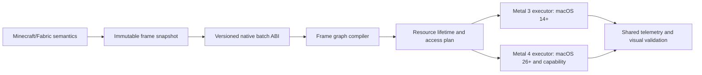

# Metallum: план базовой оптимизации renderer под Apple Silicon и Metal

Статус: обязательная программа работ, предшествующая новому освещению.

Целевая версия на момент составления: Minecraft Java 26.2, Fabric Loader 0.19.3, Sodium 0.9.1, Java 25.

Основная аппаратная точка контроля: Apple M1 Pro.

Минимальная программная база production path: Metal 3, macOS 14.

Условные capability layers: residency sets на macOS 15+ после A/B; Metal 4 на macOS 26+ при `supportsFamily(.metal4)`. Они не заменяют Metal 3/macOS 14 fallback.

Связанный документ: [`LIGHTING_ARCHITECTURE_PLAN.md`](LIGHTING_ARCHITECTURE_PLAN.md). Этот файл определяет фундамент и порядок оптимизации; lighting roadmap определяет эффекты, HDR и temporal-ready renderer. При конфликте по ресурсам, синхронизации, frame pacing или порядку внедрения сначала выполняется этот документ.

---

## 1. Однозначный инженерный вывод

Максимальный практический выигрыш для Metallum даст не одна «секретная» функция Metal, а последовательное устранение четырёх классов потерь:

1. лишней CPU-работы и копий в Java → FFM → Swift → Metal;
2. лишнего трафика unified memory и неудачных lifetime ресурсов;
3. лишних encoder/pass boundaries и слишком широкой синхронизации на Apple TBDR;
4. неограниченной работы при chunk/light churn, которая портит p95/p99 даже при хорошем среднем FPS.

Поэтому правильный порядок такой:

```text
достоверная телеметрия
→ versioned frame graph и resource access contract
→ специализированная загрузка и управление памятью
→ точная синхронизация и fusion проходов
→ precompiled shaders и предсказуемые PSO
→ decoupled chunk/light data
→ GPU-driven visibility и batching
→ условный Metal 4 executor
→ новое освещение в заранее освобождённый GPU/CPU budget
```

Metal 4 не является первым этапом. Переписывание command backend до появления общего frame graph удвоит объём работы, создаст второй набор ошибок синхронизации и само по себе не гарантирует роста FPS. Сначала Metal 3 и будущий Metal 4 должны получить один и тот же декларативный workload; затем для него создаются два executor-а.

Ожидаемый эффект программы:

- наиболее заметное улучшение не среднего FPS, а `1% low`, p95/p99 frame time и поведения при перемещении/загрузке чанков;
- меньше CPU overhead в сценах с большим draw count;
- меньше unified-memory bandwidth и transient allocation pressure;
- отсутствие shader-compilation hitches в первом игровом кадре;
- измеримый резерв для clustered lights, shadows, voxel updates, GI и volumetrics;
- возможность добавлять temporal upscaling и dynamic resolution без повторной переделки frame lifecycle.

Ориентир `+5–15%` к производительности backend-bound сцен после базовых этапов допустим только как гипотеза для планирования. Это не обещание: каждый этап принимается по A/B capture, а не по наличию нового API в коде. В Minecraft часть сцен ограничена Java simulation, chunk building или самим shader workload, и там low-level Metal изменения могут почти не изменить средний FPS.

---

## 2. Что уже оптимизировано и не должно выдаваться за новую работу

План строится поверх текущего backend.

### 2.1. Уже существующий фундамент

- Три кадра в полёте: [`MetalCommandEncoder.MAX_SUBMITS_IN_FLIGHT`](src/main/java/com/metallum/client/metal/render/MetalCommandEncoder.java).
- Отложенное освобождение Metal ресурсов после завершения submit.
- `.private` для статических GPU-only buffers и textures; `.shared` для CPU-accessible/dynamic buffers.
- Untracked hazard mode в общих buffer/texture wrappers с явной межencoderной синхронизацией.
- Пул dynamic backing до 64 MiB.
- Переиспользуемая transient staging память.
- Ограниченный cache texel-buffer views, привязанный к lifetime backing buffer.
- Sodium indirect backend и сведённые к критическим участкам FFM downcalls.
- MetalFX Spatial с раздельными render/display dimensions.
- FP16 HDR targets, отдельный SDR UI и GPU timing JSONL.
- Уже объединённый tiled compute bloom.

Эти решения сохраняются, пока новый этап не докажет лучший вариант.

### 2.2. Подтверждённые не-hotspots и опасные псевдооптимизации

- CPU semaphore для трёх in-flight кадров не следует удалять «ради FPS»: текущие измерения не показывали его заметным bottleneck.
- Время в `nextDrawable` не равно потерянному GPU-времени; часто это нормальное display pacing/vsync.
- Нельзя вслепую менять depth `.store` на `.dontCare`: поздние passes загружают depth.
- Нельзя переводить все ресурсы в `.shared` из-за unified memory. Часто читаемые GPU-only данные всё равно выгодно держать `.private`.
- Нельзя делать sampled shadow maps или основной depth memoryless, если данные читаются после render pass.
- Нельзя добавлять второй command queue только потому, что он существует: cross-queue synchronization и конкуренция за один GPU могут ухудшить p95.
- Нельзя начинать с полного GPU chunk meshing: сложность Minecraft model/visibility/material semantics слишком высока относительно вероятной первой выгоды.
- Нельзя считать `HashMap<String, ...>` или synchronized lookup доказанным главным bottleneck без профиля; новый ABI всё равно должен уйти от строк, но это не основание для массовой переписи legacy path.

### 2.3. Реальные текущие кандидаты

- Partial dynamic-buffer write сейчас сохраняет остальные диапазоны копированием почти всего логического buffer. Для часто обновляемых данных нужен ring/discard contract, а не общий orphan с preservation.
- Static upload проходит через Java `ByteBuffer` → shared staging → blit в private resource. Это правильно как общий fallback, но chunk/light streaming должен получать специализированный batch path без повторных промежуточных копий.
- Часть нативных MSL libraries компилируется через `makeLibrary(source:)`; это создаёт риск загрузочных и first-use hitches.
- Renderer пока не имеет единого декларативного описания read/write lifetime ресурсов. Поэтому невозможно безопасно вычислять точные barriers, aliasing и pass fusion автоматически.
- Один глобальный fence прост и корректен, но потенциально сериализует независимые passes. Сужать его можно только после появления resource dependency graph.
- Sodium indirect draw уже является одним Java/FFM вызовом, однако native path последовательно кодирует `drawCount` команд. Для больших стабильных наборов geometry остаётся потенциал ICB/GPU compaction.

---

## 3. Цели и не-цели

### 3.1. Обязательные цели

- Улучшить GPU p95/p99 и `1% low`, а не только средний FPS.
- Не ухудшить визуальный результат legacy renderer.
- Уменьшить CPU render-thread time, allocations и FFM crossings.
- Снизить bytes copied/uploaded и attachment store/load bandwidth.
- Сделать frame workload детерминированным и ограниченным budget-ами.
- Сохранить Metal 3/macOS 14 production path.
- Подготовить общий frame/resource contract для Metal 4, lighting и temporal scaling.
- Оставить безопасный fallback после каждого этапа.
- Разделить качество картинки и внутреннюю эффективность: оптимизация не должна скрыто понижать preset.

### 3.2. Не-цели базовой программы

- MetalFX или другой upscaler как замена low-level оптимизации.
- Iris compatibility.
- Полная замена Sodium chunk renderer до доказанного bottleneck.
- Path tracing или обязательный hardware ray tracing.
- Переход на Metal 4 ценой отказа от macOS 14.
- Async compute ради формального параллелизма.
- Изменение Minecraft simulation, networking или server tick, если профиль не показывает связь с client frame stability.
- Скрытая потеря draw distance, entity distance или texture quality ради красивого benchmark.

---

## 4. Критерий успеха: стабильный кадр, а не рекордный FPS

Для каждого режима фиксируются:

- CPU frame p50/p95/p99;
- render-thread p50/p95/p99;
- GPU frame p50/p95/p99;
- `1% low` и `0.1% low` FPS;
- worst frame после прогрева;
- время ожидания in-flight slot и `nextDrawable` отдельно;
- количество command buffers, render/compute/blit encoders и pass boundaries;
- bytes CPU→shared, shared→private и GPU→CPU за кадр;
- количество/объём transient allocations и high-water mark rings/heaps;
- количество pipeline compilations и их длительность;
- число chunk rebuilds, вызванных только светом;
- возраст и длина bounded work queues;
- resident/allocated memory и purgeable cache sizes;
- thermal state, resolution, preset, EDR headroom и scaler mode.

### 4.1. Frame-time ориентиры

| Частота | Полный frame budget | Практический GPU p95 gate |
|---|---:|---:|
| 60 FPS | 16.67 ms | ≤ 16.0 ms |
| 75 FPS | 13.33 ms | ≤ 12.7 ms |
| 90 FPS | 11.11 ms | ≤ 10.5 ms |
| 120 FPS | 8.33 ms | ≤ 7.9–8.1 ms |

Небольшой резерв нужен для OS/display jitter и редких обновлений. Постоянная работа вплотную к 8.33 ms не является стабильными 120 FPS.

### 4.2. Правила A/B сравнения

- Один commit, одинаковый world seed, camera path, render/display resolution и настройки.
- Не менее 300 измеряемых кадров после shader/world warmup; для streaming-сцен — несколько одинаковых прогонов.
- Сравниваются p50/p95/p99 и confidence range, а не один средний результат.
- Новый этап не принимается при регрессии GPU или CPU p95 более чем на `0.2 ms` без компенсирующей измеримой выгоды.
- Память сравнивается после одинакового маршрута по миру и одинакового времени стабилизации.
- Debug validation и release performance измеряются отдельно.
- Любое изменение картинки проходит screenshot/numeric comparison; снижение качества оформляется отдельной настройкой, не «оптимизацией».

### 4.3. Обязательная benchmark matrix

1. Неподвижная камера в тяжёлой сцене: чистый shading/bandwidth limit.
2. Быстрый полёт над миром: chunk streaming и visibility churn.
3. Резкий разворот камеры: occlusion/history/command generation.
4. Массовая установка/удаление блоков и факелов: dirty queues.
5. Entity farm и particles: draw/binding/overdraw pressure.
6. Дождь, прозрачность, вода и UI: blending/post path.
7. Native resolution, Spatial Quality и Spatial Performance.
8. SDR и EDR display mapping.
9. Vanilla pack и high-resolution resource pack.
10. Resize/fullscreen/display move/world reload.

M1 Pro является release gate. M3/M4/M5 используются как дополнительные точки масштабирования, но не могут скрыть регрессию M1 Pro.

---

## 5. Целевая архитектура оптимизированного backend



Frame graph не должен быть сложной универсальной библиотекой. Для Metallum достаточно небольшого typed graph, который знает:

- pass ID и encoder class;
- reads/writes каждого buffer/texture с фактическими stage/usage;
- attachment load/store/clear requirement;
- размер, формат, lifetime и persistence class ресурса;
- возможность fusion, aliasing или async scheduling;
- history generation и in-flight ownership;
- timing stage и work-budget counter;
- Metal 3 и Metal 4 encoding callback.

### 5.1. Классы ресурсов

| Класс | Lifetime | Примеры | Стратегия |
|---|---|---|---|
| Device persistent | device | immutable tables, samplers, core pipelines | private, precreated |
| World persistent | world generation | voxel clipmaps, light registry, shadow cache | private heap/resources |
| Size generation | render/display resize | scene color, depth, motion, scaler output | recreate atomically |
| History | temporal generation | previous color/depth, froxel history | explicit reset/version |
| In-flight frame | 3 slots | constants, updates, indirect args | per-slot ring/allocator |
| Pass transient | interval in graph | scratch, histogram, temporary blur | heap aliasing after proof |
| Readback | delayed CPU | timings, counters, screenshots | separate shared ring |

### 5.2. Capability matrix вместо одного `supportsMetal4`

Renderer не принимает архитектурные решения по одному boolean. При создании device-generation формируется immutable `MetalCapabilities`:

```text
programmingModel: METAL_3 | METAL_4
residencySets
commandAllocators
argumentTables
explicitCommandBarriers
dedicatedCompiler
flexiblePipelines
colorAttachmentMapping
textureViewPools
placementSparseResources
meshIndirectCommands
temporalScaling
```

Минимальная матрица:

| Capability level | Требования | Разрешённые ускорения |
|---|---|---|
| `BASE_METAL3` | macOS 14, Apple Silicon | Полный renderer/lighting, обычные encoders/fences/resource declarations |
| `METAL3_RESOURCE_PLUS` | macOS 15+ и точечный runtime support | Residency sets и другие cross-model resource features при положительном A/B |
| `METAL4_CORE` | macOS 26+, Metal 4 family, включая M1/Apple7 | Command allocators, argument tables, explicit barriers, dedicated compiler, flexible PSO, attachment mapping |
| `METAL4_EXTENDED` | Дополнительные GPU-family checks | Placement sparse, новые indirect/mesh/RT возможности только по отдельным gates |

Нельзя выводить поддержку конкретной функции только из `programmingModel`. Cross-model возможности вроде residency sets/texture-view pools также запрашиваются отдельно. Основные Metal 4 механизмы доступны M1, но placement sparse resources требуют более новой GPU family и не входят в M1 Pro release gate. Каждый optional feature имеет собственный fallback.

Capability snapshot входит в timing JSONL, pipeline/resource cache keys и diagnostic report. Он не меняется посреди generation.

### 5.3. Два executor-а, один workload

Metal 3 path остаётся эталоном корректности:

- обычные command buffers/encoders;
- текущий deferred destruction;
- fences и resource usage, суженные frame graph-ом;
- argument buffers только там, где это окупается;
- на macOS 15+ residency sets могут заменить повторяющиеся `useResource/useHeap` для стабильных групп ресурсов, если A/B показывает снижение overhead; residency не отслеживает hazards.

Metal 4 path включается только при одновременном выполнении:

- `#available(macOS 26, *)`;
- устройство сообщает Metal 4 GPU family;
- все обязательные shaders/pipelines созданы;
- resource residency и explicit barrier validation проходят;
- A/B benchmark не хуже Metal 3.

Он использует:

- reusable command buffers и allocator на in-flight slot;
- argument tables вместо per-encoder binding;
- residency sets;
- producer/consumer/intra-pass barriers из того же access graph;
- объединённый compute encoder для совместимых copy/dispatch operations;
- batch commit, если граф действительно выигрывает от нескольких command buffers.

Если любой gate не пройден, весь кадр использует Metal 3 executor. Смешивать два synchronization model внутри одного frame plan без отдельного доказанного этапа нельзя.

### 5.4. Atomic renderer generation

Executor выбирается при создании device/world/size generation до выделения зависимых ресурсов:

```text
capability snapshot
→ выбрать executor и compiler policy
→ создать allocators/tables/residency/resources
→ prewarm mandatory PSO
→ опубликовать готовую generation на границе кадра
```

Runtime failure Metal 4 не переключает отдельный pass на Metal 3 внутри активного кадра. Новая Metal 3 generation создаётся отдельно, старая продолжает жить до завершения всех in-flight submit, затем освобождается deferred queue.

Общими между executor-ами остаются logical frame graph, pass IDs, shader/metallib functions, PSO там, где API допускает совместимость, packed data ABI, lighting/HDR semantics, quality presets и telemetry IDs.

---

## 6. Этап O0 — зафиксировать baseline и расширить телеметрию

### Работы

- Зафиксировать release build и benchmark worlds/camera routes.
- Записать текущие CPU/GPU p50/p95/p99 для matrix из раздела 4.3.
- Добавить счётчики encoder/pass count, bytes copied, transient high-water, PSO compilation и resource allocation.
- Отдельно считать время Java snapshot, native batch encode, command commit, in-flight wait и drawable wait.
- Пометить существующие логи commit hash, OS, GPU family, thermal state и render/display size.
- Записывать capability snapshot, executor/compiler kind, allocator high-water, argument-table updates, residency membership changes, barrier count/stages и pipeline archive hit/miss.
- Добавить счётчик chunk rebuild reason: geometry/material/light/unknown.
- Зафиксировать screenshot и HDR numeric probes до изменений.

### Exit criteria

- Один воспроизводимый скрипт/процедура создаёт сравнимый JSONL report.
- Для каждого текущего timing stage есть понятная граница начала/конца.
- Нет влияния telemetry-off path на p95.
- Baseline сохранён рядом с датой/commit, но тяжёлые runtime logs не коммитятся в репозиторий.

### Почему это первый этап

Без bytes/encoder/allocation counters нельзя отличить полезный heap/ring от архитектурной косметики. Без причины chunk rebuild нельзя доказать главное улучшение для будущего света.

---

## 7. Этап O1 — typed frame graph и versioned resource ABI

### Работы

- Ввести минимальные `PassId`, `ResourceId`, `AccessKind`, `PipelineStage`, `PersistenceClass`.
- Описать существующий world → HDR → scaler → bloom → UI → present без изменения encoding.
- Проверять read-before-write, overlapping write и несовместимые attachment contracts в unit tests.
- Генерировать diagnostic DOT/JSON graph только по флагу.
- Заменить случайный выбор свободных binding slots в новом path на numeric generated bindings.
- Ввести version/size/capability checks для Java/native structs.
- Передавать arrays/batches, а не FFM call на отдельный light, brick, draw constant или resource update.
- Переиспользовать Swift descriptors/temporary arrays и не создавать ARC/collection objects на каждый draw; изменения legacy `HashMap<String, ...>` делать только после профиля или при переходе конкретного pass на numeric ABI.

### Ограничение scope

Legacy `MetalRenderPass` не нужно переписывать целиком в первый commit. Сначала graph должен описывать и валидировать существующий порядок; затем executor постепенно забирает ownership отдельных passes.

### Exit criteria

- Legacy output не изменился.
- Graph воспроизводит фактический порядок и attachments текущего кадра.
- Unit tests ловят искусственные missing dependency и invalid lifetime.
- Все ABI ошибки обнаруживаются до начала GPU encoding.
- Нет измеримой CPU p95 регрессии.

---

## 8. Этап O2 — специализированная CPU→GPU загрузка

### 8.1. Разделить назначения памяти

Общий `MetalGpuBuffer` остаётся fallback, но hot data получает отдельные allocators:

1. `FrameConstantRing` — небольшие constants/transforms/material indices;
2. `GeometryUploadRing` — chunk vertex/index updates;
3. `LightingUploadRing` — light records, dirty bricks, shadow/GI work items;
4. `IndirectArgumentRing` — draw/dispatch args и counters;
5. `ReadbackRing` — timings, overflow и debug probes.

Каждый upload ring имеет три независимых in-flight regions. CPU никогда не ждёт освобождения отдельной suballocation внутри активного slot: при переполнении применяется контролируемый overflow buffer или перенос bounded work на следующий кадр.

### 8.2. Правила storage/cache mode

- CPU-write-only staging по умолчанию тестируется как `.shared + .writeCombined`.
- `.writeCombined` принимается только после benchmark; CPU read из такой памяти запрещён контрактом.
- Small frequently read/write CPU structures остаются `.shared + defaultCache`.
- Static/frequently sampled GPU data остаётся `.private` после batched upload.
- Readback никогда не делит backing с write-combined upload.
- Alignment берётся из фактического shader/Metal requirement; безопасный default для constants — 16 bytes, но texture-buffer/index rules валидируются отдельно.

### 8.3. Устранить full-preservation orphan для hot data

Новый contract не обновляет маленький диапазон логического «вечного» dynamic buffer с копированием всех соседних данных. Вместо этого:

- per-frame данные append-only записываются в ring;
- shader получает address/offset текущей версии;
- immutable chunk ranges заменяются generation swap-ом;
- старый range освобождается deferred queue после последнего submit;
- partial preservation остаётся только для редких legacy callers.

### 8.4. Сократить Java-копии

Предпочтительный путь chunk/light batch:

```text
worker пишет конечный packed layout
→ immutable batch ownership transfer
→ один memcpy в mapped staging ring
→ один/несколько coalesced blit ranges в private heap
```

Если Sodium builder API позволяет безопасно писать прямо в предоставленный mapped range, отдельный эксперимент убирает и этот memcpy. Это не должно нарушать lifetime `ByteBuffer`, worker concurrency или fallback backend.

### Exit criteria

- Bytes copied и allocation count снижены в streaming/light-churn сценах.
- Нет ring overwrite при трёх кадрах в полёте.
- Overflow детерминирован, видим в telemetry и не создаёт unbounded allocation.
- p95 render-thread не хуже baseline; streaming `1% low` лучше либо этап отклонён.

---

## 9. Этап O3 — private heaps, transient aliasing и memory pressure

### 9.1. Вводить heaps по классам, не один глобальный heap

- Static geometry heap/page pools.
- Resolution-dependent render-target heaps.
- Lighting persistent heaps: clipmaps/shadows/GI.
- Transient scratch heap по compiled lifetime intervals.
- Отдельные resources для shared rings/readback.

Размер и alignment всегда получаются через Metal heap size/alignment query. Нельзя вычислять texture allocation обычным `width × height × bytesPerPixel`.

### 9.2. Aliasing

Aliasing разрешается только для pass-transient ресурсов, у которых frame graph доказал непересекающийся lifetime.

Обязательные правила:

- после `makeAliasable()` старый resource больше никогда не используется;
- history, scene color, depth, motion, shadow cache и scaler inputs не alias-ятся;
- debug capture может отключить aliasing;
- Metal 3 использует правильный fence/encoder boundary;
- Metal 4 использует device-visibility barrier; `ResourceAlias` нужен только для действительно перекрывающихся virtual mappings, не для обычных non-overlap placement-heap lifetimes;
- при сомнении создаётся новый resource, а не риск undefined behavior.

### 9.3. Memory pressure policy

Порядок освобождения:

1. diagnostic resources;
2. stale pipeline/texture-view caches;
3. далёкие shadow/voxel cache pages;
4. optional reflection/Ultra resources;
5. снижение quality generation на границе кадра.

Persistent core resources не становятся purgeable без механизма полного rebuild и validity state.

### 9.4. Residency sets на macOS 15+

- Начать с device-persistent и size-generation ресурсов с низким churn.
- Heap добавляется как одна allocation group, если shaders не обращаются к неразрешённым отдельным writable resources.
- Изменения membership stage-ятся batch-ом и commit-ятся до command encoding, которое использует новые allocations.
- World/chunk churn не должен вызывать полную пересборку большого set каждый кадр; при этом обычный `useResource/useHeap` может быть быстрее и проще.
- Residency отвечает только за доступность памяти GPU и никогда не заменяет fence/barrier/hazard graph.
- macOS 14 сохраняет прежний resource declaration path.

### Exit criteria

- Peak/steady allocated memory и heap fragmentation видимы в telemetry.
- Resize/world reload не оставляют старые generations.
- Alias validation проходит stress test и Metal validation.
- Выигрыш памяти или bandwidth измерим; heap abstraction без результата не принимается как завершённая оптимизация.

---

## 10. Этап O4 — точная синхронизация и TBDR pass fusion

### 10.1. Сначала корректность, затем сужение

Текущий глобальный fence остаётся safety baseline. Frame graph сначала строит resource dependency edges и только потом заменяет broad synchronization по одному участку.

Для каждой зависимости фиксируются:

- producer pass/stage и вид access;
- consumer pass/stage и вид access;
- attachment store/load необходимость;
- можно ли оставить оба шага внутри encoder;
- нужен ли fence/barrier или достаточно command order;
- пересекаются ли subresource/range.

### 10.2. Metal 3

- Point-to-point fences между реально зависимыми encoders.
- Compute memory barriers для write→read/write внутри совместимого encoder.
- `useResource/useHeap` соответствует фактическому indirect/argument-buffer access.
- Не снимать hazard tracking с нового ресурса, пока graph/validation не доказывает все его accesses.

### 10.3. Metal 4

- Producer barrier записывается на исходящем encoder.
- Consumer barrier — на входящем.
- Write→read/write получает `Device` visibility.
- Consecutive compute read-write использует intra-pass barrier.
- Нельзя ждать `Fragment/Tile` через intra-render `afterEncoderStages` на TBDR; такая зависимость требует корректной границы render passes.
- Stage masks сужаются по shader reflection/access contract; `StageAll` допустим только как диагностический первый шаг.
- Metal 4 command buffers не удерживают ресурсы: deferred lifetime и residency обязательны.

### 10.4. Pass fusion

В порядке ожидаемой пользы исследуются:

- совместимые clears + первый render pass;
- sequential fullscreen HDR/display operations;
- compute histogram/exposure/bloom operations с общими inputs;
- lighting/auxiliary data внутри одного forward render pass;
- tile-local light culling или compact aux только после capture;
- объединение blit и compute-class операций в Metal 4 compute encoder, если нет зависимости.

На Apple TBDR encoder boundary может выгрузить tile memory в device memory. Поэтому оценивается не только число dispatch/draw, но и attachment store/load bytes. Fusion запрещён, если меняет blending/order, увеличивает register/threadgroup pressure сильнее экономии или усложняет корректность temporal data.

### Exit criteria

- Metal validation не сообщает missing hazard/load-store error.
- Encoder count и/или attachment bandwidth снижены.
- Нет визуальной corruption в stress/resize/world reload.
- GPU p95 улучшен либо fusion отклонён и документирован.

---

## 11. Этап O5 — precompiled MSL и предсказуемые pipelines

### Работы

- Вынести собственные native shaders из embedded strings в `.metal` files по мере изменения подсистем.
- Gradle собирает generated `.metallib` через Metal compiler; build artifact попадает в текущий native packaging flow.
- Runtime `makeLibrary(source:)` остаётся только debug/fallback и для внешнего динамического GLSL→MSL, который невозможно знать заранее.
- Создать небольшой bounded feature key и function constants вместо сотен текстовых вариантов.
- Prewarm обязательные PSO после device/capability gate вне первого world frame.
- Использовать Metal binary archives/pipeline cache только после проверки portability/version invalidation.
- Cache key включает shader/library version, GPU family, pixel formats, sample count, feature key и OS/compiler compatibility.
- Pipeline creation failure не происходит в середине render pass: frame остаётся на предыдущем renderer generation/fallback.

### Shader-level правила

- `half`/`half2`/`half4` используются для color, normals, froxels и intermediate math только после error/image validation.
- Matrices, world/camera transforms, depth reconstruction и large-coordinate math сохраняют требуемую `float` точность.
- Packed formats применяются там, где уменьшают bandwidth без banding/leaks.
- SIMD-group reductions заменяют глобальные atomics для histogram/cluster counters, когда feature gate M1 Pro это поддерживает и capture показывает contention.
- Threadgroup memory размер считается вместе со снижением occupancy; больше shared memory не всегда быстрее.
- Relaxed/fast math включается точечно; HDR monotonicity, NaN/Inf и shadow comparisons проверяются численно.

### Exit criteria

- Production launch/world entry не компилирует собственный HDR/lighting MSL source.
- Pipeline warmup time и cache hit/miss отражены в telemetry.
- Первый тяжёлый кадр не содержит shader compilation hitch.
- Visual/numeric validation подтверждает выбранные FP16/fast-math участки.

---

## 12. Этап O6 — отделить chunk geometry от света

Это самый важный контракт для будущего освещения и стабильности Minecraft.

### Неподвижное правило

Изменение интенсивности/цвета/наличия света не должно перестраивать terrain vertex/index buffers, если геометрия, material assignment и visibility topology блока не изменились.

### Новая модель событий

| Событие | Geometry rebuild | Light update | Voxel occupancy | Irradiance/shadow dirty |
|---|---:|---:|---:|---:|
| Поставлен обычный непрозрачный блок | да | возможно | да | да |
| Изменена форма/состояние модели | да | возможно | да | да |
| Добавлен/убран факел без смены соседней geometry | нет | да | только emission/material bit | да |
| Изменился цвет/яркость dynamic light | нет | да | нет | да |
| Entity переместился | нет | entity buffer | нет | ограниченная shadow policy |
| Смена дня/погоды | нет | sun/frame data | нет | cached shadow/exposure policy |

### Реализация

- `LightRegistry` хранит stable IDs/generations независимо от chunk mesh.
- Terrain vertices содержат material/position data, но не baked RGB света целевого renderer.
- Chunk worker может попутно строить sub-block occupancy/material payload, но это отдельный immutable section batch.
- Dirty light/voxel/shadow/GI queues имеют caps, priorities и age.
- Coalescing объединяет несколько изменений одного brick/light до upload.
- Переполнение не запускает немедленный полный world rebuild: используется coarse invalidation, degraded lighting или перенос работы.

### Exit criteria

- Torch storm не увеличивает geometry upload/rebuild counter, кроме фактического изменения torch geometry.
- Быстрое движение dynamic lights не создаёт chunk mesh churn.
- Light updates ограничены заданным CPU/GPU budget на кадр.
- Legacy renderer остаётся доступным, пока новый material/light contract не покрывает все роли.

---

## 13. Этап O7 — GPU visibility, ICB, instancing и asset bandwidth

Этап начинается только если captures показывают CPU draw encoding, vertex processing невидимой geometry или fragment overdraw как реальный limit.

### 13.1. Hi-Z и occlusion

- Построить depth pyramid из предыдущего или текущего подходящего depth.
- Compute culling работает по chunk sections/meshlets или крупным draw groups, а не отдельным block faces.
- Conservative bounds и camera-near bypass исключают заметное popping.
- При teleport/resize/history reset occlusion на один кадр отключается или использует frustum-only.
- Результат формирует compact indirect args/count.

### 13.2. ICB/indirect execution

- Сначала CPU-encoded reusable ICB для стабильных draw groups.
- Затем GPU compaction/encoding только если это снижает native loop/CPU cost.
- Resource usage/residency всех buffers, доступных через indirect commands, объявляется явно.
- ICB capacity bounded; overflow имеет direct-draw fallback и counter.

### 13.3. Instancing

Кандидаты:

- одинаковые block entities;
- items/orbs;
- простые particles;
- repeated entity submeshes;
- shadow-only representations.

Instancing не объединяет разные material/blend/depth semantics ценой branch-heavy shader.

### 13.4. Texture/resource-pack path

- Убедиться, что mipmaps, LOD и anisotropy не заставляют GPU читать full-resolution texture далеко от камеры.
- Для high-resolution resource packs исследовать disk cache GPU-ready mip chains и ASTC только как opt-in: block compression может заметно уменьшить memory bandwidth/footprint, но lossy artifacts недопустимы для vanilla pixel art и UI.
- Cache key включает content hash, dimensions, color/material semantics, compression preset и GPU/format capability.
- Texture decoding/transcoding выполняется вне render thread и имеет bounded upload queue.
- Metal fast resource loading/Metal I/O рассматривается только для крупных нативных asset blobs после профиля startup/streaming. Оно не считается способом поднять steady-state FPS само по себе.
- Texture quality, alpha edges, normal maps и emissive HDR проходят отдельные screenshot/numeric tests.

### Exit criteria

- CPU render-thread и/или GPU vertex/fragment p95 улучшаются в entity/long-view scenes.
- Нет false occlusion и popping в reference route.
- Цена pyramid+cull ниже сэкономленной работы.
- При маленькой сцене path автоматически bypass-ится.
- Texture compression/streaming включается только при выигрыше памяти/streaming p95 без неприемлемых артефактов.

---

## 14. Этап O8 — условный Metal 4 executor

Metal 4 поддерживается M1-series на уровне GPU family, но API требует macOS 26+. Поэтому он может ускорить современную конфигурацию M1 Pro, не становясь минимальной платформой.

O8 реализуется независимыми slices. Не требуется переносить command encoding, binding и compiler одновременно.

### 14.1. O8a — capability discovery и generation scaffold

- Сформировать typed `MetalCapabilities` из OS availability, `supportsFamily` и точечных runtime queries.
- Добавить `MetalExecutorKind.METAL3/METAL4` в immutable renderer generation и timing report.
- Создать пустой Metal 4 executor/capability rejection path без изменения production rendering.
- Проверить atomic fallback при искусственной ошибке device/compiler/resource creation.

### 14.2. O8b — dedicated compiler и pipeline harvesting

- Создать `MTL4Compiler` с контролируемой queue/QoS вне render hot path.
- Сначала перенести ограниченный набор собственных predictable PSO, не динамические внешние shader roles.
- Использовать precompiled metallib как основной source.
- Добавить async compilation, pipeline dataset harvesting и versioned archive invalidation.
- Исследовать flexible PSO только для реально различающихся formats/blend states.
- Использовать color-attachment mapping там, где один shader действительно обслуживает несколько output layouts и это позволяет объединить passes/сократить PSO variants.
- Использовать совместимость PSO между Metal 3/4 для постепенного внедрения; compiler migration не блокирует command executor.

### 14.3. O8c — command allocators и reusable command buffers

- Создать минимум три allocators — по одному на in-flight frame slot.
- Reset разрешён только после completion соответствующего submit.
- Reusable command buffer имеет явный begin/end lifecycle и не владеет resource lifetime.
- Batch commit нескольких command buffers включается только при измеримом scheduling/parallel-encoding выигрыше.
- Commit feedback/counter heaps отображаются в существующие стабильные timing IDs.

### 14.4. O8d — argument tables

Вместо одной таблицы максимального размера используются bounded tables по классу работы:

- frame/global constants;
- world/lighting: lights, clipmaps, shadows, GI;
- material textures/samplers;
- pass-local/transient resources.

Каждая таблица имеет generated numeric binding schema, version, maximum indices и validation. Обновляются только изменившиеся bindings. Все косвенно доступные resources заранее включены в подходящий residency set.

### 14.5. O8e — explicit barrier compiler

- Frame graph превращает access edges в producer, consumer или intra-pass barriers.
- Write→read/write использует device visibility; read→read не получает лишний cache flush.
- Stage masks соответствуют фактическим Dispatch/Vertex/Fragment/Blit accesses, а не `All` в production.
- Broad diagnostic mode остаётся для локализации missing barrier.
- Resource range/subresource tracking вводится только после корректной whole-resource версии.
- Render pass attachment transitions учитывают TBDR fragment visibility; недопустимый intra-render fragment wait заменяется корректной pass boundary.

### 14.6. O8f — unified compute и attachment mapping

- Группировать совместимые copy/fill/dispatch operations в Metal 4 compute encoder.
- Первый representative slice: light/voxel upload → cluster build → opaque forward+ → HDR compute.
- Не объединять операции через скрытую read-after-write dependency без barrier.
- Color-attachment mapping применяется для motion/reactive/compact aux variants только при полном совпадении ordering и численных outputs.
- Texture-view pools исследуются для clipmap/shadow/mip views после сравнения с текущим bounded cache.

### 14.7. Per-pass capability policy

Каждый graph pass объявляет обязательный функциональный минимум и необязательные ускорения:

```text
ClusterBuildPass
  required: storageBuffers, indirectDispatch
  optional: argumentTables, metal4UnifiedCompute, explicitBarriers, simdReduction
  fallback: Metal3Compute
```

Optional capability меняет способ исполнения, но не format/lighting/HDR semantics. Pass не проверяет OS/GPU самостоятельно: он получает утверждённый execution plan от graph compiler.

### Чего не делать

- Не использовать sparse/placement features без конкретного clipmap/memory-pressure выигрыша.
- Не создавать argument table максимального размера без измерения binding/update overhead.
- Не делать один гигантский residency set, если churn мира заставляет часто его пересобирать.
- Не переносить все passes одним commit только ради «полного Metal 4».
- Не удалять Metal 3 после успешного запуска Metal 4.
- Не считать все Metal 4 функции доступными только из-за M1+/macOS 26: проверять feature/GPU family отдельно.
- Не смешивать Metal 3 и Metal 4 synchronization lifecycle в одном активном frame generation.

### Exit criteria

- Metal 4 output эквивалентен Metal 3 в утверждённых пределах.
- Нет validation/hazard/residency/lifetime ошибок.
- Metal 4 принимается как default только если CPU render-thread p95 лучше примерно на `8–10%`, либо полный GPU p95/`1% low` лучше минимум примерно на `5%`, либо доказанно устраняются существенные pipeline hitches/расход памяти.
- Если порог не пройден, конкретный slice остаётся experimental/off; это не блокирует другие Metal 4 capabilities.
- Runtime fallback выбирается до кадра и не смешивает ресурсы разных executor generation.
- M1 Pro Metal 4 Core и Metal 3 проходят одинаковую benchmark/reference matrix; extended features не могут быть обязательны для M1.

---

## 15. Этап O9 — frame pacing, dynamic budgets и подготовка temporal scaling

### 15.1. Frame pacing

- Сохранять максимум три кадра в полёте, пока A/B не докажет другую глубину.
- Согласовать `CAMetalLayer.maximumDrawableCount` с in-flight policy по capability; не менять три drawable на два без измерения latency против GPU starvation.
- Получать drawable достаточно поздно, чтобы не удерживать swapchain resource во время CPU preparation, но не создавать CPU/GPU bubble.
- Не spin-wait и не `waitUntilCompleted` в обычном кадре.
- Отделять display-limited `nextDrawable` wait от render bottleneck в отчётах.
- Учитывать Game Mode, thermal state и display refresh в benchmark metadata.

### 15.2. Work-budget controller

Controller не меняет качество каждую миллисекунду. Он управляет только amortized queues:

- chunk uploads;
- voxel dirty bricks;
- irradiance iterations;
- shadow pages;
- froxel history refresh;
- optional probe/reflection updates.

Правила:

- hard cap work items и GPU time estimate на кадр;
- priority по видимости, расстоянию, возрасту и gameplay significance;
- hysteresis и несколько кадров подтверждения перед изменением tier;
- starvation limit: старое изменение обязательно обслуживается или переводится в coarse fallback;
- visual transition/fade для постепенно уточняющихся данных;
- dynamic resolution меняется только после готового motion/history contract из lighting roadmap.

### Exit criteria

- Chunk/light storm увеличивает длину очереди, но не создаёт неограниченный p99 spike.
- После прекращения churn очередь сходится за bounded время.
- Нет осцилляции quality/render scale.
- Fixed-scale mode остаётся доступным для честного benchmark.

---

## 16. Как базовые оптимизации уменьшают цену нового освещения

| Фундамент | Выгода lighting path |
|---|---|
| Typed frame graph | точные barriers, fusion и lifetime всех light/GI/froxel ресурсов |
| Lighting upload ring | один batch вместо FFM/upload на источник или brick |
| Private heaps | компактное размещение clipmaps, shadow cache и scratch |
| Transient aliasing | histogram/cluster/froxel scratch не суммируют peak memory |
| Decoupled chunk/light contract | факел не remesh-ит соседние chunks |
| Metallib + PSO warmup | новый эффект не компилируется в первом кадре |
| SIMD/FP16/packed data | меньше bandwidth для clusters, irradiance, froxels |
| Hi-Z/ICB | невидимая geometry не запускает дорогой fragment lighting loop |
| Bounded queues | teleport/chunk load не обновляет все voxels/shadows сразу |
| Metal 4 executor | меньше binding/allocator overhead и точный explicit sync на поддерживаемой OS |

Для lighting implementation обязательны дополнительные ограничения:

- cluster light lists имеют фиксированную capacity и overflow policy;
- lights сортируются по projected influence/importance до fragment loop;
- shadowed lights имеют отдельный малый cap;
- voxel occupancy обновляется dirty bricks, не полным volume;
- irradiance хранится грубее occupancy и обновляется amortized;
- froxels используют reduced resolution, depth distribution и temporal history;
- GI/shadows/volumetrics используют `half`/packed formats там, где тесты разрешают;
- indirect dispatch sizes строятся по реальной dirty queue;
- пустые clusters/bricks не запускают полную работу;
- distant/low-impact updates деградируют раньше direct surface lighting;
- реальные HDR values создаются lighting/emission, поэтому semantic reconstruction и лишний legacy attachment в новом mode удаляются.

---

## 17. Предварительное распределение бюджета после оптимизации

Сначала измеряется новый non-lighting baseline. Затем preset резервирует бюджет для освещения.

### 17.1. Целевой устойчивый режим

| Preset | Цель | Политика |
|---|---|---|
| Performance | стабильные 90 FPS; 120 FPS best effort | агрессивный scale, ограниченные shadows/GI/volume |
| Balanced | стабильные 60–75 FPS | основной визуальный режим M1 Pro |
| Ultra | стабильные 60 FPS при подходящей сцене | максимальная картинка, bounded expensive effects |

120 FPS нельзя обещать для полного lighting stack на M1 Pro во всех мирах. При 8.33 ms весь current raster, lighting, shadows, GI, volumetrics, scaler, HDR и UI должны поместиться в один бюджет. Правильный Performance preset удерживает стабильные 90 FPS и повышается к 120 только при реальном headroom.

### 17.2. Go/no-go перед lighting этапом

До включения нового света должны быть известны:

- non-lighting GPU p95 каждого scaler preset;
- CPU render-thread p95;
- фиксированная стоимость scaler + HDR + bloom + UI;
- доступный остаток до целевого frame budget;
- максимальный допустимый upload/queue budget;
- memory headroom после обычного world route.

Если на M1 Pro для выбранной цели не остаётся планируемого бюджета, сначала снижается internal resolution/legacy workload или пересматривается lighting preset. Нельзя внедрить все эффекты, а затем пытаться «отоптимизировать» уже превышенный frame budget.

### 17.3. Порядок деградации при pressure

1. Отложить невидимые/далёкие dirty updates.
2. Снизить GI iterations/update radius.
3. Снизить volumetric XY/Z resolution/update rate.
4. Сократить local shadowed light count и update pages.
5. Снизить temporal input resolution с hysteresis.
6. Отключить optional reflections/Ultra material features.

Не деградируют первыми:

- корректный scene-linear/HDR contract;
- direct lighting важных источников;
- depth/motion/reactive correctness;
- UI resolution;
- resource lifetime/synchronization.

---

## 18. Предполагаемые зоны изменений в коде

Точные имена новых классов уточняются по этапу, но ownership должен оставаться понятным.

### Java/Fabric

- [`MetalCommandEncoder`](src/main/java/com/metallum/client/metal/render/MetalCommandEncoder.java): frame slot, graph submission, специализированные uploads.
- [`MetalTransientMemory`](src/main/java/com/metallum/client/metal/render/MetalTransientMemory.java): legacy fallback; не превращать его в универсальный lighting allocator.
- [`MetalGpuBuffer`](src/main/java/com/metallum/client/metal/render/MetalGpuBuffer.java): resource class/options/lifetime hooks.
- [`MetalRenderPass`](src/main/java/com/metallum/client/metal/render/MetalRenderPass.java): постепенный numeric binding/batch path.
- [`MetalNativeBridge`](src/main/java/com/metallum/client/metal/render/bridge/MetalNativeBridge.java): versioned batch ABI и capability query.
- новые `framegraph`, `memory`, `visibility`, `lighting` packages только по мере появления работающей подсистемы.

### Native Swift/Metal

- [`MetallumNative.swift`](src/main/native/MetallumNative.swift): стабильный C ABI, executor selection и постепенное выделение модулей.
- generated `.metallib` и `.metal` sources в `src/main/native/shaders`.
- Metal 3 executor остаётся default.
- Metal 4 resources/synchronization изолируются availability boundary.

### Build/tests

- Native artifact остаётся в `build/generated/metallum/natives/macos/libmetallum.dylib`.
- Generated shader artifacts не записываются в `src/main/resources` во время build.
- Новые validation tasks добавляются к существующим, а не заменяют их.

---

## 19. Порядок коммитов и rollback

Каждая строка — отдельный небольшой checkpoint или серия узких commits:

1. O0 telemetry counters и baseline без render changes.
2. O1 graph model/tests, затем read-only description текущих passes.
3. O2 constants ring, затем geometry upload ring, затем lighting ring.
4. O3 heap allocator для одного transient класса, затем расширение.
5. O4 одна resource dependency за раз; broad fence удаляется последним.
6. O5 один native shader module → metallib, затем PSO warmup/cache.
7. O6 event/rebuild reason telemetry, затем light/geometry separation.
8. O7 Hi-Z experiment за config flag; ICB только после положительного результата.
9. O8a capability + empty executor scaffold.
10. O8b dedicated compiler/harvesting на predictable PSO.
11. O8c allocators/reusable command buffer без смены pass semantics.
12. O8d argument tables по одному классу bindings.
13. O8e explicit barriers по одной dependency; broad diagnostic mode удаляется последним.
14. O8f representative unified-compute/attachment-mapping slice.
15. O9 bounded controller и temporal-ready scale hooks.

Каждый этап имеет runtime flag или поколенческую границу, позволяющую вернуться на предыдущий path без использования полусозданных ресурсов. Нельзя держать два постоянно расходящихся shader/color contract ради rollback; fallback переключает renderer атомарно на границе кадра.

---

## 20. Validation gates

После каждого кода этапа:

- `./gradlew metalRuntimeUnitTest`;
- `./gradlew hdrUnitTest`;
- `./gradlew hdrValueValidation`;
- `./gradlew gpuTimingValidation`;
- релевантные новые frame graph/memory/sync tests;
- `./gradlew clean check` перед checkpoint release/merge;
- Metal API/shader/load-store validation;
- runtime benchmark matrix и screenshot/HDR comparison.

Дополнительные тесты, которые должны появиться:

- `frameGraphValidation`;
- `resourceLifetimeValidation`;
- `uploadRingValidation`;
- `heapAliasingValidation`;
- `metalSynchronizationValidation`;
- `pipelineCacheValidation`;
- `chunkLightDecouplingValidation`;
- `indirectVisibilityValidation`;
- `frameBudgetControllerValidation`;
- `metal4ParityValidation` при доступности;
- `metalCapabilityValidation` для OS/GPU-family combinations;
- `metal4AllocatorLifecycleValidation`;
- `metal4ArgumentTableValidation`;
- `metal4BarrierValidation`;
- `metal4GenerationFallbackValidation`.

Stress cases:

- ring overflow на каждом slot;
- resize во время pending uploads;
- world unload при трёх незавершённых submit;
- shader/PSO creation failure;
- heap allocation failure/memory pressure;
- teleport + light storm + resource reload;
- Metal 4 residency set churn;
- forced fallback между frame generations.

---

## 21. Основные риски

| Риск | Последствие | Защита |
|---|---|---|
| Frame graph становится самоцелью | задержка результата | минимальный typed scope, описать сначала текущие passes |
| Ring переполняется | corruption или hitch | per-slot bounds, overflow policy, telemetry |
| `.writeCombined` читается CPU | резкая деградация | отдельный тип write-only allocation, benchmark |
| Heap aliasing ошибочен | случайная corruption | compiled lifetimes, validation, debug no-alias mode |
| Слишком узкая sync пропускает hazard | мерцание/GPU fault | broad baseline, поэтапное сужение, validation |
| Pass fusion повышает shader pressure | GPU регрессия | A/B capture и простой rollback |
| Metallib/cache несовместим с OS/GPU | startup failure | versioned key, source/debug fallback |
| Light separation ломает vanilla semantics | неверный вид блоков | geometry/material/light причины и reference scenes |
| Hi-Z даёт false occlusion | popping | conservative bounds, reset bypass, fallback |
| Metal 4 удваивает поддержку | медленная разработка | общий graph/ABI, Metal 3 остаётся эталоном |
| Capability выводится только из `supportsMetal4` | включение неподдерживаемой функции | typed matrix по OS и GPU family |
| Metal 4 allocator сброшен до completion | command/resource corruption | allocator жёстко принадлежит in-flight slot |
| Resource отсутствует в argument-table residency | GPU fault | generated residency plan и validation |
| Argument table слишком велика/часто переписывается | CPU/memory регрессия | bounded tables по классам работы и dirty updates |
| Metal 4 barrier пропущен | случайное мерцание/GPU fault | broad diagnostic mode, parity scenes, постепенное сужение |
| Metal 4 barriers слишком широки | GPU хуже Metal 3 | фактические stage/access masks и A/B counters |
| Executor переключён внутри кадра | несовместимые lifetime/sync contracts | atomic renderer generation и deferred retirement |
| Dynamic controller колеблется | нестабильная картинка | hysteresis, bounded steps, fixed mode |
| Средний FPS растёт, p99 хуже | субъективно хуже | p95/p99/1% low как release gates |

---

## 22. Definition of Done базовой оптимизации

Фундамент считается готовым для полномасштабного lighting implementation, когда одновременно выполнено:

- Есть воспроизводимый baseline и автоматическое A/B сравнение CPU/GPU frame time.
- Current frame workload описан typed resource/pass graph.
- Hot constants/geometry/light uploads используют bounded per-frame rings.
- Light-only изменения не вызывают terrain remesh в целевом renderer contract.
- Основные собственные native shaders загружаются из generated metallib; обязательные PSO прогреты.
- Resource lifetime, resize и world unload проходят stress validation.
- Broad synchronization сужена только там, где доказана корректность и выгода.
- Encoder/pass/store-load counters показывают отсутствие очевидных лишних boundaries.
- Memory high-water и heap/transient budgets контролируются.
- Chunk/light churn не создаёт unbounded work или allocation.
- M1 Pro имеет измеренный non-lighting headroom для утверждённых lighting presets.
- Metal 3/macOS 14 fallback полностью рабочий.
- Capability matrix различает Metal 3 base, residency layer, Metal 4 Core и extended GPU-family features.
- Metal 4 slices либо проходят утверждённый performance/quality threshold и включены по capability, либо честно остаются experimental.
- Все Gradle/native/runtime gates проходят.

---

## 23. Зафиксированные решения

1. Сначала оптимизация backend и frame contracts, затем новое освещение.
2. M1 Pro — обязательная точка контроля, а не «старое устройство, которое можно оставить позади».
3. Metal 3/macOS 14 остаётся production baseline.
4. Residency sets на macOS 15+ и Metal 4 на macOS 26+ — условные layers поверх общего graph, не отдельная архитектура renderer.
5. Unified memory не означает «всё Shared».
6. Main depth и sampled shadows не memoryless.
7. Store/load action меняется только по доказанному lifetime.
8. CPU semaphore и `nextDrawable` не оптимизируются без профиля.
9. Никакой неограниченной работы по chunk/light/GI/shadow queues.
10. Light update не должен remesh-ить terrain.
11. GPU chunk meshing не входит в базовый план.
12. Hi-Z/ICB/async scheduling включаются только по capture.
13. Настоящий HDR создаётся освещением/emission; heuristic reconstruction остаётся legacy.
14. Качество не понижается скрыто под видом оптимизации.
15. Каждый этап имеет A/B evidence и rollback.
16. Metal 4 внедряется независимыми compiler/allocator/binding/synchronization slices, не одним большим портом.
17. Наличие Metal 4 не подразумевает наличие всех extended GPU features.
18. Executor и capability snapshot неизменны внутри renderer generation.
19. Optional Metal 4 acceleration не меняет lighting/HDR semantics.

---

## 24. Первичные технические ориентиры

- Apple: [Tailor your apps for Apple GPUs and tile-based deferred rendering](https://developer.apple.com/documentation/metal/tailor-your-apps-for-apple-gpus-and-tile-based-deferred-rendering)
- Apple: [Choosing a resource storage mode for Apple GPUs](https://developer.apple.com/documentation/metal/choosing-a-resource-storage-mode-for-apple-gpus)
- Apple: [`MTLCPUCacheMode.writeCombined`](https://developer.apple.com/documentation/metal/mtlcpucachemode/writecombined)
- Apple: [`MTLResource.makeAliasable()`](https://developer.apple.com/documentation/metal/mtlresource/makealiasable)
- Apple: [`MTLResidencySet`](https://developer.apple.com/documentation/metal/mtlresidencyset)
- Apple: [Understanding the Metal 4 core API](https://developer.apple.com/documentation/metal/understanding-the-metal-4-core-api)
- Apple: [Using the Metal 4 compilation API](https://developer.apple.com/documentation/metal/using-the-metal-4-compilation-api)
- Apple: [Building a shader library by precompiling source files](https://developer.apple.com/documentation/metal/building-a-shader-library-by-precompiling-source-files)
- Apple: [Metal libraries and binary archives](https://developer.apple.com/documentation/metal/metal-libraries)
- Apple: [Encoding indirect command buffers on the GPU](https://developer.apple.com/documentation/metal/encoding-indirect-command-buffers-on-the-gpu)
- Apple: [Metal feature set tables](https://developer.apple.com/metal/Metal-Feature-Set-Tables.pdf)
