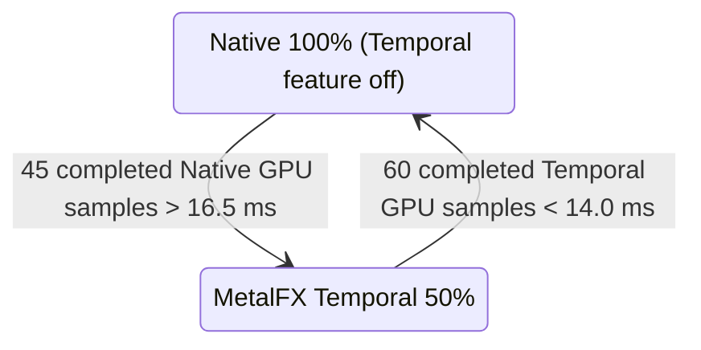

# Temporal Upscaling and Dynamic Resolution

Status: audited against the production code on 2026-07-23.

This document describes the current implementation, not a design target. It separates guarantees proven by code and automated validation from pacing that still needs a real client benchmark.

## 1. Ownership and mode policy

`MetalFxUpscaling` is the public owner of the Sodium setting. It selects exactly one of `OFF`, `SPATIAL`, or `TEMPORAL`; choosing Spatial clears the Temporal setting and vice versa. `MetalFxUpscaling.isSpatialPathActive()` returns only the separately selected Spatial mode. A Temporal frame never invokes a Spatial resolve.

Fixed Temporal presets use render-sized inputs:

| Preset | Input extent | Jitter phases |
| --- | --- | --- |
| Quality | 75% linear | 18 |
| Performance | 50% linear | 32 |
| Ultra Performance | about 33% linear | 72 |

The public dynamic Temporal mode is deliberately more conservative. It is a two-state controller, not continuous DRS:

`16.5 ms` is about 60.6 FPS and `14.0 ms` is about 71.4 FPS. The completed GPU sample is the full presented command-buffer GPU duration (`gpuEndTime - gpuStartTime`), not an FPS estimate, CPU frame time, CPU-to-GPU readback, or drawable wait. CPU-bound slowdowns therefore do not by themselves admit Temporal.

## 2. Temporal frame pipeline

When Temporal is active, the renderer publishes the `TEMPORAL_UPSCALING` feature bit in `RendererFeatureMask`; Spatial is excluded. `GameRendererMetalFxMixin` applies a pending resize before world rendering and publishes the matching renderer generation.

The production path is:

1. Minecraft renders the world and its D32 depth target at the active render extent.
2. `MetalDevice.encodeTemporalDiagnostics` runs after world depth and before the UI depth clear. It creates `RG16Float` motion and `R8Unorm` reactive data, then optionally replays packet-backed entity velocity.
3. Dynamic Temporal uses display-sized physical inputs. It copies just the active low-resolution depth rectangle to private staging, writes motion/reactive only inside that same rectangle, and preserves a private previous-depth image for disocclusion rejection.
4. The native presentation path copies the active low-resolution color rectangle into a display-sized private color input and sets MetalFX `inputContentWidth/Height` to that rectangle.
5. `MTLFXTemporalScaler` receives color, depth, motion, reactive mask, pixel-space Halton jitter, reverse-depth mode, reset state and a display-sized output texture. It resolves the history-aware display result.
6. HDR/UI composition and present consume that Temporal output directly. A Spatial resolve after Temporal is forbidden because it would discard the Temporal result and add another full-screen upscale.

The two packing copies and the previous-depth copy are GPU work, not CPU synchronization. They consume bandwidth and can make Temporal unprofitable at high input resolutions, but they do not use a GPU-to-CPU readback.

## 3. Correctness and safety properties

- MetalFX descriptor, format, usage, device capability and active-content-scale checks fail closed to native rendering.
- The output texture receives MetalFX-required shader-write usage through the scaler's declared usage profile.
- Motion, reactive, dynamic color input, dynamic depth and previous-depth history are private GPU textures.
- Dynamic Temporal has a three-slot Java motion/reactive ring matching the in-flight frame ring. Texture release is queued behind GPU completion through `MetalDestructionQueue` rather than freeing an in-flight texture.
- MetalFX history is reset on first frame, display resize, internal render-scale change, renderer-generation change, world/dimension change, teleport, camera/projection change, output change and shader reload. The reset frame uses current transforms as previous transforms, preventing stale history from being reprojected.
- Projection jitter is derived from the actual render/display ratio, applied before vanilla post-projection transforms, and sent to MetalFX in pixel space. Motion is derived from unjittered camera/static-depth reprojection and depth-disocclusion rejection.

These are strong architectural choices. The scaler is integrated through the renderer-generation and frame-state contracts rather than being a post-process bolted onto the drawable.

## 4. What is smooth in steady state

Within a continuously active Dynamic-Temporal session, the physical MetalFX workspace, display-sized input textures, Java motion/reactive ring and native depth history are keyed by display extent. Changing only `inputContentWidth/Height` does not require a new MetalFX descriptor or a new Java motion/reactive ring. MetalFX optimized initialization is requested asynchronously (`requiresSynchronousInitialization = false`), avoiding an intentional synchronous scaler-compilation wait on the render thread.

GPU fences order world depth, diagnostics, packing, MetalFX and UI inside the command buffer. They are GPU dependencies, not `waitUntilCompleted` calls on the render thread. This is the correct design for normal-frame pacing.

## 5. Confirmed transition costs and technical debt

The Native <-> Temporal switch is not the same as an input-content change, so it cannot be promised perfectly smooth.

1. **Minecraft target resize.** The switch requests `GameRenderer.resize`, which recreates the main world target and resizes `LevelRenderer`. This is render-thread work and can produce an isolated long frame even though no CPU readback occurs.
2. **Generation churn.** Native and Temporal use different `RendererFeatureMask` values. The generation change invalidates generation-owned HDR/menu workspaces and changes the frame graph. On a Temporal entry the Java motion/reactive ring may be allocated and the native dynamic workspace, staging depth, depth history and MetalFX scaler may be created. On return to Native, the current code clears the Java Temporal cache and native preparation discards Temporal caches for that device. Deferred destruction avoids use-after-free and a forced GPU wait, but a later re-entry can allocate again.
3. **Policy has no Native cost predictor.** Entry observes Native timing, but exit observes the already accelerated 50% Temporal timing. The 14 ms threshold is a conservative empirical proxy, not a measurement of what the same scene costs at Native. A workload where Temporal is below 14 ms but Native remains above 16.5 ms can spend roughly the holdoff periods alternating between the two modes. The thresholds prevent frame-by-frame thrash; they do not mathematically rule out multi-second oscillation.
4. **Steady-state bandwidth is material.** Dynamic Temporal adds depth/color packing, previous-depth maintenance, motion/reactive generation and MetalFX resolve. It should not be expected to win at 75-100% input resolution. The current 50% Dynamic input choice is intentional and based on measured wins; it is not evidence that every scene benefits.
5. **Policy state is split.** Mode admission lives in `MetalFxTemporalScaling`, generic GPU feedback in `MetallumDrsController`, renderer generation in `MetalDevice`, and physical workspaces in Swift. The contracts are explicit and tested, but the split makes transition changes easy to regress unless the whole Native -> Temporal -> Native path is tested together.

Items 1-3 are the main remaining pacing debt. They are not memory-safety defects or proof of a permanent stutter, but code inspection alone cannot eliminate them.

## 6. Automated proof and its boundary

The checked-in tests prove important local contracts:

- `temporalScalingUnitTest` verifies presets, mutual exclusion and the 100% Native <-> 50% Temporal policy constants.
- `drsScalingUnitTest` verifies DRS bounds, hysteresis and that Dynamic Temporal does not progressively invoke Spatial scaling.
- `temporalScalingValidation` creates and encodes the fixed MetalFX descriptor profiles.
- `temporalDiagnosticRuntimeValidation` validates typed motion/reactive input, a `64x64 -> 48x48` input-content transition inside unchanged `96x96` physical inputs, reset behavior, depth disocclusion, HDR precompose/UI backdrop and menu blur.

Those tests do **not** measure a real Minecraft `Native -> Temporal -> Native` transition at the built-in display resolution. They cannot prove a p95/p99 frame-time bound, absence of one-frame target-resize hitches, or absence of policy oscillation in the Overworld and Nether.

## 7. Required live evidence before claiming smooth switching

Use the fixed fullscreen HDR, VSync-off route and built-in timestamp report. Record both worlds with Dynamic Temporal selected and retain transition markers for:

- current mode, render/display dimensions and `inputContent` dimensions;
- native and Temporal transition counts and their trigger GPU samples;
- renderer-generation changes and first-use workspace creation;
- CPU frame/present wait, total GPU, `temporal_inputs`, `temporal_entity_replay` and `metal_fx` p50/p95/p99; and
- time spent in each mode plus the number of Native -> Temporal -> Native cycles.

Accept a future pacing optimization only if repeated runs improve or preserve image quality and reduce transition p95/p99 or eliminate observed cycling. Do not tune the thresholds from average FPS alone.
