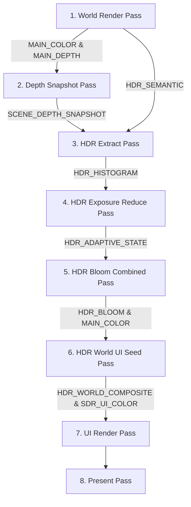

# Metallum Architecture

This document describes the high-level architecture of the **Metallum** Metal rendering backend for Minecraft on macOS.

---

## 1. Entry Points and Startup Hook

Metallum integrates into Minecraft's graphics initialization path by replacing the graphics backend loader:

1. **Backend Interception**: The class [PreferredGraphicsApiMixin](file:///Users/sergejgenerozov/Documents/Эксперимент с модом/metallum/src/main/java/com/metallum/mixin/render/PreferredGraphicsApiMixin.java) intercepts `PreferredGraphicsApi.getBackendsToTry()` to inject `MetalBackend` at the front of the list of backends to try. It also renames the default graphics option in the client menus to `"Prefer Metal"`.
2. **GLFW Window Hints**: During window creation, [MetalBackend](file:///Users/sergejgenerozov/Documents/Эксперимент с модом/metallum/src/main/java/com/metallum/client/metal/render/MetalBackend.java#L27-L29) sets the GLFW client API to `GLFW_NO_API` using:
   ```java
   GLFW.glfwWindowHint(GLFW.GLFW_CLIENT_API, GLFW.GLFW_NO_API);
   ```
   This prevents GLFW from initializing a default OpenGL context.
3. **Layer Creation**: [MetalBackend.createDevice](file:///Users/sergejgenerozov/Documents/Эксперимент с модом/metallum/src/main/java/com/metallum/client/metal/render/MetalBackend.java#L37-L89) loads the system default Metal device via `MetalNativeBridge.metallum_create_system_default_device()`. It queries the macOS Cocoa window backing scale factor, creates a `CAMetalLayer` natively, and assigns it to the Cocoa view:
   ```java
   metalLayer = MetalNativeBridge.metallum_create_metal_layer(deviceHandle, scale);
   MetalNativeBridge.metallum_NSView_setMetalLayer(cocoaView, metalLayer);
   ```
4. **Device Context**: Finally, it instantiates [MetalDevice](file:///Users/sergejgenerozov/Documents/Эксперимент с модом/metallum/src/main/java/com/metallum/client/metal/render/MetalDevice.java), which acts as the unified coordinator between the Java renderer and the native Swift implementation.

---

## 2. Threading Model and Confinement

Metallum utilizes two primary execution groups:

1. **Render Thread (Main Thread)**: All commands that interact with the Metal graphics device, compile pipelines, manage transient allocations, submit command buffers, and present drawables are strictly **confined** to the render thread. Fences and semaphores synchronize workloads between CPU ticks and GPU execution, but the CPU submission side is single-threaded.
2. **Sodium Chunk Meshing Workers**: Background threads (managed by Sodium) compile chunk geometry, extract lighting, and record mesh updates. These workers write to staging buffers. When meshing completes, chunk update packets are enqueued in thread-safe queues (e.g. `VoxelDirtyQueue`). The main render thread consumes these queues during the frame update phase to upload the data to GPU-resident memory.

---

## 3. Java ↔ Panama ↔ Swift ↔ Metal Connection

Instead of using traditional JNI with C header files, Metallum uses the modern **Java 22 Foreign Function & Memory API (Project Panama)** to invoke Swift functions directly:

```
[ Java Side ]
com.metallum.client.metal.render.bridge.MetalNativeBridge
  Uses java.lang.foreign.Linker, SymbolLookup, and MethodHandle.
  Loads "libmetallum.dylib" dynamically on startup.
       │
       ▼ (Downcall Linkage via symbol names)
[ Swift Native Layer ]
src/main/native/MetallumNative.swift
  Exports C-compatible entry points via @_cdecl("symbol_name").
       │
       ▼ (Direct Calls)
[ Apple Metal API ]
  Core Apple Silicon GPU rendering.
```

### Panama Downcall Types
In [MetalNativeBridge](file:///Users/sergejgenerozov/Documents/Эксперимент с модом/metallum/src/main/java/com/metallum/client/metal/render/bridge/MetalNativeBridge.java#L784-L790), downcalls are linked as either:
- **Standard Downcalls**: Run with `Linker.Option.critical(false)`. Safely integrates with the JVM state but introduces a small call transition overhead.
- **Critical Downcalls**: Fast path downcalls that minimize call overhead for performance-sensitive functions, but must not block the CPU or call back into the JVM.

### Struct Validation and Memory ABI
To pass data structures between Java and Swift without JNI object conversion:
1. Java constructs contiguous off-heap structures in direct bytes using `java.lang.foreign.MemorySegment` structures.
2. On the Swift side, corresponding structures (e.g. `MetallumLightingParamsV1`, `MetallumVoxelParamsV1`) are mapped directly to the raw memory address pointers.
3. Structures are versioned and verified. For example, [NativeHdrFrameGraph.initialize](file:///Users/sergejgenerozov/Documents/Эксперимент с модом/metallum/src/main/java/com/metallum/client/metal/render/framegraph/NativeHdrFrameGraph.java#L80-L92) calls `metallum_validate_frame_graph_v1` on startup to ensure that Java's serialized representation of the frame graph exactly matches Swift's internal parsing expectations.

---

## 4. The Render Pass Graph and Frame Lifecycle

Each frame's lifecycle is defined by a structured **Frame Graph**. The passes are registered on the Java side and executed in a pipeline-fused format on the native side.

### 4.1. Steady-State Render Passes (MetalFX OFF)
Defined in [NativeHdrFrameGraph.createGraph](file:///Users/sergejgenerozov/Documents/Эксперимент с модом/metallum/src/main/java/com/metallum/client/metal/render/framegraph/NativeHdrFrameGraph.java#L111-L148):



1. **`world_render`**: Renders Minecraft chunks, entities, and sky. Output targets are `MAIN_COLOR` (RGBA16Float), `MAIN_DEPTH` (Depth32Float), and `HDR_SEMANTIC` (RGBA8Unorm).
2. **`scene_depth_snapshot`**: Copies depth values into `SCENE_DEPTH_SNAPSHOT` for depth-aware semantic masking.
3. **`hdr_extract`**: Extracts bright spots and emissive pixels based on semantic light values, building `HDR_EMISSION` and filling `HDR_HISTOGRAM`.
4. **`hdr_exposure_reduce`**: Compute pass that runs a reduction shader to calculate average luminance and updates the `HDR_ADAPTIVE_STATE`.
5. **`hdr_bloom_combined`**: Runs downscaling, dual-filtering blur, and upscaling to compute `HDR_BLOOM`.
6. **`hdr_world_ui_seed`**: Composites the tonemapped EDR world with bloom into `HDR_WORLD_COMPOSITE` and writes a background color seed into the UI buffer `SDR_UI_COLOR` (to avoid blending artifacts at the EDR/SDR boundary).
7. **`ui_render`**: Draws the traditional 2D HUD and GUI elements into `SDR_UI_COLOR` using `SDR_UI_DEPTH`.
8. **`present`**: Blends `HDR_WORLD_COMPOSITE` (EDR) and `SDR_UI_COLOR` (SDR) together onto the final swapchain `drawable` for display.

### 4.2. Spatial Scaling Frame Graph (MetalFX Spatial ON)
If MetalFX Spatial Upscaling is enabled, the graph is structurally different ([NativeHdrFrameGraph.createSpatialGraph](file:///Users/sergejgenerozov/Documents/Эксперимент с модом/metallum/src/main/java/com/metallum/client/metal/render/framegraph/NativeHdrFrameGraph.java#L285-L330)):
1. **`world_render`**, **`scene_depth_snapshot`**, **`hdr_extract`**, **`hdr_exposure_reduce`**, and **`hdr_bloom_combined`** operate at render resolution.
2. **`hdr_world_reconstruction`**: Tonemaps and composites the world at render resolution.
3. **`metalfx_spatial`**: Invokes the `MTLFXSpatialScaler` to upscale the composited world to display resolution.
4. **`ui_render_with_seed`**: Draws the GUI directly on top of the upscaled target at display resolution.
5. **`present`**: Combines EDR upscaled world and SDR UI onto the drawable swapchain.
